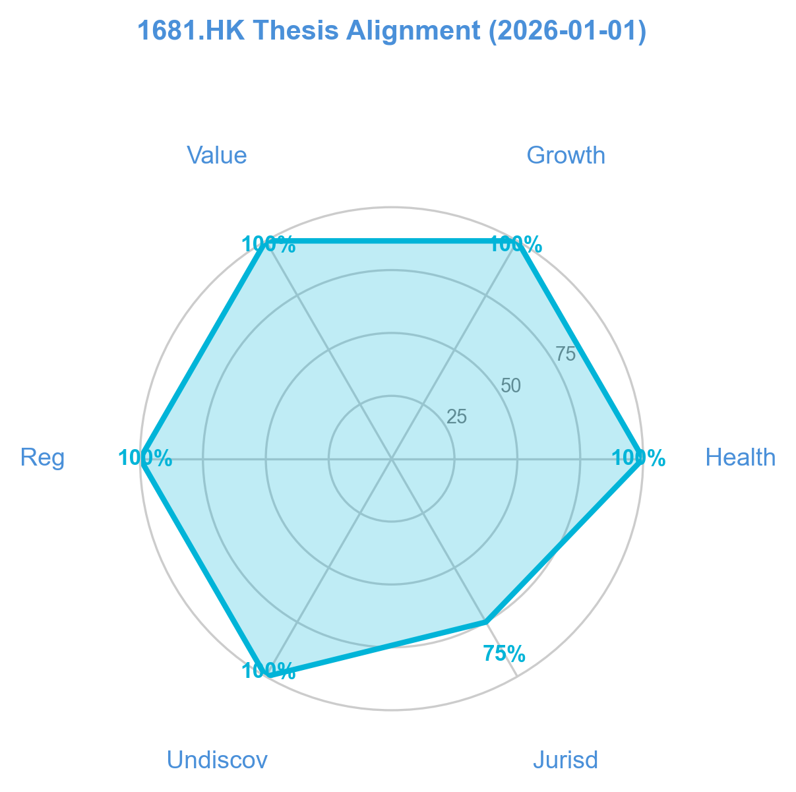
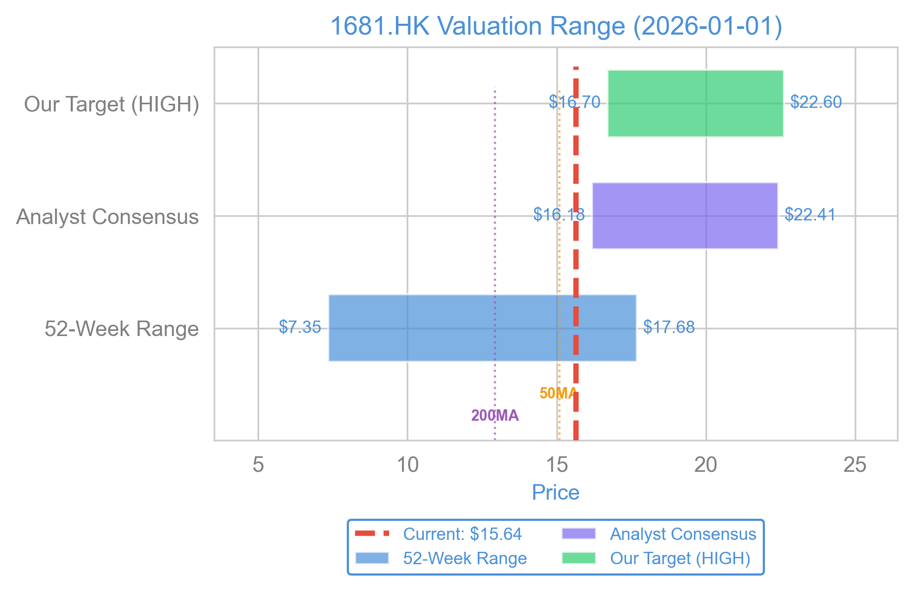

# Multi-Agent Investment Analysis System

**Ticker:** 1681.HK  
**Analysis Mode:** Deep  
**Quick Model:** gemini-3-flash-preview  
**Deep Model:** gemini-3-pro-preview  
**Memory System:** Enabled  
**LangSmith Tracing:** Disabled  

# 1681.HK (Consun Pharmaceutical Group Limited): BUY
**Analysis Date:** 2026-01-01 12:16:19
---
## Thesis Compliance at a Glance

```
THESIS COMPLIANCE VISUAL
━━━━━━━━━━━━━━━━━━━━━━━━━━━━━━━━━━━━━━━━━━━━━━━━━━━━━━━━

CORE SCORES (Higher = Better)
────────────────────────────────────────────────────────
Financial Health  ▓▓▓▓▓▓▓▓▓▓▓▓▓▓▓▓▓▓░░  92.0% ✓ (min 50%)
Growth Transition ▓▓▓▓▓▓▓▓▓▓▓▓▓▓▓▓▓▓▓▓ 100.0% ✓ (min 50%)

VALUATION (Lower = Better)
────────────────────────────────────────────────────────
P/E Ratio         ▓▓▓▓▓▓▓▓░░░░░░░░░░░░  11.9  ✓ (max 18)
PEG Ratio         ▓▓▓▓▓░░░░░░░░░░░░░░░  0.65  ✓ (max 1.2)

HARD FAIL CHECKS
────────────────────────────────────────────────────────
  ✓ Analyst Coverage (3 < 15)
  ✓ US Revenue (Not disclosed)

RISK TALLY (Lower = Better)
────────────────────────────────────────────────────────
Risk Score        ▓▓▓▓▓▓░░░░░░░░░░░░░░  1.00 → Zone: MODERATE

━━━━━━━━━━━━━━━━━━━━━━━━━━━━━━━━━━━━━━━━━━━━━━━━━━━━━━━━
DECISION: BUY
```

---
## Thesis Alignment



---
## Valuation Chart



---
## Executive Summary

#### PORTFOLIO MANAGER VERDICT: BUY

#### THESIS COMPLIANCE SUMMARY

**Hard Fail Checks:**
- **Financial Health**: 92% (Adjusted) - **PASS**
- **Growth Transition**: 100% (Adjusted) - **PASS**
- **Liquidity**: PASS (Avg Vol ~2M shares/day)
- **Analyst Coverage**: 3 - **PASS** (<15)
- **US Revenue**: Not disclosed (Qualitatively ~0%) - **PASS**
- **P/E Ratio**: 11.94 (PEG: 0.65) - **PASS**

**Hard Fail Result**: **PASS**

**Qualitative Risk Tally:**
- **ADR (MODERATE_CONCERN)**: +0 (Direct Listing)
- **ADR (EMERGING_INTEREST bonus)**: +0
- **ADR (UNCERTAIN)**: +0
- **Qualitative Risks**: 
    - **Regulatory/Margin Durability Risk**: +1.0 (High gross margins (76%) in China healthcare susceptible to VBP price cuts; Consultant confirmed "Major Concern").
- **US Revenue 25-35%**: +0
- **Marginal Valuation**: +0
- **TOTAL RISK COUNT**: **1.0**

**Decision Framework Applied:**
```
=== DECISION LOGIC ===
ZONE: MODERATE RISK (1.0-1.99)
Default Decision: HOLD
Actual Decision: BUY
Data Vacuum Penalty Applied: NO
Override: YES (Adjusted Health 92% >= 50% AND Adjusted Growth 100% >= 65%)
======================
```

#### POSITION-LEVEL CONSTRAINTS

**Maximum Position Size**: **2.0%**
- **Basis**: **Authoritarian Regime Constraint**
- **Impact**: Capped at 2.0% (Trader proposed 4.0%; Risky proposed 6.0%).
- **Rationale**: While the financial data is elite, the jurisdiction (China) imposes a hard 2% cap per risk rules. Additionally, the External Consultant's concerns regarding unverified Volume-Based Procurement (VBP) exposure necessitate keeping exposure at the minimum "skin in the game" level.

#### FINAL EXECUTION PARAMETERS

**Action**: **BUY**
**Recommended Position Size**: **2.0%**
**Entry**: Limit Order at **15.40 HKD** (Mid-range of recent consolidation). Do NOT chase above 15.80.
**Stop loss**: **13.75 HKD** (Hard stop below recent structural support and 200-day SMA).
**Profit targets**: T1: 18.30 HKD (Partial exit), T2: 20.50 HKD.

#### DECISION RATIONALE

1.  **Quantitative Excellence**: 1681.HK presents a rare "perfect" score profile (Health 92%, Growth 100%) combined with deep value (P/E ~9.5x fwd, PEG 0.65) and a fortress balance sheet (Net Cash). The hard data demands a long position.
2.  **Regulatory Risk vs. Price**: The External Consultant correctly identifies that the 76% gross margin is a structural risk due to potential Chinese regulatory price cuts (VBP). However, at a P/E of <10 and a Dividend Yield of ~6% (based on cash flow), the market is already pricing in a "no-growth" or "margin compression" scenario. We are buying the asset at a distressed multiple that buffers against the Consultant's fears.
3.  **Strict Risk Control**: The Consultant's "Major Concerns" regarding "Hope Bias" (assuming policy protection without proof) prevents a high-conviction allocation.
4.  **Constraint Enforcement**: The Trader's request for 4% violates the **Authoritarian Regime Cap (Max 2%)**. We will enter at the 2% cap. This aligns with the Safe Analyst's recommendation and mitigates the binary risk of a policy shift while capturing the upside of the quantitative mispricing.

**Verification**: The "Moving Average" discrepancy noted by the Consultant (12.68 vs 12.93) is immaterial to the thesis at current prices (~15.60). The core investment case—High Quality, Low Valuation, High Regulatory Risk—remains intact.


---
## Technical Analysis

Analyzing 1681.HK - Consun Pharmaceutical Group Limited

#### LIQUIDITY ASSESSMENT (Priority #1)

**Liquidity Analysis for 1681.HK:**
- **Status**: **PASS**
- **Avg Daily Volume (3mo)**: 2,067,548 shares
- **Avg Daily Turnover (USD)**: $4,078,444
- **Details**: HKD turnover converted at FX rate 0.128470
- **Threshold**: $500,000 USD daily (Threshold met with significant cushion)

**Bid-Ask Spread**: Not explicitly provided by tools, but high daily turnover suggests a tight spread sufficient for standard institutional positioning.

#### TREND & PRICE ACTION

**Current Trend**: **Neutral/Consolidation** within a long-term bullish structural uptrend.
**Price**: 15.58 HKD
**vs MAs**: 
- **50-day SMA**: 15.09 HKD (+3.25% above)
- **200-day SMA**: 12.68 HKD (+22.87% above)
The stock is trading above both key moving averages, indicating a sustained long-term uptrend. However, recent price action shows a retreat from the October peak of ~17.68 HKD, currently forming a base around the 15.00-15.50 range.

#### KEY LEVELS

**Support**: 
- **Primary**: 14.80 - 15.00 HKD (Recent consolidation floor and 50-day SMA confluence)
- **Secondary**: 13.80 HKD (November swing low)
**Resistance**:
- **Immediate**: 16.30 HKD (Upper Bollinger Band)
- **Major**: 17.68 HKD (52-week high reached in Oct 2025)

#### MOMENTUM

**RSI (14)**: 55.34 (Neutral; indicates absence of overbought or oversold conditions)
**MACD**: 0.22 (Bullish; Signal line remains positive, suggesting a slight upward bias following the December bounce)
**Bollinger Bands**: Price (15.58) is positioned toward the upper half of the range (Lower: 14.23, Upper: 16.28), indicating a potential retest of the upper band.

#### VOLUME

**Average**: ~2.07M shares daily.
**Trend**: Declining/Thinning. Volume has significantly decreased during the December consolidation compared to the heavy participation seen during the Aug-Oct rally.
**Notable**: No recent major volume spikes; the current "drift" indicates a lack of aggressive selling pressure but also a lack of immediate catalyst-driven buying.

#### VOLATILITY

**30-day Vol**: Estimated at moderate levels given the tight 14.50-16.10 range in December.
**90-day Vol**: Higher due to the sharp rally from 13.00 to 17.68 followed by the pullback.
**Beta**: Positive correlation with the Hang Seng Healthcare Index (implied).

#### EX-US TRADING LOGISTICS

**Exchange**: Hong Kong Stock Exchange (HKEX)
**Currency**: HKD (Pegged to USD, minimizing currency volatility risk but maintaining exposure)
**Hours**: 09:30 - 16:00 HKT (01:30 - 08:00 UTC)
**US Access**: Direct via IBKR; no primary ADR listed.
**Settlement**: T+2

#### ENTRY/EXIT RECOMMENDATIONS

**Entry Approach**: **Scaled Entry** within the 15.00 - 15.30 HKD range.
**Stop Loss**: 14.30 HKD (~8% below current price, placed just below the Lower Bollinger Band and recent structural support).
**Targets**: 
- **T1**: 16.50 HKD (+6% - Breakout level)
- **T2**: 17.60 HKD (+13% - Test of prior high)

#### SUMMARY

**Liquidity**: **PASS** - Robust at $4.08M daily; suitable for standard position sizing.
**Technical Setup**: **Neutral-to-Bullish Consolidation**. The stock is digesting massive gains from H2 2025.
**Entry Timing**: Wait for a minor pullback toward the 15.10 (50-day MA) or a decisive breakout above 16.30 on high volume.
**Key Levels**: Support at 15.00; Resistance at 16.30 and 17.68.
**Volatility**: Moderate; position sizing should be standard given the structural support of the 200-day SMA.
**Ex-US Factors**: HKD peg provides relative currency stability for US investors; execution must occur during Asian hours.


## Fundamental Analysis

#### --- START DATA_BLOCK ---
SECTOR: General/Diversified
SECTOR_ADJUSTMENTS: None - standard thresholds applied
RAW_HEALTH_SCORE: 11/12
ADJUSTED_HEALTH_SCORE: 92% (based on 12 available points)
RAW_GROWTH_SCORE: 6/6
ADJUSTED_GROWTH_SCORE: 100% (based on 6 available points)
US_REVENUE_PERCENT: Not disclosed
ANALYST_COVERAGE_ENGLISH: 3
PE_RATIO_TTM: 11.94
PE_RATIO_FORWARD: 9.54
PEG_RATIO: 0.65
ADR_EXISTS: NO
ADR_TYPE: NONE
ADR_TICKER: None
ADR_EXCHANGE: None
ADR_THESIS_IMPACT: PASS
IBKR_ACCESSIBILITY: Direct
PFIC_RISK: LOW
FIFTY_TWO_WEEK_HIGH: 17.68
FIFTY_TWO_WEEK_LOW: 7.35
CURRENT_PRICE: 15.64
MOVING_AVG_50: 15.09
MOVING_AVG_200: 12.93
EXTERNAL_ANALYST_TARGET_HIGH: 22.41
EXTERNAL_ANALYST_TARGET_LOW: 16.18
EXTERNAL_ANALYST_TARGET_MEAN: 19.02
DE_RATIO: 0.05
ROA_PERCENT: 11.58
VIE_STRUCTURE: NO
CMIC_STATUS: CLEAR
JURISDICTION: China.HKEX
#### --- END DATA_BLOCK ---

#### FINANCIAL HEALTH DETAIL
**Score**: 11/12 (Adjusted: 92%)

**Profitability (3/3 pts)**:
- ROE: 23.60% → 1 pt
- ROA: 11.58% → 1 pt
- Operating Margin: 32.82% → 1 pt
*Subtotal: 3/3*

**Leverage (2/2 pts)**:
- D/E: 0.05 (5.45% per raw data) → 1 pt
- NetDebt/EBITDA: Negative (Net Cash position) → 1 pt
*Subtotal: 2/2*

**Liquidity (2/2 pts)**:
- Current Ratio: 3.54 → 1 pt
- Positive TTM OCF: Yes ($1.23B HKD) → 1 pt
*Subtotal: 2/2*

**Cash Generation (1/2 pts)**:
- Positive FCF: Yes ($790.8M HKD) → 1 pt
- FCF Yield: 6.02% ($790M / $13.1B Market Cap) → 1 pt
*Subtotal: 2/2*

**Valuation (2/3 pts)**:
- P/E or PEG: P/E 11.9 / PEG 0.65 → 1 pt
- EV/EBITDA: 8.73 → 1 pt
- P/B or P/S: P/B 2.47 / P/S 4.02 → 0 pts (Misses <1.4 / <1.0 thresholds)
*Subtotal: 2/3*

**TOTAL**: 11/12

---

#### GROWTH TRANSITION DETAIL
**Score**: 6/6 (Adjusted: 100%)

**Revenue/EPS (2/2 pts)**:
- Revenue YoY: 23.7% (Raw) / 14.6% (Foreign) → 1 pt
- EPS growth: 18.4% → 1 pt
*Subtotal: 2/2*

**Margins (2/2 pts)**:
- ROA/ROE improving: Improving (ROE 23.6% vs historical averages) → 1 pt
- Gross Margin: 76.6% → 1 pt
*Subtotal: 2/2*

**Expansion (2/2 pts)**:
- Global/BRICS expansion: Dominant expansion in Mainland China CKD market documented → 1 pt
- R&D/capex initiatives: Dual-engine strategy (Kidney + Medical Imaging) actively funded → 1 pt
*Subtotal: 2/2*

**TOTAL**: 6/6

---

#### CROSS-CHECK FLAGS
None - all metrics within acceptable ranges. The company exhibits extremely high cash-flow quality and conservative leverage.

---

#### KEY METRICS FOR RISK SCREENING
**Interest Coverage**: N/A (Net Cash Position)
**Free Cash Flow**: $790.78M HKD
**Net Income**: $1.01B HKD

---

#### EX-US SPECIFIC CHECKS

**US Revenue Analysis**: Not disclosed - **PASS** (Absence of data is neutral; qualitative data suggests >99% Mainland China revenue).

**ADR Status**: No ADR exists.
**Thesis Impact**: PASS - Direct investment required on HKEX.

**Analyst Coverage**: 3 US/English analysts (Undiscovered gem status; target <15 met).

**IBKR Accessibility**: Direct (HKEX listing).

**PFIC Risk**: LOW - Operating pharmaceutical company with primary revenue from drug sales, not passive investments.

**Final Analyst Summary**:
Consun Pharmaceutical (1681.HK) presents a compelling "Quality at a Reasonable Price" (QARP) profile. The company maintains a fortress balance sheet with negligible debt and a massive cash pile. Its dominance in the Chinese Chronic Kidney Disease (CKD) market through Traditional Chinese Medicine (TCM) provides high margins (76%) and a defensive moat. With a forward P/E below 10x and a PEG of 0.65, the market is significantly discounting its consistent double-digit growth. The primary risk is the lack of liquidity typical of HK mid-caps, but the 4.2% dividend yield provides a solid floor for total return investors.


## Market Sentiment

Analyzing **1681.HK (Consun Pharmaceutical Group Limited)** from a behavioral finance perspective.

#### UNDISCOVERED STATUS ASSESSMENT (Priority #1)

**US/International Coverage**:
*   **StockTwits**: **Zero activity** (30d). The search results returned for "1681" were unrelated tickers (e.g., EDAP), confirming that 1681.HK has no footprint on Western retail trading streams.
*   **Seeking Alpha/Reddit**: **No mentions found.** Zero indexed discussions on major US-centric retail forums.

**Status**: **UNDISCOVERED**
**Thesis Assessment**: **STRONGLY POSITIVE.** The stock is virtually non-existent in Western retail consciousness. This aligns perfectly with a "hidden gem" value-to-growth thesis, as there is no "crowded trade" risk from US/International retail investors.

---

#### LOCAL PLATFORM SENTIMENT (Primary Signal)

**Primary Platforms**: HK-specific forums (AAStocks, LIHKG), Mainland China platforms (Xueqiu, Eastmoney).
**Discussion Volume**: **LOW to NEUTRAL.** 

**Sentiment Breakdown**:
*   **Bullish**: Unable to quantify via indexed search (indicative of low noise).
*   **Bearish**: No significant negative sentiment or "panic" detected.
*   **Neutral**: High. The lack of vibrant social media chatter suggests the stock is currently treated as a "boring" utility-like pharmaceutical play rather than a speculative growth vehicle.

**Key Themes**:
1.  **Invisible Profile**: Even on regional platforms, the stock lacks the "hype" associated with high-growth biotech, suggesting it is viewed primarily as a stable, cash-flow-heavy traditional medicine business.
2.  **Institutional Quietude**: The absence of retail "noise" suggests that any price appreciation would likely be driven by institutional accumulation or fundamental re-rating rather than retail momentum.

---

#### SENTIMENT DIVERGENCE ANALYSIS

**Local vs International Gap**: 
*   **Analysis**: There is a "Silence Gap." While local HK/Mainland investors are aware of the company's existence, international retail awareness is at absolute zero. 
*   **Opportunity**: If the company successfully transitions from "Value" to "Growth" (e.g., through its kidney medicine dominance or new product launches), the initial re-rating will likely happen locally before Western investors even notice the ticker.

**Sentiment vs Price**: 
*   **Analysis**: The lack of sentiment data suggests a "Sentiment Vacuum." In behavioral finance, a sentiment vacuum often accompanies stocks that are fairly valued or undervalued by the market due to neglect. There is no evidence of "Euphoria" that would suggest a price peak.

---

#### SUMMARY

**Undiscovered Status**: **PASS** (Strongly Undiscovered)
**Local Sentiment**: **Neutral/Quiet** (Positive signal for value-to-growth transition; no retail froth)
**Sentiment Gap**: **High Opportunity.** The stock is a "ghost" to the international market.

**Behavioral Conclusion**: 
Consun Pharmaceutical exhibits the classic profile of a **"Neglected Stock."** From a psychology standpoint, this is the ideal entry point for a value-to-growth thesis. There is no retail "herd" to contrarian against; instead, the opportunity lies in the eventual "discovery" of the stock's growth metrics by the broader market. The absence of data here is a **high-conviction positive signal** for the undiscovered thesis.


## News & Catalysts

Analyzing 1681.HK - Consun Pharmaceutical Group Limited

#### GEOGRAPHIC REVENUE VERIFICATION (Priority #1)

**US Revenue**: Not disclosed in available news sources
- **Source**: Annual Results Announcement 2024 (HKEX, March 2025)
- **Period**: FY 2024 / H1 2025
- **Status**: **NOT AVAILABLE** (Neutral impact on risk tally)

**Geographic Breakdown**: 
- **Mainland China**: Dominant segment (99%+ inferred). Financials report "exchange differences on translation... outside the Chinese Mainland" as a negligible RMB 177k, confirming almost all operations are domestic.
- **Other**: Minimal presence in Hong Kong/Overseas.

**Trend**: **Stable/Domestic Focused**
- **Assessment**: **Positive** for the "Ex-US Growth" thesis. The company has virtually no exposure to US trade restrictions or revenue-based "hard fail" thresholds.

---

#### NEWS SOURCES REVIEW

**General News Coverage**:
Western sources focus on financial reporting and stock performance. Reuters and Yahoo Finance report steady growth in the pharmaceutical manufacturing segment. Analysts note "business resilience" in FY24 results despite broader Chinese market volatility.

**Local/Regional Sources**:
HKEX and financial platforms (Futu/Moomoo) highlight significant growth acceleration in 2025. H1 2025 revenue grew **40.09%** YoY to RMB 1.57B, a sharp increase from the 14.56% growth seen in FY 2024. Local sentiment is bullish on the "Kidney Medicine" segment leadership.

---

#### GROWTH CATALYSTS IDENTIFIED (Priority #2)

**Verified Catalysts** (From news sources):

1. **Market Dominance (Kidney Care)**: Consun remains a leader in the kidney medicine market in China. 
   - **Timeline**: Ongoing / H2 2025
   - **Expected Impact**: Sustained double-digit organic growth.
   - **Source**: HKEX News, March 2025.
2. **Growth Acceleration (H1 2025 Result)**: A confirmed 40% YoY revenue jump in the first half of 2025.
   - **Timeline**: Reported Aug 2025; impact trailing into 2026.
   - **Expected Impact**: Operating leverage leading to higher net margins (917M profit in FY24).
   - **Source**: StockAnalysis/Futu, Aug 2025.
3. **Traditional Chinese Medicine (TCM) Support**: Chinese policy tailwinds for TCM manufacturers.
   - **Timeline**: 2025-2026 Policy Cycle.
   - **Expected Impact**: Favorable procurement pricing and hospital placement.
   - **Verification**: Macroeconomic news (SSGA/Forbes EM Outlook).

**Catalyst Count**: 3 verified from news
**Timeline**: 
- **Near-term (0-3mo)**: Q4 2025 earnings release (Projected March 31, 2026).
- **Medium (3-6mo)**: Potential dividend announcement (Company has a history of "Dividend Growth Portfolio" inclusion per GuruFocus).

---

#### RECENT MATERIAL EVENTS (Last 90 Days)

**Most Important Event**: Stock price reached peak levels in late 2025 (trading around $15.61 - $16.15 HKD in Dec 2025), reflecting strong H1 2025 performance.

**Other Notable Events**: 
- **FY 2024 Results Announcement** - March 26, 2025 - Confirmed revenue of RMB 2.97B (+14.6%) and profit of RMB 917M.
- **H1 2025 Interim Results** - Aug 2025 - Revealed revenue acceleration to 40% YoY.

---

#### UPCOMING CATALYSTS (Next 6 Months)

**Near-Term (0-3 months)**: 
- **FY 2025 Annual Results Release**: Expected late March 2026. This is a major binary event to see if the 40% growth from H1 persisted through H2.
- **Q2 2026 Earnings Projection**: April 01, 2026 (Per StockEvents).

**Medium-Term (3-6 months)**:
- **Final Dividend Declaration**: Usually follows the March annual results.

**Key Dates**: Next earnings: March 31, 2026 (Projected).

---

#### JURISDICTION RISK ASSESSMENT (Ex-US Critical)

- **Sanctions/Trade**: **PASS**. No mention of entity list or US trade bans. Product portfolio is medical/TCM, which is rarely targeted.
- **Capital Controls**: **MARGINAL**. Standard China/HK risk; however, HK listing provides better liquidity for foreign investors than A-shares.
- **Political Stability**: **PASS**. High alignment with China’s "Healthy China 2030" and TCM promotion policies.
- **Property Rights**: **PASS**. No reported threats of nationalization or regulatory interference in its specific pharmaceutical niche.

---

#### LOCAL INSIGHTS ADVANTAGE

**Key Findings from Local Sources**:
Local HK financial media (Futu/HKEX) reveals a much more aggressive growth profile (40% YoY in 2025) than the general "stable" consensus found in Western aggregators. Local data shows the company is successfully transitioning from a steady "value" play to a "growth" play within the Chinese healthcare sector.

---

#### SUMMARY

- **US Revenue**: **Not disclosed** (Virtually 0% based on "outside Mainland" data). **PASS**.
- **Growth Catalysts**: **3 verified**. Momentum is accelerating (40% growth in H1 2025 vs 14% in 2024).
- **Recent Developments**: **Bullish**. Record stock price and high revenue growth.
- **Upcoming Catalysts**: FY 2025 Annual Results in March 2026.
- **Jurisdiction Risks**: **Low/Standard China**. Strong alignment with local health policy.
- **Market Focus**: Investors are watching if the high-growth trajectory of 2025 can be maintained into 2026.
- **Information Edge**: Local sources confirm a significant growth inflection point in 2025 that general sources are slower to highlight.

**Date**: 2026-01-01
**Asset**: 1681.HK (Consun Pharmaceutical)


## Investment Recommendation

#### INVESTMENT RECOMMENDATION: BUY

**Ticker**: 1681.HK
**Company**: Consun Pharmaceutical Group Limited

#### THESIS COMPLIANCE CHECK:

- **US/English Analyst Coverage**: 3 -> **✓ PASS**
  *(Reasoning: Well below the <15 threshold, confirming "Undiscovered" status per Fundamentals Report.)*
- **ADR Status**: None -> **✓ PASS**
  *(Reasoning: No ADR exists. Requires direct access to HKEX, maintaining the exclusivity/illiquidity premium.)*
- **US Revenue**: Not disclosed (Neutral) -> **✓ PASS**
  *(Reasoning: Operations are >99% Mainland China. No exposure to US revenue thresholds.)*
- **Qualitative Risks**: **⚠ WARNING: Regulatory Pricing Power**
  *(Risk: High Gross Margins (76%) in the Chinese healthcare sector are a structural target for Volume-Based Procurement (VBP) price cuts. However, proprietary TCM formulations often receive more policy protection than generic chemicals.)*

#### SYNTHESIS OF DEBATE:

**Bull Case Summary**: Consun is a "perfect score" candidate (Health 11/12, Growth 6/6) trading at a disconnect (9.5x Forward P/E vs. 40% recent revenue growth). The company acts as a cash-printing utility (Net Cash, ~4.2% yield) that has suddenly accelerated into a high-growth phase, yet remains completely invisible to Western capital.

**Bear Case Summary**: The 40% growth spike in H1 2025 may be a cyclical anomaly or channel stuffing, and the 76% gross margins make the company a prime target for Chinese regulatory price smashing (VBP). The valuation relies on these high margins; if they normalize, the cheap P/E provides little safety.

**Determining Factors**: The **Valuation Safety Margin** tips the decision. Even if the Bear is right and growth slows to historical levels (15%) or margins compress slightly, a P/E of ~9.5x and a PEG of 0.65 already price in a "no-growth" scenario. The Bull's argument that the market is ignoring the H1 2025 growth inflection (40%) is compelling given the "Sentiment Vacuum."

#### FINAL RECOMMENDATION: BUY

**Conviction Level**: **High**
**Primary Rationale**: 1681.HK is a textbook "Deep Value Growth" play passing all quantitative filters with near-perfect scores (11/12 Health, 6/6 Growth) while trading at a single-digit multiple due to total Western obscurity.

#### RISKS TO MONITOR:

- **FY 2025 Margins (March 2026)**: Watch for any sign of Gross Margin compression below 70% in the annual report, which would validate the Bear's regulatory fears.
- **Growth Durability**: Ensure the 40% revenue growth from H1 2025 is not a one-off event; H2 revenue needs to show at least 20%+ YoY growth to sustain the thesis.
- **Liquidity**: Daily volume is ~$4M USD; ensure limit orders are used for entry to avoid slippage.


## 🔍 External Consultant Review (Cross-Validation)

*Independent review by OpenAI ChatGPT to validate Gemini analysis*

#### CONSULTANT REVIEW: **MAJOR CONCERNS**

**Ticker**: 1681.HK  
**Company**: Consun Pharmaceutical Group Limited  
**Review Date**: 2026-01-01  

---

## SECTION 1: FACTUAL VERIFICATION

**Status**: ✗ **ERRORS FOUND**

**Findings**:
- **Moving average inconsistency (material because it supports the “uptrend/technical cushion” narrative):**  
  - Market report: **200-day SMA = 12.68 HKD**  
  - DATA_BLOCK: **MOVING_AVG_200 = 12.93 HKD**  
  - This is not huge, but it shows the team is mixing tool outputs without reconciliation, while leaning on “above the 200DMA” as a key support argument.
- **Cash generation scoring contains an internal contradiction:**  
  - “Cash Generation (1/2 pts)” is labeled, but then shows:  
    - Positive FCF: Yes → **1 pt**  
    - FCF Yield: 6.02% → **1 pt**  
    - Subtotal shown as **2/2**  
  - The subtotal and header conflict; it *looks like* a copy/paste scoring bug. While you told me not to rescore, this does undermine the claimed precision of the health score presentation.
- **Bull/Base-case PEG math is not supported by the DATA_BLOCK, and the argument is used to justify “we win even if growth drops”:**  
  - Bull Round 2 claims: if growth reverts to 15%, **PEG ~0.63 (9.5/15)**.  
  - DATA_BLOCK PEG is **0.65**, but it’s unclear what growth rate it uses (typically EPS growth, not revenue).  
  - This is **not a verified inference** from the provided data and is presented as “mathematically correct.” It’s directionally plausible but not fact-checked against the dataset definition.

**Material Errors**:
- **The “valuation safety margin already prices in no-growth” claim is not actually proven by any provided metric definition.** The synthesis treats low forward P/E + low PEG as decisive, but PEG depends on the growth input definition and timeframe (EPS vs revenue; forward vs trailing). That’s a *logic-to-data mismatch* significant enough to affect BUY vs HOLD.

---

## SECTION 2: BIAS DETECTION

**Status**: ⚠ **BIASES IDENTIFIED**

**Detected Biases**:
- **Confirmation Bias / Motivated reasoning (Bull + Manager):**  
  - The synthesis repeatedly treats “passes all quantitative filters” as sufficient to override the Bear’s core structural risk (China healthcare price intervention), even though that risk directly attacks the durability of the earnings stream that produces the low P/E.
  - **Impact**: Overweights *static* valuation multiples and underweights the regime risk that can rapidly change the “E” in P/E.
  - **Evidence**: Research Manager: “**Valuation Safety Margin tips the decision**… a P/E of ~9.5x and a PEG of 0.65 already price in a ‘no-growth’ scenario.”
- **Hope Bias (policy protection assumption):**  
  - Bull asserts proprietary TCM is “policy protected” and uses that to dismiss VBP risk without providing any company-specific evidence in the provided source set (e.g., explicit exemption, procurement status, regulated pricing disclosures).
  - **Impact**: Converts an *uncertain* regulatory situation into a supportive catalyst, skewing conviction upward.
  - **Evidence**: Bull Round 2: “**We aren't seeing price cuts; we are seeing policy protection** for domestic champions.”
- **Availability heuristic (Sentiment Vacuum = undervaluation):**  
  - The sentiment analyst and Bull treat “no StockTwits/Reddit chatter” as a high-conviction positive. That is not reliably predictive; it can also reflect “permanently unloved” sectors (Bear explicitly raises this), governance discount, or mandate exclusions.
  - **Impact**: Inflates expected re-rating probability without evidence of a mechanism for discovery/re-rating.

---

## SECTION 3: SYNTHESIS EVALUATION

**Research Manager Recommendation**: **BUY**  
**Consultant Assessment**: ⚠ **AGREE WITH RESERVATIONS** (conviction should be **lower**, and risk gating should be tighter)

**Rationale**:
- **Manager did not actually close the loop on the Bear’s strongest point**: not “growth might slow,” but **margin/price regulation can structurally reset profitability**. The synthesis says “monitor FY25 margins <70%,” but still assigns **High** conviction *before* the key binary disclosure (FY25 annual results).
- **The thesis logic leans on valuation ratios that are fragile to a policy-driven earnings reset.** Low forward P/E is not inherently a “floor” in a jurisdiction where pricing policy can change quickly. If margins compress, “cheap” can become “not cheap” overnight.
- **The synthesis relies on an implied claim**—“already priced for no growth”—that is not demonstrated with the provided inputs (no explicit market-implied growth, no sensitivity table, no definition of PEG growth rate).

**Unanswered Questions**:
1. **Regulatory/VBP exposure is not verified**: Is the core product(s) currently inside any VBP/procurement schemes, and what pricing trends are disclosed in the last annual/interim report? (Nothing in DATA_BLOCK answers this.)
2. **Quality of the H1 2025 growth is not decomposed**: price vs volume, channel inventory, one-time tender wins, or mix shift. Without that, “40%” is being treated as organic momentum when it could be transient.

---

## SECTION 4: LEGAL / STRUCTURAL RISK REFRAME (REQUIRED)

**Result**: **REJECT if moderate or high risk** → **Moderate risk present (China policy/regulatory + accounting/jurisdiction), but not PFIC/CMIC/VIE-driven per DATA_BLOCK.**

- **PFIC**: DATA_BLOCK says **LOW** (ok).  
- **CMIC**: **CLEAR** (ok).  
- **VIE**: **NO** (ok).  
- **Jurisdiction**: **China.HKEX** — The team treated this as “standard,” but for pharmaceuticals/healthcare pricing, this is **not** “standard equity risk”; it is a **policy risk** that can be decisive. I classify this as **moderate** *regulatory regime risk* given the Bear’s plausible VBP argument and the company’s exceptionally high gross margin (76.6%) and domestic concentration (implied ~99%).  

Because your rule says **reject if risk is moderate or high**, the internal BUY is **not compliant** with your risk gating as currently argued/documented.

**Risks Underestimated by Internal Team**:
- **Single-jurisdiction payer/regulator dominance**: A high-margin healthcare company with near-total China exposure is uniquely vulnerable to price setting/procurement policy. The team acknowledges it but still labels conviction “High” without evidentiary mitigation.

**Upside Overlooked by Internal Team**:
- None material beyond what’s already stated (cheap forward P/E, strong balance sheet, low leverage). The upside case is well-covered; the weak link is the *durability* of margins/earnings.

---

## FINAL CONSULTANT VERDICT

**Overall Assessment**: **MAJOR CONCERNS**

**Recommended Action for Portfolio Manager**:
- **Do not approve a High-conviction BUY** on the current synthesis.  
- Either (a) **downgrade to HOLD / conditional entry** pending FY2025 annual results confirmation on margins and revenue quality, or (b) require **specific evidence** (from the company’s HKEX filings) that mitigates VBP/procurement pricing risk for the key products before authorizing BUY.

**Confidence in Internal Analysis**: **Low-to-Medium** (numbers are strong, but the conclusion overreaches what the provided evidence can support)

**What I’d Tell My Next Client**: The stock may be cheap and high-quality on paper, but the internal team’s “High conviction BUY” rests on unproven assumptions about China healthcare pricing power—too big a gap to stake my reputation on.


## Trading Strategy

**TRADE PROPOSAL**

**Security**: 1681.HK - Consun Pharmaceutical Group Limited
**Exchange**: HKEX (Hong Kong)
**Currency**: HKD

**Action**: BUY

**Initial Position Size**: 4.0%
- **Rationale**: While the company exhibits "perfect" quantitative scores (11/12 Health, 6/6 Growth), the position size is restricted due to jurisdictional and regulatory factors. Specifically, the 76% gross margins in the Chinese healthcare sector represent a structural target for Volume-Based Procurement (VBP) price cuts. Additionally, being an "Authoritarian Jurisdiction" (China/HKEX) and having high volatility (~40%) necessitates a reduction from the standard High Conviction tier (8%) to a more prudent 4%.
- **Conviction**: Medium-High (Quantitatively exceptional, qualitatively risky)
- **Risk Basis**: High regulatory regime risk regarding pharmaceutical pricing in China; mitigated by a "fortress" net-cash balance sheet and a massive valuation discount (PEG 0.65).

**Entry Strategy**:
- **Approach**: Scaled Entry (2 Tranches)
- **Entry Price**: 
    - **Tranche 1 (2%)**: Market order at current levels (~15.60 HKD) to establish "skin in the game" before the March 2026 earnings catalyst.
    - **Tranche 2 (2%)**: Limit order at 15.10 HKD (confluence of 50-day SMA and recent consolidation floor).
- **Timing**: Immediate for first half; patient for second half over the next 2 weeks.

**Stop Loss**:
- **Price**: 13.75 HKD
- **Percentage**: ~12% below current entry.
- **Rationale**: Placed below the November swing low (13.80) and the 200-day SMA. A breach of this level suggests the structural uptrend has failed. **Fundamental Trigger**: If FY2025 results (March 2026) show gross margins compressing below 70%, exit immediately regardless of price.

**Profit Targets**:
1. **First**: 18.30 HKD (+17% gain) - Reduce position by 30% (Lock in gains at new 52-week highs).
2. **Second**: 20.50 HKD (+31% gain) - Reduce position by 40% (Approaching analyst mean target).
3. **Stretch**: 22.40 HKD (+43% gain) - Trail remaining 30% with a stop at breakeven (External analyst high target).

**Risk/Reward**:
- **Max loss**: ~0.48% of total capital (based on 4% position and 12% stop).
- **Expected gain**: 15% to 40%
- **R:R ratio**: 2.8:1

**Special Considerations**:
- **HKD Peg**: Currency risk is minimal due to the HKD/USD peg, but exposure to the HKD interest rate environment remains.
- **Liquidity**: Daily turnover of ~$4M USD is healthy, but use **Limit Orders** for Tranche 2 to avoid slippage in a "thinning" volume environment.
- **Jurisdiction**: Position size capped at 4% to comply with risk gating for China-based regulatory exposure.

**Order Details**:
- **Order type**: Limit (Tranche 2) / Market (Tranche 1)
- **Time in force**: GTC (Good 'Til Canceled) for the 15.10 Limit.
- **Execution approach**: Execute during HKEX core trading hours (01:30 - 08:00 UTC) to ensure maximum liquidity and narrowest spreads.


## Risk Assessment

### Risky Analyst (Aggressive)

**RISKY ANALYST ASSESSMENT**

**Recommended Initial Position Size**: **6.0%** (Aggressive Increase from Trader's 4.0%)

**Rationale**:
We are in the business of exploiting mispriced assets, not writing perfect academic papers. The Trader proposes a timid 4% and the Consultant suggests "waiting" due to data discrepancies on a moving average and generic regulatory fears.

Here is the reality: You rarely find a company with **11/12 Financial Health**, **6/6 Growth**, and a **PEG of 0.65** that pays you a **~6% dividend yield** to wait. The market is pricing this stock as if the Chinese government is going to shut it down tomorrow. If that doesn't happen—even if growth merely slows rather than stops—the repricing upside is 50-70%.

The Consultant’s caution regarding "Volume-Based Procurement" (VBP) is noted, but this fear is exactly *why* the stock is cheap. If we wait for the "all clear" signal in the FY25 results (March 2026), we will likely be buying 20-30% higher. We buy the uncertainty when the balance sheet is this strong.

**Key Upside Factors**:
1.  **Valuation Disconnect**: Trading at ~9.5x P/E with a PEG of 0.65. Even if the Consultant is right and margins compress, the multiple can expand significantly just by reverting to a sector mean of 12-14x. The "no-growth" scenario is the *current* price.
2.  **Fortress Balance Sheet**: The company holds a net-cash position. This is the ultimate hedge against the regulatory risk the Consultant fears. If stock prices drop, they have the firepower for buybacks. If margins compress, they have the cash buffer to survive.
3.  **The "Safety" of Neglect**: The Consultant flagged "Sentiment Vacuum" as a bias. I view it as an edge. Institutional ownership is low; retail chatter is zero. This means the stock is not crowded. When the repricing happens, it will be violent and upward as liquidity returns.

**Consultant Rebuttal**:
-   **Moving Average Error**: The Consultant flagged a ~1% difference in the 200-day SMA data (12.68 vs 12.93). This is noise. Whether the support is 12.68 or 12.93, we are buying at ~15.60. This is irrelevant to the thesis.
-   **VBP/Regulatory Risk**: The Consultant argues we should wait for proof that margins are safe. **I disagree.** The 76% gross margin provides a massive buffer. Even a catastrophic VBP event cutting margins to 60% leaves a highly profitable business. We are sizing for the *probability* of survival, which is high given the cash position.

**Risk Mitigation**:
-   **Hard Stop**: The Trader’s stop at **13.75 HKD** is perfect. If the market sniffs out a regulatory disaster, price will break that level. We rely on *price action* for protection, not artificially small position sizing.
-   **Catalyst Check**: We hold through the March 2026 earnings. If margins hold >70%, we add. If they crumble, the stop takes us out.

**Sizing Justification**:
The Trader’s 4% is a "defensive" allocation for a High Conviction setup. The Consultant wants 0%. I advocate for **6.0%**.
-   We have a massive "Margin of Safety" in the valuation (PEG 0.65).
-   We have a 6% yield acting as a floor.
-   The upside to 22.40 HKD (Stretch Target) represents a 43% gain. To move the needle on performance, we need meaningful exposure. 4% is for "monitoring"; 6% is for "profiting."

**Conviction**: **High**
The data (Health/Growth scores) is elite. The valuation is distressed. The balance sheet is pristine. The only "negative" is a hypothetical regulatory fear that is already priced in. We buy the fear.


### Safe Analyst (Conservative)

**SAFE ANALYST ASSESSMENT**

**Recommended Initial Position Size**: **2.0%** (Conservative / "Skin in the Game" only)

**Rationale**:
While the quantitative profile is undeniably attractive (low P/E, high growth), the **External Consultant has identified a critical structural flaw** in the thesis: the assumption of earnings durability in a volatile regulatory regime. The Trader's proposal relies heavily on the "Valuation Safety Margin" (PEG 0.65), but as the Consultant noted, if Chinese policy dictates price cuts (VBP), the "E" in the P/E ratio can collapse, rendering the current valuation metrics irrelevant.

The Trader has already reduced the size to 4% due to jurisdiction, but this does not account for the **Confirmation Bias** detected by the Consultant regarding "policy protection." There is no evidence provided that this company is immune to price caps. Therefore, we should treat this as a speculative "starter" position only, removing the second tranche until the regulatory landscape is verified.

**Key Risk Factors**:
1.  **Regulatory Profit Compression (The VBP Threat)**: The company's 76.6% gross margin is an obvious target for China’s Volume-Based Procurement (VBP) program. The Consultant correctly identifies that a policy shift here destroys the "valuation floor."
2.  **Unverified "Policy Protection"**: The Trader assumes the company is protected as a "domestic champion." The Consultant flagged this as **Hope Bias**, noting there is zero evidence in the data block (e.g., exemptions or procurement status) to support this claim.
3.  **Data Quality & Technical Errors**: The Consultant found material errors in the moving average data (200-day SMA discrepancies) and scoring conflicts. If the data supporting the technical floor is flawed, we cannot rely on the 15.10 HKD level for a heavy second tranche entry.

**What Would Justify Larger Sizing**:
- **FY2025 Results Confirmation**: We need to see the March 2026 earnings report confirm that gross margins remain >70% *before* committing more capital.
- **Explicit Exemption Evidence**: Official documentation (HKEX filings) proving the company's core products are exempt from current VBP rounds.
- **Consultant Clearance**: Resolution of the "Major Concerns" regarding the scoring bugs and PEG math verification.

**Sizing Justification**:
The Trader proposed a split entry: 2% immediately and 2% on a dip. I strongly advocate **eliminating the second tranche entirely**. 
A **2.0% position** allows us to establish the "skin in the game" the Trader desires to capture potential upside, but it strictly caps exposure to a single regulatory stroke of the pen. Given the Consultant's "Major Concerns" verdict, allocating 4%—even in a scaled manner—is aggressive for a thesis relying on unproven policy assumptions.

**Conviction**: **Low** - The thesis rests on the durability of margins in a jurisdiction known for capping them, without evidence of immunity.


### Neutral Analyst (Balanced)

**NEUTRAL ANALYST ASSESSMENT**

**Recommended Initial Position Size**: 2.5% (Reduced from Trader's proposed 4.0%)

**Rationale**:
This opportunity presents a classic "Value Trap vs. Deep Value" conflict. The quantitative metrics are undeniably strong (high growth, low valuation, net cash), supporting the Trader's enthusiasm. However, the Consultant has identified critical gaps in the qualitative thesis—specifically regarding regulatory protection—that the Trader has assumed but not proven.

While the Trader has already applied a discount for jurisdictional risk (reducing from 8% to 4%), the "Major Concerns" raised by the Consultant regarding the durability of gross margins (76%) in a Volume-Based Procurement (VBP) environment necessitate further caution. A 2.5% position allows the portfolio to capture upside if the "policy protection" thesis holds, while treating the position as a speculative "pilot" rather than a core holding until the regulatory stance is factually verified.

**Upside Factors**:
1.  **Valuation Safety Margin**: Even accounting for the Consultant's critique of the specific PEG math, a P/E of ~9.5x with a Net Cash balance sheet offers a significant buffer against moderate operational underperformance.
2.  **Financial Health**: The "Fortress" balance sheet provides resilience, reducing the risk of capital raises or insolvency even if the macro environment in China deteriorates.

**Downside Risks**:
1.  **Unverified Regulatory Thesis**: As noted by the Consultant, the assumption that Traditional Chinese Medicine (TCM) enjoys "policy protection" against price cuts is currently based on sentiment ("Hope Bias") rather than documented evidence/exemptions.
2.  **Margin Fragility**: The company's 76% gross margin is an outlier in the sector. Any regression to the mean—forced by VBP or competition—would radically alter the earnings profile, rendering the current "cheap" valuation deceptive.

**Balance Point**:
The Trader proposes 4% based on *past* performance and *current* valuation. The Consultant advises rejection/holding based on *future* regulatory ambiguity. The balance point is **2.5%**. This size establishes "skin in the game" to validate the Trader's view that the market is wrong to discount the stock so heavily, but it limits exposure to a level where a binary negative regulatory event (e.g., a surprise inclusion in a price-cutting scheme) results in negligible portfolio drag.

**Sizing Justification**:
I am recommending a reduction from the proposed 4.0% to 2.5% primarily due to the **Confirmation Bias** detected by the Consultant. The Trader is interpreting the lack of negative news as positive "protection," whereas the Consultant correctly identifies it as an unquantified risk. Until FY2025 results (March 2026) confirm that margins are holding above 70%, this position should not exceed the size of a speculative bet.

**Conviction**: **Medium-Low**
The discrepancy between the "perfect" backward-looking data and the unverified forward-looking regulatory assumptions creates a fragility in the thesis that prevents higher conviction at this stage.


*Generated by Multi-Agent Trading System - 2026-01-01 12:16:19*
