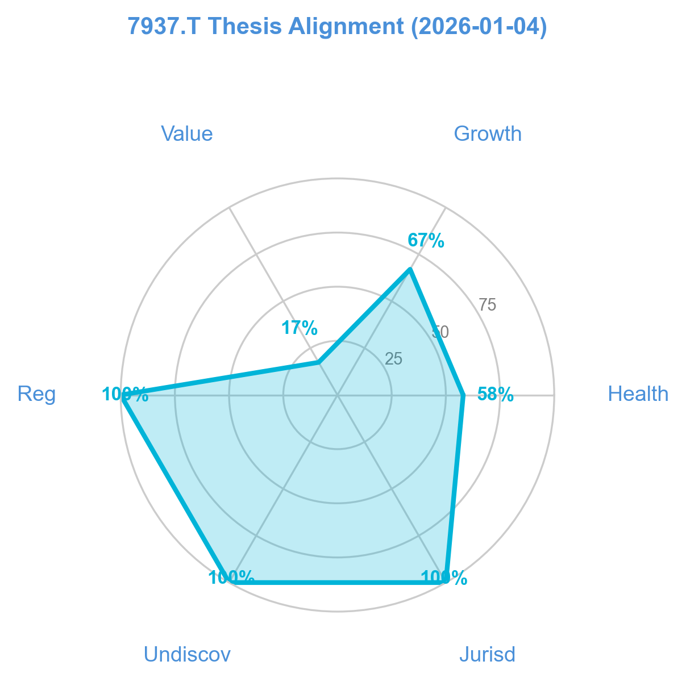
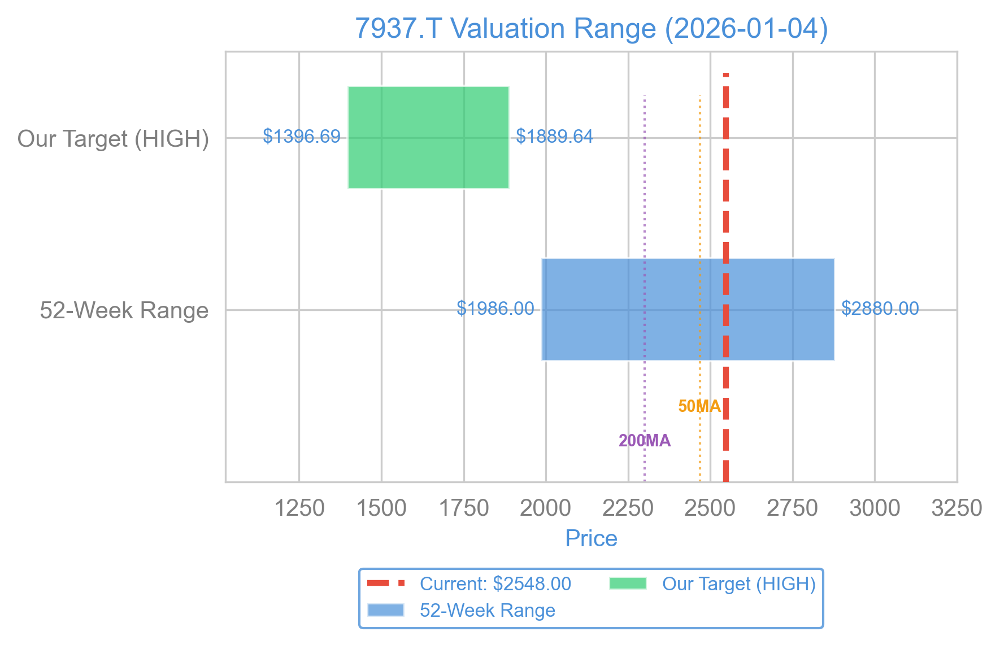

# Tsutsumi Jewelry: Buying Gold at a Discount, If You Can Find the Door

*Editor's Note: Market data in this article is from early January 2026. All currency figures are in Japanese Yen (JPY) unless otherwise noted.*

### The Joy of the "Too Hard" Pile

I have a habit of looking for investments in places where most people simply can't be bothered to look. In my experience, the market is generally efficient at pricing things that are easy to understand and easy to buy. If a stock is listed on the NYSE, has five hundred analysts covering it, and trades millions of shares a second, the price is probably "right."

But if a stock is listed only in Tokyo, has zero English-language analyst coverage, and trades so thinly that a single large market order could move the price by 3%, the market often gets it wrong.

Lately, I've been looking at Tsutsumi Jewelry Co., Ltd. (7937.T).

At first glance, Tsutsumi looks like a mistake. It is a company trading for significantly less than the value of its net assets. It has no debt. It holds enough cash to buy back three-quarters of its own stock. Yet, it receives almost no attention from the Western financial press.

There is usually a reason for this kind of obscurity. Often, the company is a fraud, or the "assets" are intangible goodwill that will disappear in a bankruptcy. But in Tsutsumi’s case, the assets are cash, gold, and diamonds. The reason it is cheap isn't because it is worthless; it is because it is inconvenient.

### The Business of Shiny Things

Tsutsumi Jewelry is a vertically integrated jeweler based in Japan. They don't just sell rings and necklaces; they source the stones, manufacture the pieces, and sell them through their own retail network. They operate trading centers in the US, Belgium, Israel, India, and Thailand to secure diamonds and precious stones directly.

This vertical integration is key to understanding their balance sheet. They are not just a retailer; they are a warehouse for commodities.

The business model is ancient. People have been adorning themselves with shiny rocks for millennia, and they will likely continue to do so. It is not a high-growth tech sector. It is a slow, cyclical, inventory-heavy business.

Currently, the company is benefiting from a structural shift in the Japanese market. With the Yen showing volatility and global inflation persisting, Japanese consumers have been treating jewelry not just as a luxury, but as a store of value.

### The Bull Case: A Financial Fortress

If you are a value investor of the Graham-and-Dodd school, looking at Tsutsumi’s financials is a bit like walking into a thrift store and finding a pristine Rolex in a bin of plastic watches.

**1. Buying Money for 60 Cents**
The most compelling argument for Tsutsumi is the valuation. The stock trades at a Price-to-Book (P/B) ratio of roughly 0.59. This means that for every 100 yen of net assets the company owns, the stock market is asking you to pay only 59 yen.

If this were a software company, a low P/B wouldn't mean much. Software assets are code and people, which walk out the door every evening. But Tsutsumi’s book value is tangible.
*   **Cash:** As of late 2025, they hold approximately ¥1,961 per share in cash and equivalents. With the stock trading around ¥2,548, the cash alone accounts for 77% of the market cap.
*   **Debt:** Zero. They have no interest-bearing debt.

**2. The "Hard Asset" Inflation Hedge**
The remaining value on the books is largely inventory. In retail, inventory is usually a liability—clothes go out of fashion, food spoils. But Tsutsumi’s inventory consists of gold, platinum, and diamonds.

In an inflationary environment, this inventory appreciates. While other retailers are struggling with rising input costs, Tsutsumi is sitting on a stockpile of raw materials acquired at yesterday’s prices. The Bull Case argues that this inventory shouldn't be valued at cost (which is how accounting works), but at current market value, which is likely higher.

**3. The TSE Catalyst**
The Tokyo Stock Exchange (TSE) has been on a mission to shame companies that trade below a P/B of 1.0. They view it as an admission by management that they are destroying value. The TSE has been pressuring these firms to boost their valuations through buybacks or increased dividends. Tsutsumi is a prime target for this pressure. To get back to a P/B of 1.0, the stock would need to rise nearly 70%.

### The Bear Case: The Trap Door

However, if it were that simple, a hedge fund would have bought the whole company by now. There are significant risks here that explain the discount.

**1. The Liquidity Desert**
The biggest risk isn't fundamental; it's mechanical. The average daily turnover for Tsutsumi is around $142,000 USD. To put that in perspective, a single affluent retail trader in the US could accidentally corner the daily liquidity with a market order.

If you buy this stock, you are entering a room with a very small door. If you decide to leave when everyone else wants to leave, you won't fit. You cannot trade this stock with size without moving the price against yourself.

**2. The Cash Flow Disconnect**
While the Net Income is positive (¥1.71 billion), the Operating Cash Flow (OCF) for the trailing twelve months is negative (-¥3.08 billion).

This is a classic red flag. It means the company is reporting profits on paper, but cash is actually leaving the building. Why? Because they are buying massive amounts of inventory.
*   **The Bull view:** They are strategically stocking up on gold before prices rise further.
*   **The Bear view:** They are overstuffing their warehouses with unsold goods that will eventually have to be written down.

If that inventory turns out to be "dead stock" rather than a "strategic hedge," that beautiful book value will evaporate.

**3. The Dividend Confusion**
Data feeds on this stock are messy. Some screeners show a dividend yield of 0.00%. Others show 3.53%. This discrepancy often scares away automated value screens. (My check of the upcoming corporate calendar indicates a 45 JPY dividend is expected in March 2026, which supports the yield thesis, but the confusion itself is a barrier to entry for many).

### Valuation: The Deep Value Discount

To visualize just how disconnected the price is from the fundamentals, look at the valuation ranges below. The stock is currently trading near the bottom of every standard valuation metric except for the P/E ratio, which is elevated due to the current earnings/inventory dynamic.

When we adjust for the massive cash position, the Enterprise Value (EV) is incredibly low. The EV/EBITDA ratio is roughly 3.16x. In the US luxury retail sector, you typically pay 10x to 15x.

### Verdict: Wait for the Proof

I am fascinated by Tsutsumi Jewelry. It checks almost all my boxes: ignored, unloved, asset-rich, and cheap. It is the financial equivalent of a sturdy, mid-century house selling for the price of the lumber.

However, the negative Operating Cash Flow is a problem I cannot ignore. I need to know if they are hoarding gold (smart) or hoarding unsold rings (dangerous).

The next earnings report is expected in early February 2026. This will be the "reveal." If we see the Operating Cash Flow flip back to positive, or if we see strong holiday sales validating the inventory buildup, the thesis holds.

**Action:**
I am rating this a **HOLD / WATCH** for now.

I am not buying yet. I want to see the Q3 numbers. If you are aggressive and feel compelled to buy the "assets for free" thesis immediately, you must respect the liquidity. Do not use market orders. Use limit orders, and keep the position size small—under 1.5% of your portfolio. This is not a stock you can sell in a hurry.

Tsutsumi is a classic example of the friction in real-world markets. The value is there, staring us in the face. The question is whether we can grab it without getting our hands stuck in the jar.

*Disclaimer: This article reflects my personal point of view, and I offer it for informational purposes only. It does not constitute personal advice, and I am not acting in an advisory or fiduciary capacity. The analysis provided here reflects my individual risk tolerance and goals. And, while I have made every effort to ensure the accuracy of what I say, I do make mistakes. Verify all figures through official filings and reports.*

### References
*   [Tsutsumi Jewelry Co., Ltd. Stock Data (Yahoo Finance)](https://finance.yahoo.co.jp/quote/7937.T)
*   [Tokyo Stock Exchange Listed Company Search](https://www2.jpx.co.jp/tseHpFront/JJK010010Action.do?Show=Show)