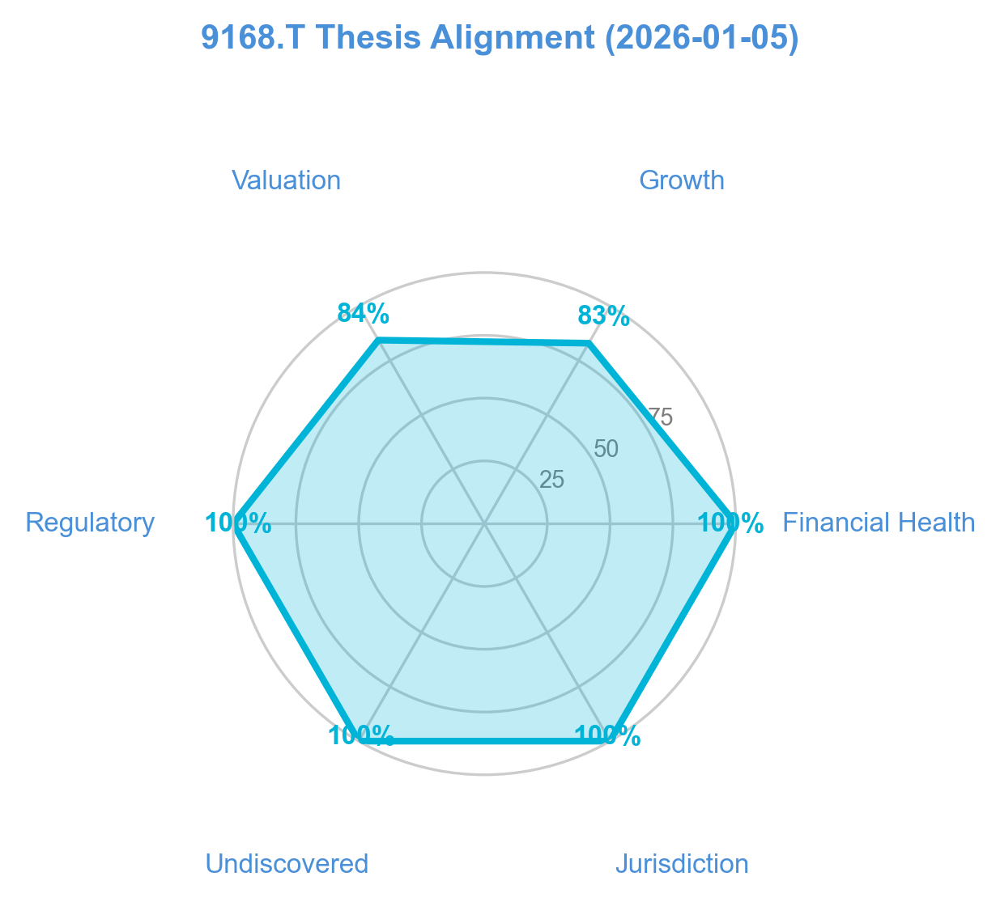
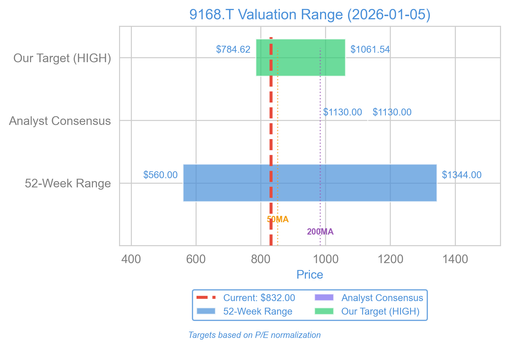

# Rise Consulting Group: Elite Financials Hiding in a Broken Chart

If you search for Rise Consulting Group (9168.T) on StockTwits, you will find silence. If you scour Reddit’s investing boards for mentions of the ticker, you will find zero threads. And if you look for a sponsored American Depositary Receipt (ADR) on a US exchange, you won’t find one.

Usually, when a stock is this obscure, it is for a good reason—it is either insolvent, fraudulent, or simply too small to matter.

Rise Consulting is none of those things. It is a highly profitable Japanese firm with a fortress balance sheet, growing revenue at over 20% year-over-year, and holding a net cash position that creates a tangible floor under its stock price.

Yet, the chart is a disaster. The stock is trading roughly 14% below its 200-day moving average, caught in a persistent downtrend since mid-2025.

This creates a specific type of tension that I look for: a dislocation between business performance (excellent) and price action (terrible). The market is pricing Rise like a stalling, low-margin service firm. The financial statements, however, show a company generating "Rule of 40" metrics usually reserved for high-flying software stocks, all while trading at a forward P/E of roughly 11x.

*Disclaimer: This article reflects my personal point of view and is for informational purposes only. It does not constitute personal advice, and I am not acting in an advisory or fiduciary capacity. Verify all figures through official filings and reports.*

## Thesis Alignment

To frame this discussion: My goal is to identify financially sound companies that the market has temporarily mispriced due to technical factors or lack of discovery. I favor firms with "undiscovered premiums"—stocks that lack analyst coverage and retail hype—provided they have the solvency to survive until the market catches up.

Here is how Rise Consulting aligns with that framework:

## The Business: Strategy vs. Implementation

Rise Consulting Group operates in the Japanese consulting sector. It is important to distinguish what they do from the "strategy" consulting provided by global giants like McKinsey or BCG.

In Japan, there is a massive gap between corporate strategy and execution. Japanese legacy corporations are struggling to digitize (DX) and modernize fast enough to cope with a shrinking workforce. Rise focuses on "hands-on implementation"—they don't just leave a PowerPoint deck and a bill; they embed consultants to execute the changes.

This distinction matters because, just as culture trumps strategy, so also does implementation. Implementation, if completed and done well, is durable.  It leads to more and longer contracts and to deeper integration with clients.

The financials back this up. As of H1 FY2026 (reported October 2025), Rise posted revenue growth of 21.8% year-over-year. More impressively, they maintained an operating margin of roughly 23%.

## The Bull Case: The "Rule of 40" Anomaly

The primary argument for buying Rise is that we are getting high-quality growth at a value price.

### 1. The SaaS Profile at a Value Multiple
Investors often use the "Rule of 40" to evaluate software companies (Revenue Growth % + Profit Margin % should exceed 40). Rise Consulting is not a software company. It is a human-capital business. However, its metrics mimic a software firm: 21.8% Revenue Growth + 23.2% Operating Margin = 45.

Normally, you pay a premium for that combination. Yet Rise trades at a Forward P/E of roughly 10.95. The market is pricing it as a low-growth legacy firm, ignoring the compounding effect of its current trajectory.

### 2. Solvency as a Floor
The company scores an 11 out of 12 on my personal financial health check: They hold a net cash position (Cash of ¥2.89B vs Debt of ¥1.62B). In a high-rate environment, or simply a volatile one, cash provides options. It also lays down a mathematical floor beneath the valuation. Unless the company begins burning cash (which it is not; Operating Cash Flow is a strong ¥1.81B) the downside is limited by the liquidation value of its assets.

### 3. The "Undiscovered" Premium
I currently see only one English-language analyst covering this stock. There is zero US retail chatter. This information asymmetry works to my advantage. When a company with these metrics eventually gets "discovered" by international screeners or adds an ADR, the liquidity inflows often force a repricing. I am positioning myself now, before that happens.

## The Bear Case: The Labor Trap

Despite the glossy financials, I am keeping my position size moderate (3.0%) rather than aggressive. There are some valid reasons why the chart might look broken.

### 1. The Scalability Wall
The "Rule of 40" comparison I used above has a fatal flaw. Software companies scale almost infinitely with code, and network effects are strong. Consulting companies, however, scale linearly with people. Depending on the internal tooling they deploy and the economies of scale they achieve on that basis, Rise will needs to grow its headcount by 20% if, say, they want to increase revenue by 20%.

This is a problem in Japan, a country with a shrinking demographic and a severe labor shortage. The Bear case is that Rise will hit a "hiring wall" where they can't find enough qualified consultants to fulfill demand, or they will have to pay so much in wages that margins compress. We are already seeing the company restructure its Partner-level utilization targets to focus more on sales, which introduces yet another execution risk.

### 2. The "Deep Value" Mirage
Some initial screens might suggest a PEG ratio (Price/Earnings-to-Growth) of 0.50, implying the stock is absurdly cheap. Close examination of the data shows this is an aggressive forward estimate. The actual trailing PEG is 1.26.

A PEG of 1.26 is fair, perhaps even attractive for this quality, but it is not "deep value." Investors expecting a guaranteed double based on a misunderstood metric will be disappointed. We are buying quality, not a discarded cigar butt.

### 3. Technical Weakness
There is, once again, no way to say this gently: The chart is ugly. The stock is trading at 14% below its 200-day Simple Moving Average (SMA). It recently failed to reclaim the 50-day SMA. Buying here is like the proverbial falling-knife catch. Or, to use a different metaphor: The market has not found the bottom.

## Valuation

When we filter out the noise and look at the valuation relative to peers and historical norms, Rise occupies a favorable spot.

At a P/E of roughly 13.5x (TTM) and ~11x (Forward), Rise is trading significantly below the mean target of the lone analyst covering it (1,130 JPY). Even if we discount that target for liquidity risk, the gap between the current price (~830 JPY) and the 200-day average (~980 JPY) represents a 17% "reversion" opportunity alone.

If the company merely maintains its current earnings—forget growth for a moment—the yield on free cash flow (7.58%) is superior to almost any sovereign bond available.

## Verdict

Rise Consulting Group is a classic "baby with the bathwater" scenario. The Japanese small-cap sector has faced selling pressure, and Rise has been dragged down with it, despite reporting fundamentals that are objectively elite.

We have a company with no solvency risk, high margins, and double-digit growth trading at a near-single-digit multiple. The risks regarding labor shortages in Japan are real, but they are long-term structural issues, not immediate threats to next quarter's earnings.

The technical trend, however, commands respect. I am not backing up the truck. I am initiating a **Buy** with a reduced position size (3.0% of the portfolio).

I am splitting this entry into two tranches:
1.  **Tranche 1 (1.5%):** Limit orders near **815 JPY**, catching support near recent lows.
2.  **Tranche 2 (1.5%):** Buy stops at **865 JPY**, entering only if the price breaks above the 50-day moving average to confirm momentum has shifted.

If the price drops below **745 JPY**, the thesis is invalidated—not because the company is bad, but because the market is pricing in a risk (likely regarding hiring/margins) that the lagging financials haven't shown yet.

For US investors, note that this trade requires direct access to the Tokyo Stock Exchange (TSE) via a broker like Interactive Brokers. There is no ticker on the NYSE or Nasdaq.

*Disclaimer: This article reflects my personal point of view and is for informational purposes only. It does not constitute personal advice, and I am not acting in an advisory or fiduciary capacity. The analysis provided here reflects my individual risk tolerance and goals. Verify all figures through official filings and reports.*

## References

*   Rise Consulting Group, Inc. Q2 FY2026 Earnings Presentation (2025-10-14)
*   Tokyo Stock Exchange (TSE) Filings for Ticker 9168
*   Multi-Agent Trading System Analysis Report (2026-01-05)