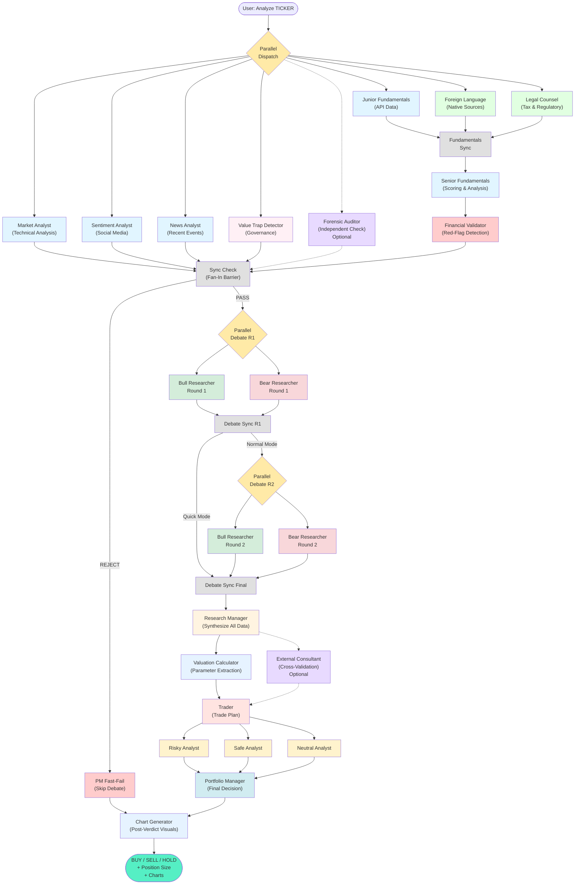

# Multi-Agent International Equity Analysis System

> **An open-source agentic AI system that democratizes sophisticated equity research for international markets**

**If you're concerned about US political instability, rising federal debt, dollar depreciation, or an AI-driven market bubble**, this system offers a way to diversify by evaluating transitional value-to-GARP (Value → Growth at a Reasonable Price) opportunities in ex-US markets. It uses the same multi-perspective analysis patterns employed by institutional research teams, but is powered by free- or cheap-tier AI and financial data APIs and can be run from a basic MacBook or other laptop.

**What you need:** Python 3.12+, a Google Gemini API key (free tier), and basic command-line familiarity. Optional: Additional API keys for enhanced data (FMP, Tavily, EODHD). Everything runs locally on your machine—no cloud subscription required.

[](https://www.python.org/downloads/)
[](https://opensource.org/licenses/MIT)
[](https://github.com/langchain-ai/langgraph)

---

## What Makes This Different

**Most "AI trading bots" are simple scripts.** This is a **thesis-driven fundamental analysis engine** with institutional-grade architecture.

### The Problem This Solves

- **Retail investors lack access** to multi-analyst teams that debate different perspectives
- **Ex-US markets are underserved** by English-language research platforms  
- **Premium research tools cost $2,000-$24,000/year** (Bloomberg, FactSet)
- **Small-cap international stocks** often have zero analyst coverage in the US

### This System Provides

✅ **Multi-Agent Debate Pattern** - Bull/Bear/Risk analysts argue, then a Portfolio Manager decides
✅ **International Coverage** - Handles HK, Japan, Taiwan, Korea with proper FX/exchange logic
✅ **Disciplined Risk Framework** - Hard-fail gatekeeping prevents emotional/hype-driven decisions
✅ **Thesis Alignment Radar** - 6-axis visual showing Health, Growth, Value, Undiscovered, Regulatory, and Jurisdiction
✅ **Visual Valuation Charts** - "Football Field" charts showing price ranges, targets, and moving averages
✅ **Zero Marginal Cost** - Can run (amidst 429s and retries) on free-tier Gemini API, albeit slowly
✅ **Full Transparency** - Every decision explained with supporting data and reasoning

---

## Architecture: Agentic AI at Work

This isn't a single prompt to an LLM. It's a **stateful orchestration** of specialized AI agents, each with distinct roles, debating and synthesizing information through a directed graph workflow.



### How Agents Collaborate

1. **Parallel Data Gathering (Fan-Out)** - Seven analyst branches (plus optional Auditor) run **simultaneously** to maximize speed. In `graph.py`, a conditional edge from the Dispatcher fans out to all branches at once — each branch is a `workflow.add_node()` call with its own tool-calling loop (agent node + tool node pair connected by a `route_tools` conditional edge):
   - Market Analyst — calls `get_technical_indicators`, `calculate_liquidity_metrics` via `toolkit.get_market_tools()`
   - Sentiment Analyst — calls `get_social_media_sentiment`, `get_multilingual_sentiment_search`
   - News Analyst — calls `get_news`, `get_macroeconomic_news`
   - Junior Fundamentals — calls `get_financial_metrics`, `get_fundamental_analysis` (raw API data only)
   - Foreign Language Analyst — calls `search_foreign_sources` (Tavily + DuckDuckGo in parallel) and `get_official_filings` (EDINET/DART structured filing data when available)
   - **Legal Counsel** — calls `search_legal_tax_disclosures` (PFIC/VIE risk, withholding rates)
   - **Value Trap Detector** — calls `get_ownership_structure`, `get_news`, `search_foreign_sources`, `get_official_filings` for governance analysis. Uses native terminology (持ち合い, 재벌, etc.) for jurisdiction-specific searches.
   - **Forensic Auditor** (optional, OpenAI-powered) — uses the same tools as FLA + Junior combined. Retrieves primary financial documents and flags accounting anomalies. Output is available to External Consultant via `auditor_report` in shared state.

   Each branch has its own tool-calling loop (`agent_node` → `route_tools` → `tool_node` → back to `agent_node`). This parallel architecture reduces analysis time by ~60% compared to sequential execution.

2. **Sync Check (Fan-In Barrier)** - All branches converge at synchronization points implemented as barrier nodes in `graph.py`. The Fundamentals Sync waits for **Junior + Foreign Language + Legal Counsel** (3 edges converge) before Senior processes their combined data. The main Sync Check waits for all 7+ branches before proceeding. Each barrier uses a state-counting router that checks whether all expected reports are present before advancing.

3. **Junior/Senior/Foreign/Legal Fundamentals Split** - The Junior Fundamentals Analyst calls data tools (get_financial_metrics, get_fundamental_analysis) and returns raw API data. The Foreign Language Analyst searches native-language sources for segment breakdowns, parent-subsidiary ownership, and filing-level cash flow statements — high-value data that API-only tools miss. The **Legal Counsel** identifies specific jurisdictional risks (e.g., PFIC status for US taxpayers, VIE structure risks in China). The Senior Fundamentals Analyst receives all three data streams, cross-validates operating cash flow against filing data, flags segment deterioration and ownership concentration, and produces scored analysis with a structured DATA_BLOCK.

4. **Red-Flag Pre-Screening** - The Financial Validator (`validators/red_flag_detector.py`) is pure Python, not an LLM — it parses the DATA_BLOCK with exact thresholds for catastrophic risks (extreme leverage >500% D/E, earnings quality issues, refinancing risk, unsustainable distributions, cyclical peak signals) and warning-level flags (segment deterioration, OCF discrepancy, value trap indicators, PFIC/VIE risks). A conditional edge in `graph.py` reads `pre_screening_result`: **REJECT** routes directly to PM Fast-Fail (skipping debate entirely); **PASS** continues to adversarial debate (warnings add risk penalty but don't block).

5. **Adversarial Debate (Parallel Rounds)** - Bull and Bear researchers argue opposite perspectives in parallel rounds (fan-out/fan-in for each round):
   - **Round 1**: Bull R1 and Bear R1 run simultaneously, then converge at Debate Sync R1
   - **Round 2** (normal mode only): Bull R2 and Bear R2 fan out again with R1 context, converge at Debate Sync Final
   - Quick mode (`--quick`): a conditional edge skips R2, routing directly from Debate Sync R1 to Final

6. **Research Synthesis** - After debate converges at Debate Sync Final, the Research Manager combines all analyst reports with full debate history to create an investment plan.

7. **Post-Research Parallel Processing** - Two agents run in parallel after Research Manager, both converging on Trader:
   - **Valuation Calculator** - Extracts valuation parameters (P/E, PEG, sector) from DATA_BLOCK and selects the best valuation method. Python code then calculates price targets (avoiding LLM arithmetic errors).
   - **External Consultant** (Optional) - Independent cross-validation using OpenAI ChatGPT. Reads all analyst reports plus the Forensic Auditor's anomaly findings from shared state to detect biases and validate Gemini's analysis.

8. **Trade Planning** - Trader creates specific execution parameters based on the investment plan, receiving both Valuation Calculator and Consultant outputs.

9. **Risk Assessment (Parallel)** - Three risk analysts run in parallel from Trader, all converging on Portfolio Manager:
   - **Risky Analyst** - Aggressive risk tolerance
   - **Safe Analyst** - Conservative risk tolerance
   - **Neutral Analyst** - Balanced risk tolerance

10. **Executive Decision** - Portfolio Manager synthesizes all viewpoints, applies thesis criteria, and makes final BUY/SELL/HOLD decision with a structured PM_BLOCK output.

11. **Chart Generation (Post-Verdict)** - After Portfolio Manager decides, the Chart Generator creates visualizations that reflect the PM's risk-adjusted view:
    - **Football Field Chart** - Valuation ranges (suppressed for SELL/DO_NOT_INITIATE verdicts)
    - **6-Axis Radar Chart** - Thesis alignment with PM-adjusted scores
    - Both fast-fail and normal paths route through Chart Generator before completing

12. **Lessons Learned (Automatic)** - Compares past analysis verdicts to actual market outcomes. On re-analysis of a ticker, the system automatically evaluates past prediction snapshots; when excess return vs local benchmark exceeds significance thresholds, a single Gemini Flash call generates a generalizable lesson (e.g., "Low PEG in cyclical entertainment stocks indicates peak earnings, not undervaluation"). Lessons are stored in a global ChromaDB collection and injected into Bull/Bear researcher prompts for future analyses. Already-processed snapshots are skipped via early dedup (~50ms), so repeated runs add near-zero overhead. Disabled with `--no-memory`.

**Why This Matters:** Single-LLM (and worse yet, single-prompt) systems are prone to confirmation bias. Multi-model + multi-agent debate forces the system as a whole to consider contradictory evidence, mimicking how institutional research teams actually work. The parallel fan-out/fan-in pattern provides speed without sacrificing data quality. The Junior/Senior/Foreign split uses multiple data pathways (APIs + native-language web sources) to reduce data gaps common when analyzing international stocks. The Financial Validator provides deterministic pre-screening to catch catastrophic risks before debate. The Valuation Calculator separates LLM judgment (method selection) from Python calculation (arithmetic), avoiding LLM math hallucinations. The structured **DATA_BLOCK** and **PM_BLOCK** provide reliable schemas for extracting complex metrics, ensuring the visualization layer remains accurate. The optional External Consultant uses a different AI model (OpenAI) to catch groupthink.

---

## Quick Start

### Prerequisites

- Python 3.12+
- Poetry (dependency management)
- Google Gemini API key (free tier: 15 RPM, slow and glitchy, but workable)
- Optional: Tavily API, FMP API, StockTwits, EODHD access

### Installation

```bash
# Clone repository
git clone https://github.com/yourusername/multi-agent-trading-system.git
cd multi-agent-trading-system

# Install dependencies (creates .venv automatically)
poetry install

# Configure environment
cp .env.example .env
# Edit .env with your API keys (GOOGLE_API_KEY is required)

# Optional: Enable external consultant for cross-validation
# Add OPENAI_API_KEY to .env for ChatGPT-based bias detection
# See docs/CONSULTANT_INTEGRATION.md for details

# Activate virtual environment (if needed for direct python calls)
source .venv/bin/activate  # On macOS/Linux
# OR
.venv\Scripts\activate  # On Windows
```

### Run Your First Analysis

```bash
# Suppress gRPC fork() cleanup issue warnings (mostly an OS/X thing)
export GRPC_VERBOSITY=ERROR
export GRPC_TRACE=""

# Analyze a single ticker
poetry run python -m src.main --ticker 0005.HK

# Output to file (auto-detects non-TTY, outputs clean markdown)
# Use --output to ensure charts are generated and links are correct
poetry run python -m src.main --ticker 0005.HK --output results/0005.HK.md

# Quiet mode (suppress logging, output markdown only)
poetry run python -m src.main --ticker 0005.HK --quiet --output results/0005.HK.md

# Brief mode (header, summary, decision only)
poetry run python -m src.main --ticker 0005.HK --brief --output results/0005.HK_brief.md

# Custom chart format (SVG) and transparency
poetry run python -m src.main --ticker 0005.HK --svg --transparent --output results/0005.HK.md

# Skip chart generation entirely
poetry run python -m src.main --ticker 0005.HK --no-charts

# Verbose logging (more detail than default)
poetry run python -m src.main --ticker 0005.HK --verbose

# Disable persistent memory (skip ChromaDB)
poetry run python -m src.main --ticker 0005.HK --no-memory

# Override AI models via CLI (takes precedence over .env)
poetry run python -m src.main --ticker 0005.HK --quick-model gemini-3-flash-preview --deep-model gemini-3-pro-preview

# Custom image directory
# If --output is provided, --imagedir defaults to {output_dir}/images
# You can override it:
poetry run python -m src.main --ticker 0005.HK --output results/report.md --imagedir results/assets/charts

# Batch retrospective: process all past tickers
poetry run python -m src.main --retrospective-only

# Run with real-time logging visible (unbuffered Python output)
# Redirect to file and monitor with: tail -f scratch/ticker_analysis_info.txt
# Note: Use --output for the report so that charts are generated
poetry run python -u -m src.main --ticker 0005.HK --output scratch/report.md >scratch/ticker_analysis_info.txt 2>&1 &

# Batch analysis (manual ticker list)
./scripts/run_tickers.sh

# Run tests to verify installation
poetry run pytest tests/ -v
```

### Automated Screening Pipeline (Fastest Path to Gems)

Find undervalued international stocks end-to-end — no manual steps:

```bash
# One command: scrape 18+ exchanges → filter by fundamentals → quick-screen
# all candidates → full analysis on BUY verdicts only
./scripts/run_pipeline.sh

# Or step by step:

# 1. Scrape + filter (produces a ticker list)
poetry run python scripts/find_gems.py --output scratch/gems.txt

# 2. Run the 3-stage pipeline against that list
./scripts/run_pipeline.sh --skip-scrape scratch/gems.txt

# Paid API tier? Shorten the cooldown
./scripts/run_pipeline.sh --cooldown 10

# Resume after a crash (already-processed tickers are skipped automatically)
./scripts/run_pipeline.sh --skip-scrape scratch/gems_2026-02-19.txt

# Overnight run on macOS (--yes skips confirmation prompts)
caffeinate -i ./scripts/run_pipeline.sh --yes
```

The pipeline pauses before each AI stage to show a summary (ticker count, estimated time, output location) and asks for confirmation. Use `--yes` / `-y` to skip prompts for unattended runs.

Output lands in `scratch/`: quick-screen reports (`*_quick.md`), full reports for BUYs, and a `buys_YYYY-MM-DD.txt` summary.

### Configuring API Rate Limits (NEW)

The system automatically handles Gemini API rate limits based on your tier.
**Free tier (15 RPM) works out of the box** with no configuration needed.

If you upgrade to a **paid Gemini API tier**, make sure you're using an
API key for the correct project (project settings determine your tier),
and then up your RPM limits in .env:

```bash
# In your .env file, add:
GEMINI_RPM_LIMIT=360   # Paid tier 1: faster than free tier
# or
GEMINI_RPM_LIMIT=1000  # Paid tier 2: should be much, much faster than free tier
```

**Performance comparison (Google Tier 1, paid Tavily, ChatGPT API):**

| Configuration | Time | Cost | Tokens |
|---------------|------|------|--------|
| Pro + Normal mode (DEEP_MODEL=gemini-3-pro-preview) | ~5 min | ~$0.46 | ~244k |
| Flash + Normal mode (DEEP_MODEL=gemini-3-flash-preview) | ~3:15 | ~$0.13 | ~214k |
| Pro + Quick mode (--quick flag) | ~1:40 | ~$0.09 | ~200k |

- **Free tier (15 RPM):** ~1 analysis per 10-20 minutes (sometimes stalling or dying)
- **Paid tier 1 (360 RPM):** ~3-5 analyses in the same period (tested benchmarks above)
- **Paid tier 2 (1000 RPM):** ? analyses in the same period (not tested)

The system applies a 20% safety margin automatically to prevent hitting API limits. For
batch analysis of tickers, paid tiers can reduce runtime substantially.  The system is
complex and expensive, though, when you're running even at tier 1 ($50-100 for a normal
batch of 300 tickers).

### Observability with Langfuse (Optional)

Trace multi-agent analysis runs using [Langfuse](https://langfuse.com) (open-source LLM observability):

1. Set your keys in `.env`:
   ```bash
   LANGFUSE_PUBLIC_KEY=pk-lf-...
   LANGFUSE_SECRET_KEY=sk-lf-...
   LANGFUSE_BASE_URL=https://us.cloud.langfuse.com  # or EU: https://cloud.langfuse.com
   ```

2. Enable tracing per-run via CLI flag:
   ```bash
   poetry run python -m src.main --ticker 0005.HK --trace-langfuse
   ```

   Or enable globally in `.env`:
   ```bash
   LANGFUSE_ENABLED=true
   ```

**Precedence:** CLI flags (`--trace-langfuse`) override `.env` settings, which override
code defaults. This applies to all CLI flags (e.g., `--quick-model` overrides `QUICK_MODEL`
in `.env`).

Each analysis creates a Langfuse session (e.g., `0005.HK-2026-01-28-a3f7b2c1`) with tags
for mode, models, and memory status. Both Langfuse and LangSmith can be enabled simultaneously
-- they use independent tracing mechanisms.

### AI Model Configuration and Thinking Levels (IMPORTANT - Dec 2025)

The system uses a **two-tier thinking level architecture** optimized for both performance and reasoning depth. Understanding this is crucial for reliable operation, especially with
Gemini models.

#### Two-Tier Thinking System

### Tier 1: Data Gathering Agents (Always LOW thinking)

- Market, Social, News, Fundamentals, Foreign Language, and Junior Analysts
- All use `QUICK_MODEL` (set this to a fast model for simple extraction tasks)
- **Automatically sets `thinking_level="low"`** for Gemini 3+ models
- Small context (~3-8k tokens), simple data extraction - doesn't need deep reasoning

### Tier 2: Synthesis & Decision Agents (Mode-Dependent thinking)

- Bull/Bear Researchers, Research Manager, Portfolio Manager, Risk Analysts
- Uses `DEEP_MODEL` (reasoning model for complex analysis)
- **Quick mode (`--quick`):** `thinking_level="low"` (faster, less deep reasoning)
- **Normal mode (default):** `thinking_level="high"` (slower, deeper reasoning)
- Large context (~100k-180k tokens), heavy reasoning load - benefits from high thinking

#### Critical Recommendation: Use Gemini 3+ (flash) for QUICK_MODEL

**⚠️ IMPORTANT:** If you're using Gemini models, use **Gemini 3+** (e.g., `gemini-3-pro-preview`)
for your `QUICK_MODEL`, not Gemini 2.x models.

**Why?** The 4 data gathering agents call tools to fetch financial data. Gemini 2.x models have **tool-calling bugs** with some LangGraph versions that can cause failures during data collection. Gemini 3+ models work reliably.

### What happens if you use Gemini 2.x for QUICK_MODEL

- You'll see a WARNING log message at startup
- Data gathering agents may fail to fetch financial data correctly
- The entire analysis pipeline depends on clean data from these agents, so results will degrade

### Recommended configuration** (in your environment or code)

```bash
# For best results with Gemini models:
QUICK_MODEL=gemini-3-pro-preview    # For data gathering (thinking_level="low" auto-set)
DEEP_MODEL=gemini-3-pro-preview     # For synthesis (thinking_level="high" in normal mode)

# Or use different tiers if you have API access:
QUICK_MODEL=gemini-3-flash-preview  # Faster, cheaper data gathering
DEEP_MODEL=gemini-3-pro-preview     # More powerful synthesis
```

**Note:** Model configuration is controlled via environment variables in your `.env` file

```bash
QUICK_MODEL=gemini-3-flash-preview  # Used by data gathering agents
DEEP_MODEL=gemini-3-pro-preview     # Used by synthesis agents in normal mode
```

The defaults (if not set) are defined in `src/config.py`. All LLM instances are automatically tracked for proper cleanup at application shutdown.

#### Performance Implications

### Quick mode (`--quick`):

- 1 debate round vs 2 (50% fewer agent turns)
- All synthesis agents use `thinking_level="low"` (faster responses)
- **Tested runtime:** ~1:40 per ticker (Pro model), ~$0.09 cost
- **Trade-off:** Less thorough reasoning, may miss nuanced risks

### Normal mode (default):

- 2 debate rounds (more adversarial back-and-forth)
- All synthesis agents use `thinking_level="high"` (deeper reasoning)
- **Tested runtime:** ~5 min (Pro) or ~3:15 (Flash), cost $0.46 / $0.13
- **Benefit:** More thorough analysis, better risk detection, higher quality recommendations

For batch analysis of 300+ tickers, quick mode can save hours of runtime but may produce less rigorous recommendations. Use normal mode for final investment decisions.

### Batch Analysis - Screening Hundreds of Tickers

For serious portfolio construction, you'll want to screen many candidates at once. Here's one way
to generate and analyze a large watchlist.

#### Step 1: Generate Your Ticker List with AI

Use ChatGPT, Claude, or Gemini with this prompt to generate a candidate list:

```text
Generate a plain-text list of 300-500 Yahoo Finance ticker symbols for international equities that meet these criteria:

REQUIRED:
- Listed on major exchanges in: Japan, Hong Kong, Taiwan, South Korea, Singapore, UK, Germany, Switzerland, France, Canada, Australia
- Mid-cap to large-cap (market cap $500M - $50B USD)
- Reasonable liquidity (average daily volume >$500k USD)
- Growth potential: revenue growth >5% annually OR margin expansion trajectory
- Value characteristics: P/E <25, P/B <3
- NO PFIC reporting risks (avoid passive foreign investment companies like REITs, mutual funds)
- NO restricted markets for US investors (no Chinese A-shares, no sanctioned countries)

FORMAT:
- Yahoo Finance format tickers (e.g., 7203.T for Toyota, 0700.HK for Tencent)
- One ticker per line
- No explanations, headers, or additional text
- Plain text only

Focus on: industrials, technology, consumer discretionary, healthcare
Exclude: financials, REITs, utilities, telecoms

Output the list and provide a download link so I can save it as sample_tickers.txt.  Make sure there is one ticker to a line, with no comments.
```

**Alternative:** Ask the AI to output as a code block you can copy directly:

```text
[Same prompt as above, but add:]

Format the output as a code block so I can copy-paste it into a text file.
```

#### Step 2: Save the Ticker List

Save the AI-generated list to `scratch/sample_tickers.txt`:

```bash
# Create the file (example tickers shown)
cat > scratch/sample_tickers.txt << 'EOF'
7203.T
6758.T
0700.HK
0005.HK
2330.TW
005930.KS
NOVN.SW
ASML.AS
SAP.DE
SHOP.TO
EOF

# Or paste your AI-generated list into the file with a text editor
```

#### Step 3: Run Batch Analysis

Note: **⚠️ This will take a long time (likely a day or more for 300+ tickers)**

```bash
# macOS users: Prevent sleep during long analysis
caffeinate -i ./scripts/run_tickers.sh

# Linux/WSL users: Run normally
./scripts/run_tickers.sh

# Or run in background with logging (logs still go to stderr/file depending on mode)
./scripts/run_tickers.sh --loud 2> batch_analysis.log &
```

**Timing estimates (Google Tier 1):**

| Tickers | Quick (~1:40/ea) | Flash Normal (~3:15/ea) | Pro Normal (~5 min/ea) |
|---------|------------------|-------------------------|------------------------|
| 50 | ~1.4 hrs, ~$5 | ~2.7 hrs, ~$7 | ~4.2 hrs, ~$23 |
| 100 | ~2.8 hrs, ~$9 | ~5.4 hrs, ~$13 | ~8.3 hrs, ~$46 |
| 300 | ~8 hrs, ~$27 | ~16 hrs, ~$39 | ~25 hrs, ~$138 |

**Note**: Small-cap/illiquid stocks may still show data gaps, but this *usually* reflects
genuine data unavailability from financial APIs, not system failures.

**Pro tip for macOS users:**
The `caffeinate -i` command prevents your Mac from sleeping because it think it's inactive.
(It may sleep for other reasons even with caffeinate.)

#### Step 4: Review Results

Results are saved to `scratch/ticker_analysis_results.md`:

```bash
# View results
cat scratch/ticker_analysis_results.md

# Filter for BUY recommendations only
egrep '^###.*PORTFOLIO MANAGER VERDICT.*BUY *$' scratch/ticker_analysis_results.md

# Count decisions
echo "BUY: $(egrep -c '^###.*PORTFOLIO MANAGER VERDICT.*BUY *$' scratch/ticker_analysis_results.md)"
echo "HOLD: $(egrep -c '^###.*PORTFOLIO MANAGER VERDICT.*HOLD *$' scratch/ticker_analysis_results.md)"
echo "SELL: $(egrep -c '^###.*PORTFOLIO MANAGER VERDICT.*SELL *$' scratch/ticker_analysis_results.md)"
```

#### What to Expect

Versions of the codebase have varied in their strictness, but in general, from a list of 300 candidates, you'll typically get:

- **BUY recommendations:** 25-50 stocks (depends on model used)
- **HOLD recommendations:** 5-50 stocks (interesting but flawed or uncertain equities)
- **SELL recommendations:** 200+ stocks (thesis violations, poor fundamentals)

The system is **intentionally conservative** - it's designed to find the best candidates, not to give you 100 "buys."

### Example Output Structure

```markdown
# 2412.TW (Chunghwa Telecom Co., Ltd.): SELL
**Analysis Date:** 2025-12-17 23:57:57
---
## Executive Summary
### FINAL DECISION: SELL

### THESIS COMPLIANCE SUMMARY

**Hard Fail Checks:**
- **Financial Health**: 67% (Adjusted) - [PASS]
- **Growth Transition**: 67% (Adjusted) - [PASS]
- **Liquidity**: PASS - [PASS]
- **Analyst Coverage**: 6 - [PASS]
- **US Revenue**: Not disclosed - [N/A]
- **P/E Ratio**: 26.37 (PEG: 5.49) - [FAIL]

**Hard Fail Result**: **FAIL on: [P/E Ratio > 25]**

**Qualitative Risk Tally** (Calculated for context, though Hard Fail triggers SELL):
- **ADR (MODERATE_CONCERN)**: [+0.33]
- **ADR (EMERGING_INTEREST bonus)**: [+0]
- **ADR (UNCERTAIN)**: [+0]
- **Qualitative Risks**: Valuation Disconnect [+1.0], Geopolitical Strategy Risk [+1.0]
- **US Revenue 25-35%**: [+0]
- **Marginal Valuation**: [+0] (N/A, P/E > 25 is beyond marginal)
- **TOTAL RISK COUNT**: 2.33
...
```

### Troubleshooting

#### Poetry/Dependency Issues

If you encounter import errors, dependency conflicts, or weird behavior after updating dependencies:

```bash
# Complete clean rebuild (recommended)
poetry env remove --all && rm poetry.lock && poetry install

# Quick rebuild (keeps lock file)
poetry env remove --all && poetry install

# Nuclear option (if nothing else works)
poetry env remove --all
poetry cache clear pypi --all
rm poetry.lock
poetry install
```

#### Common Issues

**Problem:** `ImportError: No module named 'langchain'`  
**Solution:** Run `poetry install` to create/update virtual environment

**Problem:** `ModuleNotFoundError` after git pull  
**Solution:** Dependencies changed - run `poetry env remove --all && poetry install`

**Problem:** Tests failing with import errors  
**Solution:** Rebuild environment with commands above

**Problem:** Poetry complains about Python version  
**Solution:** Ensure Python 3.12+ is active: `python --version`

**Problem:** API errors or rate limits  
**Solution:** Check `.env` file has valid API keys, verify quotas at provider dashboards

---

## IBKR Portfolio Management (Optional)

For users who trade international equities via Interactive Brokers, an optional reconciliation tool bridges the gap between evaluator recommendations and live portfolio positions.

```bash
# Requires IBKR credentials in .env and the ibind optional dependency
poetry install -E ibkr

# All portfolio_manager.py commands require the Poetry venv.
# Either prefix every command with `poetry run`, or activate once:
source .venv/bin/activate   # then plain `python` works for the session

# Verify credentials and IBKR connection before doing anything else
poetry run python scripts/portfolio_manager.py --test-auth
# Checks every required env var, validates RSA key files locally
# (sign/verify + encrypt/decrypt round-trips), then opens a live
# read-only session and prints account ID, portfolio value, and cash.
# Prompts for IBKR_OAUTH_ACCESS_TOKEN_SECRET if it's not in .env.

# Report only (no IBKR connection needed in --read-only mode)
poetry run python scripts/portfolio_manager.py --read-only

# Full reconciliation against live IBKR positions
poetry run python scripts/portfolio_manager.py

# With order size recommendations
poetry run python scripts/portfolio_manager.py --recommend

# Place orders interactively (per-order confirmation)
poetry run python scripts/portfolio_manager.py --execute

# Re-run evaluator on stale analyses and then reconcile
poetry run python scripts/portfolio_manager.py --refresh-stale --quick
```

The tool compares live IBKR positions against the latest analysis JSONs in `results/` and produces position-aware actions:

| Action | Trigger |
|--------|---------|
| **BUY** | Not held, evaluator says BUY, cash available |
| **SELL** | Held + evaluator says SELL/DNI, or stop-loss breached |
| **TRIM** | Held and overweight vs target allocation |
| **HOLD** | Within target range, verdict is BUY |
| **REVIEW** | Stale analysis, no analysis, or price target hit |

Staleness detection flags analyses older than 14 days or with >15% price drift from the TRADE_BLOCK entry price. A configurable cash buffer (default 5% of portfolio) is reserved and never deployed into new positions.

See `src/ibkr/` for the supporting modules and `src/ibkr_config.py` for credential configuration.

---

## Investment Thesis (Built-In)

The system enforces a **value-to-growth transition** strategy focused on:

### Hard Requirements

- ✅ **Financial Health Score ≥ 50%** - Sustainable profitability, cash flow, manageable debt
- ✅ **Growth Score ≥ 50%** - Revenue/EPS growth, margin expansion, or turnaround trajectory  
- ✅ **Liquidity ≥ $500k USD daily** - Tradeable via IBKR without excessive slippage ($500k = PASS, $100k-$500k = MARGINAL, <$100k = HARD FAIL)
- ✅ **Analyst Coverage < 15** - "Undiscovered" by mainstream US research

### Soft Factors (Risk Scoring)

- Valuation (P/E ≤ 18, PEG ≤ 1.2, P/B ≤ 1.4)
- US Revenue exposure (prefer less exposure here)
- ADR availability (sponsored means equity is well "discovered")
- Qualitative risks (geopolitical, industry headwinds, management issues)

**Philosophy:** Find mid-cap stocks in international markets that are transitioning from value (undervalued) to growth (expansion phase), before too many US analysts discover them.  One of the few ways retail can generate alpha, competing against major funds, hedgies, etc.

---

## Technical Highlights

### Robust Data Pipeline

The system uses a **smart fallback architecture** to handle unreliable free APIs.  I wish web (Tavily) were more reliable, but, sigh:

```python
# Simplified data fetching logic (actual implementation fetches all sources in parallel)
async def get_financial_metrics(ticker):
    # All sources fetched simultaneously via ThreadPoolExecutor
    results = await fetch_all_sources_parallel(ticker)  # yfinance, yahooquery, FMP, EODHD, Alpha Vantage
    merged = merge_all(results)  # Best value wins per metric
    if critical_gaps(merged):
        merged = fill_with_tavily_search(ticker)  # Web search fallback
    return validate_and_sanitize(merged)
```

**Data Sources** (fetched in parallel, merged by priority):

1. **yfinance** - Primary (free, comprehensive)
2. **YahooQuery** - Backup for specific metrics
3. **FMP** (Financial Modeling Prep) - Premium data if API key provided
4. **EODHD** - Alternative fundamental data (paid for a key, but still not great for international equities)
5. **Alpha Vantage** - Additional fundamental data source
6. **Tavily + DuckDuckGo** - Dual web search (run in parallel, results merged and deduplicated). DDG is free with no API key, providing a different search index from Tavily.
7. **Official Filing APIs** - EDINET (Japan), with DART (Korea) and Companies House (UK) planned. Structured filing data (shareholders, segments, cash flow) that web search can't reliably surface.

### Memory System (Ticker Isolation)

Each ticker analysis gets **isolated ChromaDB collections** to prevent cross-contamination:

```python
# Before fix: Global memory led to Canon data bleeding into HSBC analysis
# After fix: Ticker-specific namespaces
memories = create_memory_instances("0005.HK")
# → Creates: 0005_HK_bull_memory, 0005_HK_bear_memory, etc.
```

**Why This Matters:** Without isolation, the AI might reference Samsung's chip shortage when analyzing an unrelated Hong Kong bank stock.  And yes, this kept happening.  When writing agentic systems, agents need to share data when you want them to, not when you don't, and historical data (Chroma) needs to be stored carefully (here by ticker) or it cross-contaminates later runs that use it.

### Prompt Engineering Excellence

Each agent uses **versioned, structured prompts** in a separate `prompts/` subdirectory, with strict output formats:

```json
{
  "agent_key": "fundamentals_analyst",
  "version": "7.1",
  "system_message": "### CRITICAL: DATA VALIDATION\n\nBEFORE reporting ANY metric as N/A:\n1. Verify tool returned null/error\n2. Document which tool and response\n3. Only then mark N/A...",
  "metadata": {
    "thesis_version": "7.0",
    "changes": "Updated to receive raw JSON from Junior Analyst"
  }
}
```

Prompts enforce **algorithms via natural language** (e.g., "IF US Revenue > 35%: FAIL (hard fail)"), combining deterministic rules with LLM reasoning, such as it is as of late 2025.

---

## Performance & Accuracy

### Third-Party Validation (Grok/Gemini Analysis)

**Overall Assessment:** 80%-ish accuracy on quantitative metrics, with some limitations on sentiment analysis for mega-cap stocks and messy ADR detection and liquidity calculation (turns out, currencies are hard).

**Strengths Identified:**

- ✅ Quantitative metrics (P/E, ROE, revenue growth) match Yahoo Finance/Bloomberg
- ✅ Handles obscure small-caps better than free tools (e.g., SAKURA Internet 3778.T)
- ✅ Multi-agent debate reduces hallucination vs single-prompt systems
- ✅ "Data Vacuum" logic prevents fabrication when data unavailable

**Weaknesses Identified:**

- ⚠️ Enforces "undiscovered" thesis for mega-caps (HSBC, Samsung are well-known, for example)
- ⚠️ Yet, favors mega-caps in a weird way because you can find data on them!
- ⚠️ Can't fully match real fund managers, who have just amazing data at their fingertips
- ⚠️ Sentiment analysis limited by free StockTwits API (misses institutional sentiment)
- ⚠️ Currencies aren't handled perfectly (liquidity is especially hard to get right)

### Speed & Cost

**Tested with Google Tier 1, paid Tavily, ChatGPT API (Dec 2025):**

| Configuration | Time | Cost per Ticker |
|---------------|------|-----------------|
| `DEEP_MODEL=gemini-3-pro-preview` (normal) | ~5 min | ~$0.46 |
| `DEEP_MODEL=gemini-3-flash-preview` (normal) | ~3:15 | ~$0.13 |
| `--quick` flag (any DEEP_MODEL) | ~1:40 | ~$0.09 |

- **Quick Mode:** ~$0.09/ticker, 1:40 runtime, 1 debate round
- **Normal + Flash:** ~$0.13/ticker, 3:15 runtime, 2 debate rounds (best value)
- **Normal + Pro:** ~$0.46/ticker, 5 min runtime, 2 debate rounds (most thorough)
- **API Cost:** $0 on Gemini free tier (15 RPM limit - slow for big jobs)
- **Scalability:** Deploy to Azure Container Instances for 24/7 batch processing

To assess costs, run: `python examples/check_token_costs.py`. For batch analysis of 300 tickers:
- Quick mode: ~$27, ~8 hours
- Flash normal: ~$39, ~16 hours
- Pro normal: ~$138, ~25 hours

One future enhancement would be to include building the pre-search for hundreds of tickers to look at right in, as an option, so the scan could be started without having to use the ```scripts/run_tickers.sh``` wrapper.  Another might be building in a real UI, lol.

---

## Learning Agentic AI

This repository is an educational resource for understanding **production-grade agentic systems**:

### Key Concepts Demonstrated

1. **State Machines (LangGraph)** - Conditional routing, loops, human-in-the-loop checkpoints
2. **Memory Isolation** - Preventing RAG context bleeding across analyses  
3. **Tool Use** - LLMs calling Python functions (data fetchers, calculators, web search)
4. **Structured Outputs** - Enforcing consistent, structured reporting formats via prompts
5. **Debate Patterns** - Adversarial multi-agent collaboration (reduces bias)

### Architecture Patterns Worth Studying

```text
├── prompts/                  # Versioned agent prompts (JSON) — each agent has its own file
│   ├── fundamentals_analyst.json      # Senior Fundamentals (DATA_BLOCK scoring)
│   ├── foreign_language_analyst.json  # Native-language search (segments/ownership/filing CF)
│   ├── value_trap_detector.json       # Governance analysis (VALUE_TRAP_BLOCK)
│   ├── legal_counsel.json             # PFIC/VIE risk detection
│   ├── bull_researcher.json           # Pre-mortem failure analysis, adversarial debate
│   ├── bear_researcher.json           # Kill criteria, downside probability
│   ├── portfolio_manager.json         # Final decision with PM_BLOCK output
│   └── ...                            # research_manager, writer, risk analysts, etc.
│
├── src/
│   ├── main.py               # CLI entry point — parses args, calls run_analysis(), optional article generation
│   ├── graph.py              # LangGraph StateGraph — wires nodes, edges, fan-out/fan-in barriers, conditional routing
│   ├── agents.py             # Node factories — create_analyst_node(), create_researcher_node(), etc.
│   │                         #   Each factory returns a callable that graph.py registers via workflow.add_node()
│   ├── toolkit.py            # @tool functions — get_financial_metrics, search_foreign_sources, get_official_filings, etc.
│   │                         #   Toolkit class groups tools by agent role (get_foreign_language_tools(), etc.)
│   ├── prompts.py            # Loads versioned JSON prompts, injects ticker/date context into system messages
│   ├── config.py             # Pydantic Settings — validated config from .env, API key getters, directory setup
│   ├── llms.py               # LLM factory — create_gemini_model(), create_writer_llm() (Claude), thinking levels
│   ├── memory.py             # ChromaDB vector store — ticker-isolated collections, prevents cross-contamination
│   ├── observability.py      # Langfuse/LangSmith callback setup for tracing
│   ├── report_generator.py   # Formats final markdown report from graph state
│   ├── article_writer.py     # Post-graph article generation (Claude-first, Gemini fallback; --article flag)
│   ├── fx_normalization.py   # Live FX rates (yfinance) for international liquidity calculation
│   ├── ticker_utils.py       # Ticker normalization (7203 → 7203.T), company name cleaning
│   ├── ticker_corrections.py # Known ticker format corrections by exchange
│   ├── tavily_utils.py       # Shared Tavily search-with-timeout (breaks circular import)
│   ├── consultant_tools.py   # Tools available to the External Consultant (spot-check metrics)
│   ├── enhanced_sentiment_toolkit.py  # Multilingual sentiment search tool
│   ├── liquidity_calculation_tool.py  # $500k USD threshold check with FX conversion
│   ├── stocktwits_api.py     # StockTwits social sentiment data
│   ├── token_tracker.py      # Token usage tracking across agents
│   ├── cleanup.py            # Graceful shutdown — closes LLM connections, ChromaDB handles
│   │
│   ├── validators/
│   │   └── red_flag_detector.py  # Deterministic pre-screening — sector-aware thresholds, code-driven (not LLM)
│   ├── charts/
│   │   ├── base.py           # Chart dataclasses (FootballFieldData, RadarChartData, ChartConfig)
│   │   ├── chart_node.py     # LangGraph node — runs post-PM to generate charts from PM_BLOCK
│   │   ├── extractors/       # Parse DATA_BLOCK, PM_BLOCK, VALUATION_PARAMS into chart data
│   │   └── generators/       # Matplotlib/Seaborn chart rendering (football field, radar)
│   └── data/
│       ├── fetcher.py        # Smart multi-source pipeline — parallel fetch, merge-by-priority, gap detection
│       ├── validator.py      # Financial data sanity checks (P/E not 50,000, etc.)
│       ├── interfaces.py     # Abstract base for data source fetchers
│       ├── fmp_fetcher.py    # Financial Modeling Prep integration
│       ├── eodhd_fetcher.py  # EODHD international data integration
│       ├── alpha_vantage_fetcher.py  # Alpha Vantage fallback
│       └── filings/          # Official filing APIs (EDINET for Japan, DART for Korea — phase 2)
│           ├── base.py       # FilingResult dataclass + FilingFetcher ABC
│           ├── registry.py   # Suffix→fetcher dispatcher (e.g., .T → EDINET)
│           └── edinet_fetcher.py  # Japan EDINET: shareholders, segments, cash flow from 有価証券報告書
```

**How the pieces connect:** `main.py` calls `create_graph()` in `graph.py`, which builds a `StateGraph` by registering nodes from `agents.py` factories, binding tools from `toolkit.py`, and wiring edges (including conditional fan-out/fan-in barriers). Each agent node receives a system prompt from `prompts.py`, calls an LLM from `llms.py`, and writes results to typed state fields. The `data/` layer provides financial data to tools; `validators/` pre-screens before debate; `charts/` visualizes after the PM decides. The `article_writer.py` is entirely outside the graph — a post-analysis step triggered by `--article`.

**Why This Matters for Practitioners:**

- Most tutorials show toy examples. This shows how to handle **production edge cases** (network failures, data corruption, API rate limits)
- Demonstrates **separation of concerns** (agents, tools, data, orchestration)
- Includes **tests** that actually run (not aspirational TODO comments)

---

## Democratizing Finance

### The Vision

**Institutional research is a luxury good.** A single Bloomberg Terminal costs $24,000/year. A hedge fund analyst team costs $500k-$2M annually. This system provides:

- **Institutional-quality analysis** for $0 marginal cost
- **Global market access** without multilingual analysts
- **Systematic discipline** replacing emotional trading
- **Reproducible research** with versioned prompts and auditable decisions

### Real-World Use Cases

✅ **Individual Investors** - Diversify into ex-US markets with confidence  
✅ **AI Researchers** - Study multi-agent coordination in complex domains  
✅ **Educators** - Teach agentic AI, RAG, and LangGraph through practical finance  
✅ **Startups** - Foundation for boutique research services

### Limitations & Reality Check

❌ **Not a Get-Rich-Quick Bot** - This is a research tool, not an execution engine  
❌ **Data Quality** - Free APIs have gaps; premium data costs money for a reason  
❌ **Backward-Looking** - Analyzes historical financials; struggles with forward catalysts  
❌ **No Real-Time Execution** - You must manually place trades via your broker

**Use this for:** Generating a shortlist of candidates for deep due diligence  
**Don't use this for:** Automated trading, day trading, options strategies

---

## Testing & Quality

### Comprehensive Test Suite

Run tests if you are thinking of changing anything or issuing a PR, or even if you've forked the repo and are, e.g., changing the investment hypothesis.  Make new tests to cover code you write.

```bash
# Run all tests
poetry run pytest tests/ -v

# Run specific test categories
poetry run pytest tests/test_memory_isolation.py -v
poetry run pytest tests/test_toolkit.py -v
poetry run pytest tests/test_liquidity_tool.py -v

# Check coverage
poetry run pytest --cov=src tests/
```

**Test Coverage:**

- ✅ Unit tests for all data fetchers and validators
- ✅ Integration tests for memory isolation  
- ✅ Edge case tests for AI response malformation
- ✅ Live API tests (skipped in CI, run manually)

**Lesson:** Edge case testing is essential for AI systems that consume unreliable external data.  It's not easy to get agentic AI systems right.  They require a lot of care, almost like people.

---

## Deployment (Educational Reference)

### Docker Support (Modernized Dec 2025)

Production-ready **multi-stage Dockerfile** (Poetry 2.x, non-root user, ~40% smaller images):

```bash
# Build and run
docker build -t trading-system .
docker run --env-file .env trading-system --ticker 0005.HK --quick

# Or use docker-compose
docker compose run --rm investment-agent --ticker 7203.T
```

**Updates**: Fixed health checks for batch jobs, ChromaDB dependencies, security hardening. See `Dockerfile` for details.

### Azure Container Instances (Terraform)

Reference implementation for cloud deployment (requires customization):

```bash
cd terraform/
terraform init
terraform plan -var="google_api_key=your_key"  # Review carefully
terraform apply  # Only after validating plan
```

**Recent fixes** (Dec 2025): Removed broken HTTP health checks (batch job doesn't need them), updated Gemini model names, added backend config example (commented). See `terraform/main.tf` for guidance.

**Note:** Infrastructure configs are **educational examples**—they won't run out-of-the-box. Customize for your environment or ask coding AIs (Anthropic Claude works well, as of Dec 2025) for help. See `CLAUDE.md` for architecture details.

### GitHub Actions (CI/CD)

```yaml
# .github/workflows/test.yml
- Runs pytest on every push
- Validates prompt JSON schemas
- Checks code style with ruff
```

---

## Contributing

Contributions welcome! Areas for improvement:

1. **Data Sources** - Integrate Polygon.io, Coingecko, or other specialized APIs
2. **Sentiment** - Add X (Twitter) API, Reddit scraping, or Stocktwits Pro
3. **Execution** - IBKR API integration for automated order placement
4. **UI** - Streamlit/Gradio frontend for non-technical users
5. **Backtesting** - Historical performance simulation framework

### Development Setup

```bash
# Install dev dependencies
poetry install --with dev

# Run linter
poetry run ruff check src/

# Format code  
poetry run ruff format src/

# Type checking
poetry run mypy src/
```

### Project Structure Notes

**scratch/ Directory:** Used for temporary analysis output and test files. The `.gitignore` excludes all contents but keeps the directory:

```gitignore
# In .gitignore
scratch/*
!scratch/.gitkeep
```

This ensures the directory exists for scripts like `run_tickers.sh` while keeping analysis output local.

---

## License & Disclaimer

**License:** MIT - Free for commercial and personal use

**Disclaimer:** This system is for **research and educational purposes only**. It is **NOT financial advice**.

- AI systems can make errors or be biased
- Data sources may have inaccuracies or delays  
- International investing carries currency, political, and regulatory risks
- Always conduct independent due diligence before investing real money

**DYOR (Do Your Own Research)** - Use this tool to generate ideas, not to make final decisions.

---

## Acknowledgments

**Built With:**

- [LangChain](https://python.langchain.com/) & [LangGraph](https://langchain-ai.github.io/langgraph/) - Agent orchestration
- [Google Gemini](https://deepmind.google/technologies/gemini/) - LLM inference (free tier!)
- [ChromaDB](https://www.trychroma.com/) - Vector storage  
- [yfinance](https://github.com/ranaroussi/yfinance) - Market data
- [Tavily](https://tavily.com/) - Web search API

**Inspiration:**

- [Fareed Khan](https://levelup.gitconnected.com/building-a-deep-thinking-trading-system-with-multi-agentic-architecture-c13da7effd2d) - Multi-agent trading systems
- [Clive Thompson](https://www.linkedin.com/in/clive-thompson-661997251) - just a smart value trader
- Institutional research teams at hedge funds and investment banks
- The open-source AI community making powerful tools accessible

---

## Questions or Feedback?

- **Issues:** [GitHub Issues](https://github.com/rgoerwit/ai-investment-agent/issues)
- **LinkedIn:** [Your Profile](https://www.linkedin.com/in/goerwitz)

---

If you found this useful, please star the repo - it helps others discover the project.

Fork it, improve it, share it. Let's democratize sophisticated financial analysis together.
