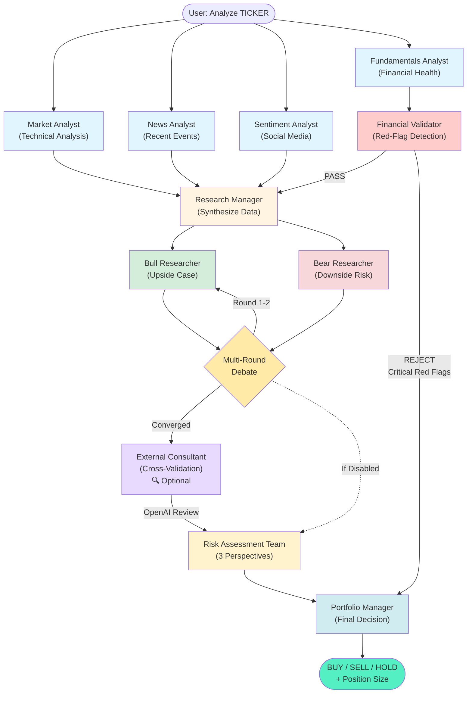

# 🌐 Multi-Agent International Equity Analysis System

> **An open-source agentic AI system that democratizes sophisticated equity research for international markets**

**If you're concerned about US political instability, rising federal debt, dollar depreciation, or an AI-driven market bubble**, this system offers a way to diversify by evaluating GARP (Growth at a Reasonable Price) opportunities in ex-US markets. It uses the same multi-perspective analysis patterns employed by institutional research teams, but is powered by free- or cheap-tier AI and financial data APIs and can be run from a basic MacBook or other laptop.

**What you need:** Python 3.12+, a Google Gemini API key (free tier), and basic command-line familiarity. Optional: Additional API keys for enhanced data (FMP, Tavily, EODHD). Everything runs locally on your machine—no cloud subscription required.

[](https://www.python.org/downloads/)
[](https://opensource.org/licenses/MIT)
[](https://github.com/langchain-ai/langgraph)

---

## 🎯 What Makes This Different

**Most "AI trading bots" are simple scripts.** This is a **thesis-driven fundamental analysis engine** with institutional-grade architecture.

### The Problem This Solves

- **Retail investors lack access** to multi-analyst teams that debate different perspectives
- **Ex-US markets are underserved** by English-language research platforms  
- **Premium research tools cost $2,000-$24,000/year** (Bloomberg, FactSet)
- **Small-cap international stocks** often have zero analyst coverage in the US

### This System Provides

✅ **Multi-Agent Debate Pattern** - Bull/Bear/Risk analysts argue, then a Portfolio Manager decides  
✅ **International Coverage** - Handles HK, Japan, Taiwan, Korea with proper FX/exchange logic  
✅ **Disciplined Risk Framework** - Hard-fail gatekeeping prevents emotional/hype-driven decisions  
✅ **Zero Marginal Cost** - Can run (amidst 429s and retries) on free-tier Gemini API, albeit slowly  
✅ **Full Transparency** - Every decision explained with supporting data and reasoning

---

## 🏗️ Architecture: Agentic AI at Work

This isn't a single prompt to an LLM. It's a **stateful orchestration** of specialized AI agents, each with distinct roles, debating and synthesizing information through a directed graph workflow.



### How Agents Collaborate

1. **Parallel Data Gathering** - Four analyst agents simultaneously fetch technical, fundamental, news, and sentiment data
2. **Red-Flag Pre-Screening** - Financial Validator checks for catastrophic risks (extreme leverage, earnings quality issues, refinancing risk) before proceeding
3. **Research Synthesis** - A Research Manager combines findings and identifies key themes (if pre-screening passes)
4. **Adversarial Debate** - Bull and Bear researchers argue opposite perspectives for 1-2 rounds
5. **External Consultant** (Optional) - Independent cross-validation using OpenAI ChatGPT to detect biases and validate Gemini's analysis
6. **Risk Assessment** - Three risk analysts (Conservative/Neutral/Aggressive) evaluate from different risk tolerances
7. **Executive Decision** - Portfolio Manager synthesizes all viewpoints and applies thesis criteria

**Why This Matters:** Single-LLM systems are prone to confirmation bias. Multi-agent debate forces the AI to consider contradictory evidence, mimicking how institutional research teams actually work. The Financial Validator node provides pre-screening to catch catastrophic financial risks before debate, saving time and token costs. The optional External Consultant uses a different AI model (OpenAI) to catch groupthink and validate conclusions that a single-model system might miss.

---

## 🚀 Quick Start

### Prerequisites

- Python 3.12+
- Poetry (dependency management)
- Google Gemini API key (free tier: 15 RPM)
- Optional: Tavily API, FMP API, StockTwits access

### Installation

```bash
# Clone repository
git clone https://github.com/yourusername/multi-agent-trading-system.git
cd multi-agent-trading-system

# Install dependencies (creates .venv automatically)
poetry install

# Configure environment
cp .env.example .env
# Edit .env with your API keys (GOOGLE_API_KEY is required)

# Optional: Enable external consultant for cross-validation
# Add OPENAI_API_KEY to .env for ChatGPT-based bias detection
# See docs/CONSULTANT_INTEGRATION.md for details

# Activate virtual environment (if needed for direct python calls)
source .venv/bin/activate  # On macOS/Linux
# OR
.venv\Scripts\activate  # On Windows
```

### Run Your First Analysis

```bash
# Suppress gRPC fork() cleanup issue warnings (mostly an OS/X thing)
export GRPC_VERBOSITY=ERROR
export GRPC_TRACE=""

# Analyze a single ticker; add --quiet to skip all the logging; add --brief for short output
poetry run python -m src.main --ticker 0005.HK

# Quick mode (faster, 1 debate round)
poetry run python -m src.main --ticker 7203.T --quick

# Run with real-time logging visible (unbuffered Python output)
# Redirect to file and monitor with: tail -f scratch/ticker_analysis_info.txt
poetry run python -u -m src.main --ticker 0005.HK >scratch/ticker_analysis_info.txt 2>&1 &

# Batch analysis
poetry run bash run_tickers.sh

# Run tests to verify installation
poetry run pytest tests/ -v
```

### Configuring API Rate Limits (NEW)

The system automatically handles Gemini API rate limits based on your tier. **Free tier (15 RPM) works out of the box** with no configuration needed.

If you upgrade to a **paid Gemini API tier**, make sure you're using an
API key for the correct project (project settings determine your tier),
and then up your RPM limits in .env:

```bash
# In your .env file, add:
GEMINI_RPM_LIMIT=360   # Paid tier 1: 24x faster than free tier
# or
GEMINI_RPM_LIMIT=1000  # Paid tier 2: 67x faster than free tier
```

**Performance comparison:**

- **Free tier (15 RPM):** ~1 analysis per 5-10 minutes (sometimes stalling or dying)
- **Paid tier 1 (360 RPM):** ~24 analyses in the same period (24x speedup...theoretically)
- **Paid tier 2 (1000 RPM):** ~67 analyses in the same period (even faster)

The system applies a 20% safety margin automatically to prevent hitting API limits. For
batch analysis of tickers, paid tiers can reduce runtime substantially.

### Batch Analysis - Screening Hundreds of Tickers

For serious portfolio construction, you'll want to screen many candidates at once. Here's one way
to generate and analyze a large watchlist.

#### Step 1: Generate Your Ticker List with AI

Use ChatGPT, Claude, or Gemini with this prompt to generate a candidate list:

```text
Generate a plain-text list of 300-500 Yahoo Finance ticker symbols for international equities that meet these criteria:

REQUIRED:
- Listed on major exchanges in: Japan, Hong Kong, Taiwan, South Korea, Singapore, UK, Germany, Switzerland, France, Canada, Australia
- Mid-cap to large-cap (market cap $500M - $50B USD)
- Reasonable liquidity (average daily volume >$500k USD)
- Growth potential: revenue growth >5% annually OR margin expansion trajectory
- Value characteristics: P/E <25, P/B <3
- NO PFIC reporting risks (avoid passive foreign investment companies like REITs, mutual funds)
- NO restricted markets for US investors (no Chinese A-shares, no sanctioned countries)

FORMAT:
- Yahoo Finance format tickers (e.g., 7203.T for Toyota, 0700.HK for Tencent)
- One ticker per line
- No explanations, headers, or additional text
- Plain text only

Focus on: industrials, technology, consumer discretionary, healthcare
Exclude: financials, REITs, utilities, telecoms

Output the list and provide a download link so I can save it as sample_tickers.txt
```

**Alternative:** Ask the AI to output as a code block you can copy directly:

```text
[Same prompt as above, but add:]

Format the output as a code block so I can copy-paste it into a text file.
```

#### Step 2: Save the Ticker List

Save the AI-generated list to `scratch/sample_tickers.txt`:

```bash
# Create the file (example tickers shown)
cat > scratch/sample_tickers.txt << 'EOF'
7203.T
6758.T
0700.HK
0005.HK
2330.TW
005930.KS
NOVN.SW
ASML.AS
SAP.DE
SHOP.TO
EOF

# Or paste your AI-generated list into the file with a text editor
```

#### Step 3: Run Batch Analysis

Note: **⚠️ This will take a long time (likely overnight for 300+ tickers)**

```bash
# macOS users: Prevent sleep during long analysis
caffeinate -i ./scripts/run_tickers.sh

# Linux/WSL users: Run normally
./scripts/run_tickers.sh

# Or run in background with logging
./scripts/run_tickers.sh > batch_analysis.log 2>&1 &
```

**Timing estimates:**

- 50 tickers: ~2-4 hours (standard mode) or ~1-2 hours (quick mode - varies)
- 100 tickers: ~4-8 hours (standard mode) or ~2-4 hours (quick mode - varies)

**Note**: Small-cap/illiquid stocks may still show data gaps, but this *usually* reflects
genuine data unavailability from financial APIs, not system failures.

**💡 Pro tip for macOS users:**
The `caffeinate -i` command prevents your Mac from sleeping because it think it's inactive.
(It may sleep for other reasons even with caffeinate.)

#### Step 4: Review Results

Results are saved to `scratch/ticker_analysis_results.md`:

```bash
# View results
cat scratch/ticker_analysis_results.md

# Filter for BUY recommendations only
grep -B 5 "FINAL DECISION: BUY" scratch/ticker_analysis_results.md

# Count decisions
echo "BUY: $(grep -c 'FINAL DECISION: BUY' scratch/ticker_analysis_results.md)"
echo "HOLD: $(grep -c 'FINAL DECISION: HOLD' scratch/ticker_analysis_results.md)"
echo "SELL: $(grep -c 'FINAL DECISION: SELL' scratch/ticker_analysis_results.md)"
```

#### What to Expect

Versions of the codebase have varied in their strictness, but in general, from a list of 300 candidates, you'll typically get:

- **BUY recommendations:** 5-15 stocks (depends on model used)
- **HOLD recommendations:** 20-40 stocks (interesting but flawed)
- **SELL recommendations:** 250+ stocks (thesis violations, poor fundamentals)

The system is **intentionally conservative** - it's designed to find the best candidates, not to give you 100 "buys."

### Example Output Structure

```text
# 0005.HK (HSBC HOLDINGS): SELL

## Executive Summary
FINAL DECISION: SELL
Position Size: 0%
Conviction: High

### THESIS COMPLIANCE
- Financial Health: 62.5% [PASS]
- Growth Transition: 0% [FAIL]
- Liquidity: $223M daily [PASS]
- Analyst Coverage: 9 [PASS]

### DECISION RATIONALE
1. Hard thesis violation on growth (0% vs 50% required)
2. High qualitative risk (geopolitical exposure, cyclical)
3. Consensus across all risk analysts: 0% allocation
...
```

### Troubleshooting

#### Poetry/Dependency Issues

If you encounter import errors, dependency conflicts, or weird behavior after updating dependencies:

```bash
# Complete clean rebuild (recommended)
poetry env remove --all && rm poetry.lock && poetry install

# Quick rebuild (keeps lock file)
poetry env remove --all && poetry install

# Nuclear option (if nothing else works)
poetry env remove --all
poetry cache clear pypi --all
rm poetry.lock
poetry install
```

#### Common Issues

**Problem:** `ImportError: No module named 'langchain'`  
**Solution:** Run `poetry install` to create/update virtual environment

**Problem:** `ModuleNotFoundError` after git pull  
**Solution:** Dependencies changed - run `poetry env remove --all && poetry install`

**Problem:** Tests failing with import errors  
**Solution:** Rebuild environment with commands above

**Problem:** Poetry complains about Python version  
**Solution:** Ensure Python 3.12+ is active: `python --version`

**Problem:** API errors or rate limits  
**Solution:** Check `.env` file has valid API keys, verify quotas at provider dashboards

---

## 💡 Investment Thesis (Built-In)

The system enforces a **value-to-growth transition** strategy focused on:

### Hard Requirements

- ✅ **Financial Health Score ≥ 50%** - Sustainable profitability, cash flow, manageable debt
- ✅ **Growth Score ≥ 50%** - Revenue/EPS growth, margin expansion, or turnaround trajectory  
- ✅ **Liquidity ≥ $500k USD daily** - Tradeable via IBKR without excessive slippage
- ✅ **Analyst Coverage < 15** - "Undiscovered" by mainstream US research

### Soft Factors (Risk Scoring)

- 📊 Valuation (P/E ≤ 18, PEG ≤ 1.2, P/B ≤ 1.4)
- 🌍 US Revenue exposure (prefer 25-35% for diversification)
- 🏢 ADR availability (sponsored means equity is well "discovered")
- ⚠️ Qualitative risks (geopolitical, industry headwinds, management issues)

**Philosophy:** Find mid-cap stocks in international markets that are transitioning from value (undervalued) to growth (expansion phase), before too many US analysts discover them.  One of the few ways retail can generate alpha, competing against major funds, hedgies, etc.

---

## 🛠️ Technical Highlights

### Robust Data Pipeline

The system uses a **smart fallback architecture** to handle unreliable free APIs.  I wish web (Tavily) were more reliable, but, sigh:

```python
# Simplified data fetching logic
def get_financial_metrics(ticker):
    result = try_yfinance(ticker)
    if insufficient(result):
        result = merge(result, try_yahooquery(ticker))
    if still_insufficient(result):
        result = merge(result, try_fmp(ticker))
    if still_insufficient(result):
        result = merge(result, try_eodhd(ticker))
    if critical_gaps(result):
        result = fill_with_tavily_search(ticker)
    return validate_and_sanitize(result)
```

**Data Sources** (in priority order):

1. **yfinance** - Primary (free, comprehensive)
2. **YahooQuery** - Backup for specific metrics
3. **FMP** (Financial Modeling Prep) - Premium data if API key provided
4. **EODHD** - Alternative fundamental data (paid for a key, but still not great for international equities)
5. **Tavily** - Web search fallback for critical gaps (this code needs improvement)

### Memory System (Ticker Isolation)

Each ticker analysis gets **isolated ChromaDB collections** to prevent cross-contamination:

```python
# Before fix: Global memory led to Canon data bleeding into HSBC analysis
# After fix: Ticker-specific namespaces
memories = create_memory_instances("0005.HK")
# → Creates: 0005_HK_bull_memory, 0005_HK_bear_memory, etc.
```

**Why This Matters:** Without isolation, the AI might reference Samsung's chip shortage when analyzing an unrelated Hong Kong bank stock.  And yes, this kept happening.  When writing agentic systems, agents need to share data when you want them to, not when you don't, and historical data (Chroma) needs to be stored carefully (here by ticker) or it cross-contaminates later runs that use it.

### Prompt Engineering Excellence

Each agent uses **versioned, structured prompts** with strict output formats:

```json
{
  "agent_key": "fundamentals_analyst",
  "version": "6.1",
  "system_message": "### CRITICAL: DATA VALIDATION\n\nBEFORE reporting ANY metric as N/A:\n1. Verify tool returned null/error\n2. Document which tool and response\n3. Only then mark N/A...",
  "metadata": {
    "thesis_version": "6.0",
    "changes": "Added strict validation to prevent data vacuum abuse"
  }
}
```

Prompts enforce **algorithms via natural language** (e.g., "IF US Revenue > 35%: FAIL (hard fail)"), combining deterministic rules with LLM reasoning, such as it is as of late 2025.

---

## 📊 Performance & Accuracy

### Third-Party Validation (Grok/Gemini Analysis)

**Overall Assessment:** 80%-ish accuracy on quantitative metrics, with some limitations on sentiment analysis for mega-cap stocks and messy ADR detection and liquidity calculation (turns out, currencies are hard).

**Strengths Identified:**

- ✅ Quantitative metrics (P/E, ROE, revenue growth) match Yahoo Finance/Bloomberg
- ✅ Handles obscure small-caps better than free tools (e.g., SAKURA Internet 3778.T)
- ✅ Multi-agent debate reduces hallucination vs single-prompt systems
- ✅ "Data Vacuum" logic prevents fabrication when data unavailable

**Weaknesses Identified:**

- ⚠️ Enforces "undiscovered" thesis for mega-caps (HSBC, Samsung are well-known)
- ⚠️ Yet, favors mega-caps in a weird way because you can find data on them!
- ⚠️ Can't fully match real fund managers, who have just amazing data at their fingertips
- ⚠️ Sentiment analysis limited by free StockTwits API (misses institutional sentiment)
- ⚠️ Currencies aren't handled perfectly (liquidity is especially hard to get right)

### Speed & Cost

- **Quick Mode:** 2-4 minutes per ticker
- **Standard Mode:** 5-10 minutes per ticker  
- **API Cost:** $0 on Gemini free tier (15 RPM limit - slow for big jobs; I went to tier 2)
- **Scalability:** Deploy to Azure Container Instances for 24/7 batch processing

To assess costs, run:  ```bash examples/check_token_costs.py```. At tier 2 and using gemini-3-pro-preview as my DEEP_MODEL (see .env), unfortunately, my cost was > $.15/ticker.
If this it too expensive, use the --quiet --brief flags, or switch to a cheaper model.

One future enhancement would be to include building the pre-search for hundreds of tickers to look at right in, as an option, so the scan could be started without having to use the ```scripts/run_tickers.sh``` wrapper.  Another might be building in a real UI, lol.

---

## 🎓 Learning Agentic AI

This repository is an educational resource for understanding **production-grade agentic systems**:

### Key Concepts Demonstrated

1. **State Machines (LangGraph)** - Conditional routing, loops, human-in-the-loop checkpoints
2. **Memory Isolation** - Preventing RAG context bleeding across analyses  
3. **Tool Use** - LLMs calling Python functions (data fetchers, calculators, web search)
4. **Structured Outputs** - Enforcing consistent, structured reporting formats via prompts
5. **Debate Patterns** - Adversarial multi-agent collaboration (reduces bias)

### Architecture Patterns Worth Studying

```text
src/
├── agents.py          # Agent factory functions (analyst_node, researcher_node)
├── graph.py           # LangGraph state machine orchestration
├── toolkit.py         # Tool definitions (get_financial_metrics, get_news)
├── memory.py          # ChromaDB vector storage with ticker isolation
├── prompts/           # Versioned, structured agent prompts (JSON)
├── data/
│   ├── fetcher.py     # Smart multi-source data pipeline
│   └── validator.py   # Financial data sanity checks
└── main.py            # CLI entry point with clean state management
```

**Why This Matters for Practitioners:**

- Most tutorials show toy examples. This shows how to handle **production edge cases** (network failures, data corruption, API rate limits)
- Demonstrates **separation of concerns** (agents, tools, data, orchestration)
- Includes **tests** that actually run (not aspirational TODO comments)

---

## 🌍 Democratizing Finance

### The Vision

**Institutional research is a luxury good.** A single Bloomberg Terminal costs $24,000/year. A hedge fund analyst team costs $500k-$2M annually. This system provides:

- 📈 **Institutional-quality analysis** for $0 marginal cost
- 🌏 **Global market access** without multilingual analysts
- 🤖 **Systematic discipline** replacing emotional trading
- 🔬 **Reproducible research** with versioned prompts and auditable decisions

### Real-World Use Cases

✅ **Individual Investors** - Diversify into ex-US markets with confidence  
✅ **AI Researchers** - Study multi-agent coordination in complex domains  
✅ **Educators** - Teach agentic AI, RAG, and LangGraph through practical finance  
✅ **Startups** - Foundation for boutique research services

### Limitations & Reality Check

❌ **Not a Get-Rich-Quick Bot** - This is a research tool, not an execution engine  
❌ **Data Quality** - Free APIs have gaps; premium data costs money for a reason  
❌ **Backward-Looking** - Analyzes historical financials; struggles with forward catalysts  
❌ **No Real-Time Execution** - You must manually place trades via your broker

**Use this for:** Generating a shortlist of candidates for deep due diligence  
**Don't use this for:** Automated trading, day trading, options strategies

---

## 🧪 Testing & Quality

### Comprehensive Test Suite

Run tests if you are thinking of changing anything or issuing a PR, or even if you've forked the repo and are, e.g., changing the investment hypothesis.  Make new tests to cover code you write.

```bash
# Run all tests
poetry run pytest tests/ -v

# Run specific test categories
poetry run pytest tests/test_memory_isolation.py -v
poetry run pytest tests/test_toolkit.py -v
poetry run pytest tests/test_liquidity_tool.py -v

# Check coverage
poetry run pytest --cov=src tests/
```

**Test Coverage:**

- ✅ Unit tests for all data fetchers and validators
- ✅ Integration tests for memory isolation  
- ✅ Edge case tests for AI response malformation
- ✅ Live API tests (skipped in CI, run manually)

**Lesson:** Edge case testing is essential for AI systems that consume unreliable external data.  It's not easy to get agentic AI systems right.  They require a lot of care, almost like people.

---

## 🚢 Deployment (Educational Reference)

### Docker Support (Modernized Dec 2025)

Production-ready **multi-stage Dockerfile** (Poetry 2.x, non-root user, ~40% smaller images):

```bash
# Build and run
docker build -t trading-system .
docker run --env-file .env trading-system --ticker 0005.HK --quick

# Or use docker-compose
docker compose run --rm investment-agent --ticker 7203.T
```

**Updates**: Fixed health checks for batch jobs, ChromaDB dependencies, security hardening. See `Dockerfile` for details.

### Azure Container Instances (Terraform)

Reference implementation for cloud deployment (requires customization):

```bash
cd terraform/
terraform init
terraform plan -var="google_api_key=your_key"  # Review carefully
terraform apply  # Only after validating plan
```

**Recent fixes** (Dec 2025): Removed broken HTTP health checks (batch job doesn't need them), updated Gemini model names, added backend config example (commented). See `terraform/main.tf` for guidance.

**Note:** Infrastructure configs are **educational examples**—they won't run out-of-the-box. Customize for your environment or ask coding AIs (Anthropic Claude works well, as of Dec 2025) for help. See `CLAUDE.md` for architecture details.

### GitHub Actions (CI/CD)

```yaml
# .github/workflows/test.yml
- Runs pytest on every push
- Validates prompt JSON schemas
- Checks code style with ruff
```

---

## 🤝 Contributing

Contributions welcome! Areas for improvement:

1. **Data Sources** - Integrate Polygon.io, Alpha Vantage, or Coingecko
2. **Sentiment** - Add X (Twitter) API, Reddit scraping, or Stocktwits Pro
3. **Execution** - IBKR API integration for automated order placement
4. **UI** - Streamlit/Gradio frontend for non-technical users
5. **Backtesting** - Historical performance simulation framework

### Development Setup

```bash
# Install dev dependencies
poetry install --with dev

# Run linter
poetry run ruff check src/

# Format code  
poetry run ruff format src/

# Type checking
poetry run mypy src/
```

### Project Structure Notes

**scratch/ Directory:** Used for temporary analysis output and test files. The `.gitignore` excludes all contents but keeps the directory:

```gitignore
# In .gitignore
scratch/*
!scratch/.gitkeep
```

This ensures the directory exists for scripts like `run_tickers.sh` while keeping analysis output local.

---

## ⚖️ License & Disclaimer

**License:** MIT - Free for commercial and personal use

**Disclaimer:** This system is for **research and educational purposes only**. It is **NOT financial advice**.

- AI systems can make errors or be biased
- Data sources may have inaccuracies or delays  
- International investing carries currency, political, and regulatory risks
- Always conduct independent due diligence before investing real money

**DYOR (Do Your Own Research)** - Use this tool to generate ideas, not to make final decisions.

---

## 🙏 Acknowledgments

**Built With:**

- [LangChain](https://python.langchain.com/) & [LangGraph](https://langchain-ai.github.io/langgraph/) - Agent orchestration
- [Google Gemini](https://deepmind.google/technologies/gemini/) - LLM inference (free tier!)
- [ChromaDB](https://www.trychroma.com/) - Vector storage  
- [yfinance](https://github.com/ranaroussi/yfinance) - Market data
- [Tavily](https://tavily.com/) - Web search API

**Inspiration:**

- [Fareed Khan](https://levelup.gitconnected.com/building-a-deep-thinking-trading-system-with-multi-agentic-architecture-c13da7effd2d) - Multi-agent trading systems
- [Clive Thompson](https://www.linkedin.com/in/clive-thompson-661997251) - just a smart value trader
- Institutional research teams at hedge funds and investment banks
- The open-source AI community making powerful tools accessible

---

## 📬 Questions or Feedback?

- **Issues:** [GitHub Issues](https://github.com/rgoerwit/ai-investment-agent/issues)
- **LinkedIn:** [Your Profile](https://www.linkedin.com/in/goerwitz)

---

**⭐ If you found this useful, please star the repo!** It helps others discover the project.

**🔀 Fork it, improve it, share it.** Let's democratize sophisticated financial analysis together.
