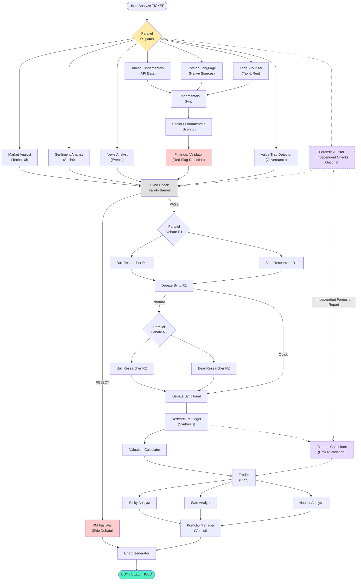
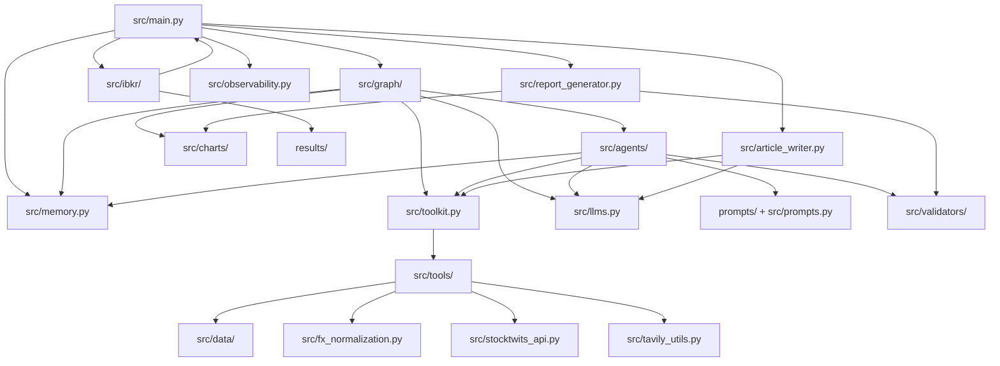

# Multi-Agent International Equity Analysis System

> **An open-source agentic AI system that democratizes sophisticated equity research for international markets**

If you're concerned about US political instability, rising federal debt, dollar depreciation, or an AI-driven market bubble, this system offers a way to diversify by evaluating transitional value-to-GARP (Value → Growth at a Reasonable Price) opportunities in ex-US markets. It uses the same multi-perspective analysis patterns employed by institutional research teams, but is powered by free- or cheap-tier AI and financial data APIs and can be run from a basic MacBook or other laptop.

**What you need:** Python 3.12+, a Google Gemini API key (free tier), and basic command-line familiarity. Optional: Additional API keys for enhanced data (FMP, Tavily, EODHD). Everything can run locally on your machine—no cloud subscription required.

[](https://www.python.org/downloads/)
[](https://opensource.org/licenses/MIT)
[](https://github.com/langchain-ai/langgraph)

---

## What Makes This Different

Most "AI trading bots" are simple scripts. This is a **thesis-driven fundamental analysis engine** with institutional-grade, self-correcting architecture.

### The Problem This Solves

- **Retail investors lack access** to multi-analyst teams that debate different perspectives
- **Ex-US markets are underserved** by English-language research platforms  
- **Premium research tools cost $2,000-$24,000/year** (Bloomberg, FactSet)
- **Small-cap international stocks** often have zero analyst coverage in the US

### This System Provides

- **Multi-Agent Debate Pattern** - Bull/Bear/Risk analysts argue, then a Portfolio Manager decides
- **International Coverage** - Handles HK, Japan, Taiwan, Korea with proper FX/exchange logic
- **Disciplined Risk Framework** - Hard-fail gatekeeping prevents emotional/hype-driven decisions
- **Thesis Alignment Radar** - 6-axis visual showing Health, Growth, Value, Undiscovered, Regulatory, and Jurisdiction
- **Visual Valuation Charts** - "Football Field" charts showing price ranges, targets, and moving averages
- **Zero Marginal Cost** - Can run (amidst 429s and retries) on free-tier Gemini API, albeit slowly
- **Full Transparency** - Every decision explained with supporting data and reasoning

---

## Architecture: Agentic AI at Work

This isn't a single prompt to an LLM. It's a **stateful orchestration** of specialized AI agents, each with distinct roles, debating and synthesizing information through a directed graph workflow.


```mermaid
graph TB
    Start(["User: Analyze TICKER"]) --> Dispatcher{"Parallel<br/>Dispatch"}

    %% Parallel Fan-Out
    Dispatcher --> MarketAnalyst["Market Analyst<br/>(Technical)"]
    Dispatcher --> SentimentAnalyst["Sentiment Analyst<br/>(Social)"]
    Dispatcher --> NewsAnalyst["News Analyst<br/>(Events)"]
    Dispatcher --> JuniorFund["Junior Fundamentals<br/>(API Data)"]
    Dispatcher --> ForeignLang["Foreign Language<br/>(Native Sources)"]
    Dispatcher --> LegalCounsel["Legal Counsel<br/>(Tax & Reg)"]
    Dispatcher --> ValueTrap["Value Trap Detector<br/>(Governance)"]
    
    %% THE INDEPENDENT CHANNEL
    Dispatcher -.-> Auditor["Forensic Auditor<br/>(Independent Check)<br/>Optional"]

    MarketAnalyst --> SyncCheck["Sync Check<br/>(Fan-In Barrier)"]
    SentimentAnalyst --> SyncCheck
    NewsAnalyst --> SyncCheck
    ValueTrap --> SyncCheck
    Auditor -.-> SyncCheck

    %% Fundamentals sub-graph
    JuniorFund --> FundSync["Fundamentals<br/>Sync"]
    ForeignLang --> FundSync
    LegalCounsel --> FundSync
    FundSync --> SeniorFund["Senior Fundamentals<br/>(Scoring)"]
    SeniorFund --> Validator["Financial Validator<br/>(Red-Flag Detection)"]
    Validator --> SyncCheck

    %% Decision Logic
    SyncCheck -->|"REJECT"| PMFastFail["PM Fast-Fail<br/>(Skip Debate)"]
    SyncCheck -->|"PASS"| DebateR1{"Parallel<br/>Debate R1"}

    %% Bull/Bear Debate
    DebateR1 --> BullR1["Bull Researcher R1"]
    DebateR1 --> BearR1["Bear Researcher R1"]
    BullR1 --> DebateSyncR1["Debate Sync R1"]
    BearR1 --> DebateSyncR1

    DebateSyncR1 -->|"Normal"| DebateR2{"Parallel<br/>Debate R2"}
    DebateSyncR1 -->|"Quick"| DebateSyncFinal["Debate Sync Final"]

    DebateR2 --> BullR2["Bull Researcher R2"]
    DebateR2 --> BearR2["Bear Researcher R2"]
    BullR2 --> DebateSyncFinal
    BearR2 --> DebateSyncFinal

    DebateSyncFinal --> ResearchManager["Research Manager<br/>(Synthesis)"]

    %% INDEPENDENT CHANNEL CROSS-VALIDATION
    ResearchManager --> ValuationCalc["Valuation Calculator"]
    ResearchManager -.-> Consultant["External Consultant<br/>(Cross-Validation)"]
    
    %% Visualizing the Independent Data Injection
    Auditor -.->|Independent Forensic Report| Consultant

    ValuationCalc --> Trader["Trader<br/>(Plan)"]
    Consultant -.-> Trader

    %% Risk Team
    Trader --> RiskyAnalyst["Risky Analyst"]
    Trader --> SafeAnalyst["Safe Analyst"]
    Trader --> NeutralAnalyst["Neutral Analyst"]

    RiskyAnalyst --> PortfolioManager["Portfolio Manager<br/>(Verdict)"]
    SafeAnalyst --> PortfolioManager
    NeutralAnalyst --> PortfolioManager

    PMFastFail --> ChartGen["Chart Generator"]
    PortfolioManager --> ChartGen

    ChartGen --> Decision(["BUY / SELL / HOLD"])

    %% Styling
    style Dispatcher fill:#ffeaa7,color:#333
    style SyncCheck fill:#e0e0e0,color:#333
    style Validator fill:#ffcccc,color:#333
    style Consultant fill:#e8daff,color:#333
    style Auditor fill:#e8daff,color:#333,stroke-dasharray: 5 5
    style PMFastFail fill:#ffcccc,color:#333
    style Decision fill:#55efc4,color:#333
```

### How Agents Collaborate

1. **Parallel analyst fan-out** - `src/graph/` dispatches Market, Sentiment, News, Junior Fundamentals, Foreign Language, Legal Counsel, and Value Trap in parallel, with an optional Auditor lane.
2. **Per-agent tool loops** - Each analyst has its own agent → tool-node → agent loop so tool results do not bleed across parallel branches.
3. **Fundamentals barrier** - Junior Fundamentals, Foreign Language, and Legal Counsel must all finish before Senior Fundamentals synthesizes them into `DATA_BLOCK`.
4. **Deterministic pre-screening** - `src/validators/red_flag_detector.py` parses `DATA_BLOCK` in Python. `REJECT` routes straight to PM Fast-Fail; `PASS` continues to debate.
5. **Debate and synthesis** - Bull and Bear researchers run one or two rounds depending on `--quick`, then Research Manager consolidates the result.
6. **Post-research checks** - Valuation Calculator runs deterministic price-target math; optional Consultant and Auditor provide cross-checks on the thesis.
7. **Portfolio decision path** - Trader hands off to three risk personas, then Portfolio Manager makes the final verdict and emits `PM_BLOCK`.
8. **Post-verdict output** - Chart Generator runs after the PM decision, and optional memory/retrospective processing stores ticker-isolated lessons for future analyses.

This matters because the system is not relying on one prompt and one model to get it right. The graph enforces parallel evidence gathering, deterministic rejection rules, adversarial debate, and structured outputs that downstream code can consume safely.

---

## Quick Start

### Prerequisites

- Python 3.12+
- Poetry (dependency management)
- Google Gemini API key (free tier: 15 RPM, slow and glitchy, but workable)
- Optional: Tavily API, FMP API, StockTwits, EODHD access

### Installation

```bash
# Clone repository
git clone https://github.com/rgoerwit/ai-investment-agent.git
cd ai-investment-agent

# Install dependencies (creates .venv automatically)
poetry install

# Configure environment
cp .env.example .env
# Edit .env with your API keys (GOOGLE_API_KEY is required)

# Optional: enable OpenAI-based consultant / auditor paths
# Add OPENAI_API_KEY to .env

# Activate virtual environment (if needed for direct python calls)
source .venv/bin/activate  # On macOS/Linux
# OR
.venv\Scripts\activate  # On Windows
```

### Run Your First Analysis

```bash
# Suppress gRPC fork() cleanup issue warnings (mostly an OS/X thing)
export GRPC_VERBOSITY=ERROR
export GRPC_TRACE=""

# Analyze a single ticker
poetry run python -m src.main --ticker 0005.HK

# Output to file (auto-detects non-TTY, outputs clean markdown)
# Use --output to ensure charts are generated and links are correct
poetry run python -m src.main --ticker 0005.HK --output results/0005.HK.md

# Quiet mode (suppress logging, output markdown only)
poetry run python -m src.main --ticker 0005.HK --quiet --output results/0005.HK.md

# Brief mode (header, summary, decision only)
poetry run python -m src.main --ticker 0005.HK --brief --output results/0005.HK_brief.md

# Custom chart format (SVG) and transparency
poetry run python -m src.main --ticker 0005.HK --svg --transparent --output results/0005.HK.md

# Skip chart generation entirely
poetry run python -m src.main --ticker 0005.HK --no-charts

# Verbose logging (high-signal app diagnostics)
poetry run python -m src.main --ticker 0005.HK --verbose

# Debug logging (developer-focused; raw HTTP remains off unless explicitly enabled)
poetry run python -m src.main --ticker 0005.HK --debug

# Disable persistent memory (skip ChromaDB)
poetry run python -m src.main --ticker 0005.HK --no-memory

# Override AI models via CLI (takes precedence over .env)
poetry run python -m src.main --ticker 0005.HK --quick-model gemini-3-flash-preview --deep-model gemini-3-pro-preview

# Custom image directory
# If --output is provided, --imagedir defaults to {output_dir}/images
# You can override it:
poetry run python -m src.main --ticker 0005.HK --output results/report.md --imagedir results/assets/charts

# Batch retrospective: process all past tickers
poetry run python -m src.main --retrospective-only

# Run with real-time logging visible (unbuffered Python output)
# Redirect to file and monitor with: tail -f scratch/ticker_analysis_info.txt
# Note: Use --output for the report so that charts are generated
poetry run python -u -m src.main --ticker 0005.HK --output scratch/report.md >scratch/ticker_analysis_info.txt 2>&1 &

# Batch analysis (manual ticker list)
./scripts/run_tickers.sh

# Run tests to verify installation
poetry run pytest tests/ -v
```

### Automated Screening Pipeline (Fastest Path to Gems)

Find undervalued international stocks end-to-end — no manual steps:

```bash
# One command: scrape 18+ exchanges → filter by fundamentals → quick-screen
# all candidates → full analysis on BUY verdicts only 
# (caffeinate assumed installed; if not, run the script directly)
caffeinate -i ./scripts/run_pipeline.sh

# Or step by step:

# 1. Scrape + filter (produces a ticker list)
poetry run python scripts/find_gems.py --output scratch/gems.txt

# 2. Run the 3-stage pipeline against that list
./scripts/run_pipeline.sh --skip-scrape scratch/gems.txt

# Paid API tier? Shorten the cooldown
./scripts/run_pipeline.sh --cooldown 10

# Overnight run on macOS (--yes skips confirmation prompts)
caffeinate -i ./scripts/run_pipeline.sh --yes
```

The pipeline pauses before each AI stage to show a summary (ticker count, estimated time, output location) and asks for confirmation. Use `--yes` / `-y` to skip prompts for unattended runs.

**Key flags:**

| Flag | Description |
|------|-------------|
| `-y, --yes` | Skip all confirmation prompts (for cron/CI/overnight runs) |
| `--skip-scrape FILE` | Skip Stage 0 scraping; use an existing ticker list file |
| `--stage N` | Run only stage N (0=scrape, 1=quick-screen, 2=full analysis) |
| `--buys-file FILE` | Explicit BUY list to use for Stage 2 (see resumption notes below) |
| `--cooldown N` | Seconds between analyses (default: 60 for free tier, 10 for paid) |
| `--quick` | Pass `--quick` flag to each analysis (1 debate round, faster) |

Output lands in `scratch/`: quick-screen reports (`*_quick.md`), full reports for BUYs, and a `buys_YYYY-MM-DD.txt` summary.

#### Resuming an Interrupted Run

The pipeline has built-in resumability: any ticker whose output file already contains a verdict line is skipped automatically. To resume:

```bash
# Same-day resume (pipeline ran and was interrupted today)
# Just re-run with --stage 2 — it finds today's buys file and skips completed tickers
./scripts/run_pipeline.sh --stage 2

# Cross-day resume (pipeline started yesterday, interrupted, resuming today)
# Use --buys-file to point at yesterday's BUY list.
# The script detects the date in the filename and matches output files correctly —
# without this, it would look for today's output files and re-analyze everything.
./scripts/run_pipeline.sh --stage 2 --buys-file scratch/buys_2026-03-02.txt
```

Without `--buys-file` on a cross-day resume, the script looks for today's BUY list and stops. Point it at the earlier `buys_YYYY-MM-DD.txt` file to reuse the correct outputs.

### Configuring API Rate Limits

The system automatically handles Gemini API rate limits based on your tier.
**Free tier (15 RPM) works out of the box** with no configuration needed.

If you upgrade to a **paid Gemini API tier**, make sure you're using an
API key for the correct project (project settings determine your tier),
and then up your RPM limits in .env:

```bash
# In your .env file, add:
GEMINI_RPM_LIMIT=360   # Paid tier 1: faster than free tier
# or
GEMINI_RPM_LIMIT=1000  # Paid tier 2: should be much, much faster than free tier
```

The system applies a 20% safety margin automatically. Free tier works, but batch runs are slow; paid tiers mainly reduce waiting and retry pressure.

### Observability with Langfuse (Optional)

Trace multi-agent analysis runs using [Langfuse](https://langfuse.com) (open-source LLM observability):

1. Set your keys in `.env`:
   ```bash
   LANGFUSE_PUBLIC_KEY=pk-lf-...
   LANGFUSE_SECRET_KEY=sk-lf-...
   LANGFUSE_BASE_URL=https://us.cloud.langfuse.com  # or EU: https://cloud.langfuse.com
   ```

2. Enable tracing per-run via CLI flag:
   ```bash
   poetry run python -m src.main --ticker 0005.HK --trace-langfuse
   ```

   Or enable globally in `.env`:
   ```bash
   LANGFUSE_ENABLED=true
   ```

**Precedence:** CLI flags (`--trace-langfuse`) override `.env` settings, which override
code defaults. This applies to all CLI flags (e.g., `--quick-model` overrides `QUICK_MODEL`
in `.env`).

Each analysis creates a Langfuse session (e.g., `0005.HK-2026-01-28-a3f7b2c1`) with tags
for mode, models, and memory status. Both Langfuse and LangSmith can be enabled simultaneously
-- they use independent tracing mechanisms.

### AI Security / Tool Auditing (Advanced)

The runtime includes a shared interception layer for external tool calls. Advanced users can use it to add audit logging or content-inspection hooks around tool inputs and results before those results are fed back into agents.

This is mainly useful for reviewing prompt-injection or context-contamination risk from search, filing, and other external data sources. See `src/tooling/` if you want to extend that behavior.

### AI Model Configuration and Thinking Levels

The runtime separates fast extraction work from slower synthesis work:

- `QUICK_MODEL` powers the data-gathering agents and uses low thinking.
- `DEEP_MODEL` powers the synthesis and decision agents.
- `--quick` keeps the debate to one round and lowers synthesis thinking; normal mode uses two rounds and deeper reasoning.

If you use Gemini for `QUICK_MODEL`, prefer Gemini 3+ models. Older Gemini tool-calling behavior has been less reliable in this workflow.

```bash
QUICK_MODEL=gemini-3-flash-preview
DEEP_MODEL=gemini-3-pro-preview
```

That is the simplest default split: cheaper/faster extraction, stronger synthesis.

### Batch Analysis

For broad screening, put one Yahoo-format ticker per line in a file such as `scratch/sample_tickers.txt`, then run:

Note: **This will take a long time (likely a day or more for 300+ tickers)**

```bash
# macOS users: Prevent sleep during long analysis
caffeinate -i ./scripts/run_tickers.sh

# Linux/WSL users: Run normally
./scripts/run_tickers.sh

# Or run in background with logging (logs still go to stderr/file depending on mode)
./scripts/run_tickers.sh --loud 2> batch_analysis.log &
```

Expect long runtimes on free-tier APIs. `--quick` is usually the right screening mode; rerun shortlisted names in normal mode before acting.

#### Review Results

Results are saved to `scratch/ticker_analysis_results.md`:

```bash
# View results
cat scratch/ticker_analysis_results.md

# Filter for BUY recommendations only
egrep '^###.*PORTFOLIO MANAGER VERDICT.*BUY *$' scratch/ticker_analysis_results.md

# Count decisions
echo "BUY: $(egrep -c '^###.*PORTFOLIO MANAGER VERDICT.*BUY *$' scratch/ticker_analysis_results.md)"
echo "HOLD: $(egrep -c '^###.*PORTFOLIO MANAGER VERDICT.*HOLD *$' scratch/ticker_analysis_results.md)"
echo "SELL: $(egrep -c '^###.*PORTFOLIO MANAGER VERDICT.*SELL *$' scratch/ticker_analysis_results.md)"
```

The system is intentionally conservative. Large screens should produce mostly rejects and holds; the point is to reduce the list, not to force a high BUY count.

### Example Output Structure

```markdown
# 2412.TW (Chunghwa Telecom Co., Ltd.): SELL
**Analysis Date:** 2025-12-17 23:57:57
---
## Executive Summary
### FINAL DECISION: SELL

### THESIS COMPLIANCE SUMMARY

**Hard Fail Checks:**
- **Financial Health**: 67% (Adjusted) - [PASS]
- **Growth Transition**: 67% (Adjusted) - [PASS]
- **Liquidity**: PASS - [PASS]
- **Analyst Coverage**: 6 - [PASS]
- **US Revenue**: Not disclosed - [N/A]
- **P/E Ratio**: 26.37 (PEG: 5.49) - [FAIL]

**Hard Fail Result**: **FAIL on: [P/E Ratio > 25]**

**Qualitative Risk Tally** (Calculated for context, though Hard Fail triggers SELL):
- **ADR (MODERATE_CONCERN)**: [+0.33]
- **ADR (EMERGING_INTEREST bonus)**: [+0]
- **ADR (UNCERTAIN)**: [+0]
- **Qualitative Risks**: Valuation Disconnect [+1.0], Geopolitical Strategy Risk [+1.0]
- **US Revenue 25-35%**: [+0]
- **Marginal Valuation**: [+0] (N/A, P/E > 25 is beyond marginal)
- **TOTAL RISK COUNT**: 2.33
...
```

### Troubleshooting

#### Poetry/Dependency Issues

If you encounter import errors, dependency conflicts, or weird behavior after updating dependencies:

```bash
# Complete clean rebuild (recommended)
poetry env remove --all && rm poetry.lock && poetry install

# Quick rebuild (keeps lock file)
poetry env remove --all && poetry install

# Nuclear option (if nothing else works)
poetry env remove --all
poetry cache clear pypi --all
rm poetry.lock
poetry install
```

#### Common Issues

**Problem:** `ImportError: No module named 'langchain'`  
**Solution:** Run `poetry install` to create/update virtual environment

**Problem:** `ModuleNotFoundError` after git pull  
**Solution:** Dependencies changed - run `poetry env remove --all && poetry install`

**Problem:** Tests failing with import errors  
**Solution:** Rebuild environment with commands above

**Problem:** Poetry complains about Python version  
**Solution:** Ensure Python 3.12+ is active: `python --version`

**Problem:** API errors or rate limits  
**Solution:** Check `.env` file has valid API keys, verify quotas at provider dashboards

---

## IBKR Portfolio Management (Optional)

For users who trade international equities via Interactive Brokers, an optional reconciliation tool bridges the gap between evaluator recommendations and live portfolio positions.

```bash
# Requires IBKR credentials in .env and the ibind optional dependency
poetry install -E ibkr

# All portfolio_manager.py commands require the Poetry venv.
# Either prefix every command with `poetry run`, or activate once:
source .venv/bin/activate   # then plain `python` works for the session

# Verify credentials and IBKR connection before doing anything else
poetry run python scripts/portfolio_manager.py --test-auth
# Checks every required env var, validates RSA key files locally
# (sign/verify + encrypt/decrypt round-trips), then opens a live
# read-only session and prints account ID, portfolio value, and cash.
# Prompts for IBKR_OAUTH_ACCESS_TOKEN_SECRET if it's not in .env.

# Report only (no IBKR connection needed in --read-only mode)
poetry run python scripts/portfolio_manager.py --read-only

# Full reconciliation against live IBKR positions
poetry run python scripts/portfolio_manager.py

# With order size recommendations
poetry run python scripts/portfolio_manager.py --recommend

# Order execution is currently disabled; use --recommend for actionable suggestions
poetry run python scripts/portfolio_manager.py --recommend

# Re-run evaluator on stale analyses (and unanalyzed positions) then reconcile
poetry run python scripts/portfolio_manager.py --refresh-stale --quick

# Concentration limits — warn when a BUY/ADD would breach a threshold
poetry run python scripts/portfolio_manager.py --recommend --sector-limit 25 --exchange-limit 35

# Evaluate IBKR watchlist items against existing analyses
# (default looks for a watchlist named "default watchlist"; override with --watchlist-name)
poetry run python scripts/portfolio_manager.py --recommend --watchlist-name "my watchlist"
```

The tool compares live IBKR positions against the latest analysis JSONs in `results/` and produces position-aware actions:

| Action | Trigger |
|--------|---------|
| **BUY** | Not held, evaluator says BUY, cash available |
| **SELL** | Held + evaluator says SELL/DNI, or stop-loss breached |
| **TRIM** | Held and overweight vs target allocation |
| **ADD** | Held but underweight vs target allocation |
| **HOLD** | Within target range, verdict is BUY |
| **REVIEW** | Stale analysis, no analysis, or price target hit |
| **REMOVE** | On watchlist (not held) + evaluator says SELL/DNI/REJECT |
| **HOLD** *(watchlist)* | On watchlist (not held) + evaluator says HOLD — monitoring only |

The `--recommend` report includes:
- **CONCENTRATION** — sector and exchange weights as ASCII bar charts; ADD/BUY reasons flag when a trade would push any bucket over its limit (default: sector 30%, exchange 40%)
- **PORTFOLIO HEALTH** — cross-portfolio signals: low average health/growth scores, currency concentration, stale-analysis ratio
- **DEFERRED ACTIONS** — sequenced plan showing what to execute today, when T+2 sell proceeds clear, and which HOLDs are approaching their re-analysis deadline

Staleness detection flags analyses older than 14 days or with >15% price drift from the TRADE_BLOCK entry price. A configurable cash buffer (default 5% of portfolio) is reserved and never deployed into new positions.

See `src/ibkr/` for the supporting modules and `src/ibkr_config.py` for credential configuration.

---

## Investment Thesis (Built-In)

The system enforces a **value-to-growth transition** strategy focused on:

### Hard Requirements

- **Financial Health Score ≥ 50%** - Sustainable profitability, cash flow, manageable debt
- **Growth Score ≥ 50%** - Revenue/EPS growth, margin expansion, or turnaround trajectory  
- **Liquidity ≥ $500k USD daily** - Tradeable via IBKR without excessive slippage ($500k = PASS, $100k-$500k = MARGINAL, <$100k = HARD FAIL)
- **Analyst Coverage < 15** - "Undiscovered" by mainstream US research

### Soft Factors (Risk Scoring)

- Valuation (P/E ≤ 18, PEG ≤ 1.2, P/B ≤ 1.4)
- US Revenue exposure (prefer less exposure here)
- ADR availability (sponsored means equity is well "discovered")
- Qualitative risks (geopolitical, industry headwinds, management issues)

**Philosophy:** Find mid-cap stocks in international markets that are transitioning from value (undervalued) to growth (expansion phase), before too many US analysts discover them.  One of the few ways retail can generate alpha, competing against major funds, hedgies, etc.

---

## Technical Highlights

### Robust Data Pipeline

- Fetches from multiple sources in parallel, merges by precedence, and falls back to web or filing sources when core financial data is incomplete.
- Uses yfinance, yahooquery, FMP, EODHD, Alpha Vantage, Tavily, DuckDuckGo, and exchange-specific filing APIs where available.
- Keeps deterministic validation in the loop so obviously bad values do not silently flow downstream.

### Memory System

- ChromaDB collections are ticker-scoped to avoid cross-ticker contamination.
- Retrospective lessons are written back as optional context for future runs.
- `--no-memory` disables the whole layer when you want stateless execution.

### Prompting and Structured Outputs

- Prompts live in `prompts/` and are versioned JSON files.
- Core downstream parsing relies on structured sections such as `DATA_BLOCK`, `PM_BLOCK`, and valuation parameter blocks.
- Deterministic code still owns arithmetic, validation, and hard-fail logic.

---

## Runtime and Cost

**Tested with Google Tier 1, paid Tavily, ChatGPT API (Dec 2025):**

| Configuration | Time | Cost per Ticker |
|---------------|------|-----------------|
| `DEEP_MODEL=gemini-3-pro-preview` (normal) | ~5 min | ~$0.46 |
| `DEEP_MODEL=gemini-3-flash-preview` (normal) | ~3:15 | ~$0.13 |
| `--quick` flag (any DEEP_MODEL) | ~1:40 | ~$0.09 |

- **Quick Mode:** ~$0.09/ticker, 1:40 runtime, 1 debate round
- **Normal + Flash:** ~$0.13/ticker, 3:15 runtime, 2 debate rounds (best value)
- **Normal + Pro:** ~$0.46/ticker, 5 min runtime, 2 debate rounds (most thorough)
- **API Cost:** $0 on Gemini free tier (15 RPM limit - slow for big jobs)
- **Free tier:** workable for occasional runs, slow for broad screens
- **Paid tiers:** mainly improve throughput and reduce retry friction

To assess costs, run `python examples/check_token_costs.py`. For batch analysis of 300 tickers:
- Quick mode: ~$27, ~8 hours
- Flash normal: ~$39, ~16 hours
- Pro normal: ~$138, ~25 hours

---

## Learning Agentic AI

This repository is an educational resource for understanding **production-grade agentic systems**:

### Key Concepts Demonstrated

1. **State Machines (LangGraph)** - Conditional routing, loops, human-in-the-loop checkpoints
2. **Memory Isolation** - Preventing RAG context bleeding across analyses  
3. **Tool Use** - LLMs calling Python functions (data fetchers, calculators, web search)
4. **Structured Outputs** - Enforcing consistent, structured reporting formats via prompts
5. **Debate Patterns** - Adversarial multi-agent collaboration (reduces bias)

### Architecture Patterns Worth Studying

```text
├── prompts/                  # Versioned agent prompts (JSON)
│   └── ...                   # analyst, debate, PM, writer, and risk prompts
│
├── src/
│   ├── main.py               # CLI entry point
│   ├── graph/                # graph builder, routing, tool-node execution, component assembly
│   ├── agents/               # node factories, shared state, reducers, runtime helpers
│   ├── tools/                # tool implementations grouped by domain
│   ├── toolkit.py            # facade that groups tools by agent role
│   ├── prompts.py            # prompt loading and override handling
│   ├── llms.py               # LLM factory functions and model policy
│   ├── memory.py             # ChromaDB-backed memory and retrospective hooks
│   ├── report_generator.py   # final markdown report rendering
│   ├── article_writer.py     # optional post-analysis article generation
│   ├── validators/           # deterministic validation and red-flag screening
│   ├── charts/               # chart node, extractors, and renderers
│   ├── data/                 # multi-source market/fundamental data fetching
│   ├── ibkr/                 # portfolio, reconciliation, and broker integration
│   └── tooling/              # tool audit / interception layer
```

**How the pieces connect:** `main.py` builds the workflow from `src/graph/`, which wires nodes from `src/agents/`, binds role-appropriate tools from `toolkit.py` / `src/tools/`, and routes state through the debate and PM path. The data layer feeds tools, validators gate the debate, charts run after the PM decision, and `article_writer.py` remains a post-graph step triggered by `--article`.

**Why This Matters for Practitioners:**

- Most tutorials show toy examples. This shows how to handle **production edge cases** (network failures, data corruption, API rate limits)
- Demonstrates **separation of concerns** (agents, tools, data, orchestration)
- Includes **tests** that actually run (not aspirational TODO comments)

---

## Democratizing Finance

### The Vision

Institutional research is a luxury good. A single Bloomberg Terminal costs $24,000/year. A hedge fund analyst team costs $500k-$2M annually. This system provides:

- **Institutional-quality analysis** for $0 marginal cost
- **Global market access** without multilingual analysts
- **Systematic discipline** replacing emotional trading
- **Reproducible research** with versioned prompts and auditable decisions

### Real-World Use Cases

- **Individual Investors** - Diversify into ex-US markets with confidence  
- **AI Researchers** - Study multi-agent coordination in complex domains  
- **Educators** - Teach agentic AI, RAG, and LangGraph through practical finance  
- **Startups** - Foundation for boutique research services

### Limitations & Reality Check

- **Not a Get-Rich-Quick Bot** - This is a research tool, not an execution engine  
- **Data Quality** - Free APIs have gaps; premium data costs money for a reason  
- **Backward-Looking** - Analyzes historical financials; struggles with forward catalysts  
- **No Real-Time Execution** - You must manually place trades via your broker

**Use this for:** Generating a shortlist of candidates for deep due diligence  
**Don't use this for:** Automated trading, day trading, options strategies

---

## Testing & Quality

### Comprehensive Test Suite

Run tests before changing core behavior, and add targeted tests for any new edge case you introduce.

```bash
# Run all tests
poetry run pytest tests/ -v

# Run specific test categories
poetry run pytest tests/memory/test_memory_isolation.py -v
poetry run pytest tests/financial/test_toolkit.py -v
poetry run pytest tests/financial/test_liquidity_tool.py -v

# Check coverage
poetry run pytest --cov=src tests/
```

**Test Coverage:**

- Unit tests for all data fetchers and validators
- Integration tests for memory isolation  
- Edge case tests for AI response malformation
- Live API tests (skipped in CI, run manually)

Edge case testing matters here because the runtime depends on unreliable external APIs, model outputs, and graph synchronization.

---

## Deployment (Educational Reference)

### Docker Support

Production-ready **multi-stage Dockerfile** (Poetry 2.x, non-root user, ~40% smaller images):

```bash
# Build and run
docker build -t trading-system .
docker run --env-file .env trading-system --ticker 0005.HK --quick

# Or use docker-compose
docker compose run --rm investment-agent --ticker 7203.T
```

### Azure Container Instances (Terraform)

Reference implementation for cloud deployment (requires customization):

```bash
cd terraform/
terraform init
terraform plan -var="google_api_key=your_key"  # Review carefully
terraform apply  # Only after validating plan
```

**Note:** Infrastructure configs are examples, not a turn-key hosted product. Read `terraform/main.tf` and adjust for your environment.

### GitHub Actions (CI/CD)

```yaml
# .github/workflows/ci.yml
- Runs pytest on every push
- Validates prompt JSON schemas
- Checks code style with ruff
```

---

## Appendix: Code Structure Overview

This is a static package-level view of the repo. It complements the runtime workflow diagram above; it is not meant to describe execution order.


```mermaid
graph TD
    Main["src/main.py"] --> Graph["src/graph/"]
    Main --> Report["src/report_generator.py"]
    Main --> Article["src/article_writer.py"]
    Main --> Memory["src/memory.py"]
    Main --> Observability["src/observability.py"]
    Main --> IBKR["src/ibkr/"]

    Graph --> Agents["src/agents/"]
    Graph --> Toolkit["src/toolkit.py"]
    Graph --> LLMs["src/llms.py"]
    Graph --> Memory
    Graph --> Charts["src/charts/"]

    Toolkit --> Tools["src/tools/"]
    Tools --> Data["src/data/"]
    Tools --> FX["src/fx_normalization.py"]
    Tools --> Stocktwits["src/stocktwits_api.py"]
    Tools --> Tavily["src/tavily_utils.py"]

    Agents --> Prompts["prompts/ + src/prompts.py"]
    Agents --> Validators["src/validators/"]
    Agents --> LLMs
    Agents --> Toolkit
    Agents --> Memory

    Report --> Charts
    Report --> Validators
    Article --> Toolkit
    Article --> LLMs

    IBKR --> Results["results/"]
    IBKR --> Main
```

Read it this way:

- `src/main.py` is the staged CLI/runtime entry point: setup, mode dispatch, analysis execution, persistence, and article/output handling.
- `src/graph/` owns graph assembly, routing, and graph-scoped tool-node behavior.
- `src/agents/` owns node logic and prompt-driven analysis behavior.
- `src/toolkit.py` and `src/tools/` form the agent tool surface over market, news, search, filing, and ownership data.
- `src/data/`, `src/validators/`, `src/memory.py`, and `src/charts/` are shared subsystems used by the graph and reporting layers.
- `src/ibkr/` is adjacent to, not embedded inside, the single-ticker analysis flow.

---

## Contributing

Contributions welcome! Areas for improvement:

1. **Data Sources** - Integrate Polygon.io, Coingecko, or other specialized APIs
2. **Sentiment** - Add X (Twitter) API, Reddit scraping, or Stocktwits Pro
3. **Execution** - IBKR API integration for automated order placement
4. **UI** - Streamlit/Gradio frontend for non-technical users
5. **Backtesting** - Historical performance simulation framework

### Development Setup

```bash
# Install dev dependencies
poetry install --with dev

# Run linter
poetry run ruff check src/

# Format code  
poetry run ruff format src/

# Type checking
poetry run mypy src/
```

### Project Structure Notes

**scratch/ Directory:** Used for temporary analysis output and test files. The `.gitignore` excludes all contents but keeps the directory:

```gitignore
# In .gitignore
scratch/*
!scratch/.gitkeep
```

This ensures the directory exists for scripts like `run_tickers.sh` while keeping analysis output local.

---

## License & Disclaimer

**License:** MIT - Free for commercial and personal use

**Disclaimer:** This system is for **research and educational purposes only**. It is **NOT financial advice**.

- AI systems can make errors or be biased
- Data sources may have inaccuracies or delays  
- International investing carries currency, political, and regulatory risks
- Always conduct independent due diligence before investing real money

**DYOR (Do Your Own Research)** - Use this tool to generate ideas, not to make final decisions.

---

## Acknowledgments

**Built With:**

- [LangChain](https://python.langchain.com/) & [LangGraph](https://langchain-ai.github.io/langgraph/) - Agent orchestration
- [Google Gemini](https://deepmind.google/technologies/gemini/) - LLM inference (free tier!)
- [ChromaDB](https://www.trychroma.com/) - Vector storage  
- [yfinance](https://github.com/ranaroussi/yfinance) - Market data
- [Tavily](https://tavily.com/) - Web search API

**Inspiration:**

- [Fareed Khan](https://levelup.gitconnected.com/building-a-deep-thinking-trading-system-with-multi-agentic-architecture-c13da7effd2d) - Multi-agent trading systems
- [Clive Thompson](https://www.linkedin.com/in/clive-thompson-661997251) - just a smart value trader
- Institutional research teams at hedge funds and investment banks
- The open-source AI community making powerful tools accessible

---

## Questions or Feedback?

- **Issues:** [GitHub Issues](https://github.com/rgoerwit/ai-investment-agent/issues)

---

If this is useful, star the repo or open an issue with a concrete bug report or improvement idea.
