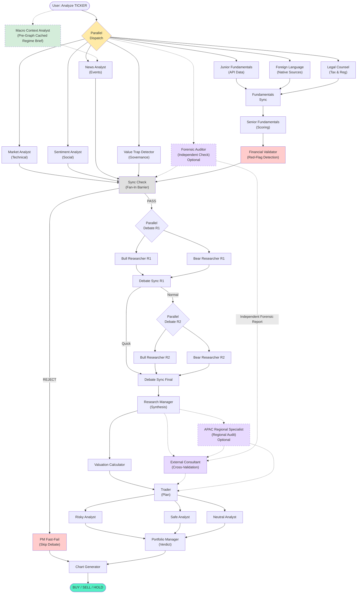

# Multi-Agent International Equity Analysis System

This repository is a multi-agent international equity research system. It can analyze single tickers, run broader screening pipelines, and optionally reconcile saved results against an Interactive Brokers portfolio through either a CLI workflow or a local Flask dashboard.

You need Python 3.12+, Poetry, and working API keys. For the default CLI path, set Gemini, Finnhub, and Tavily keys.

I've gone to a lot of trouble to make this work with inexpensive/free services, at the cost of some code complexity. But practically speaking, search, LLM, and data-service keys are needed to get truly useful results. See the `.env.example` file.

Environment note:

- `poetry run ...` is the safest default for this repo.
- If you activate a virtual environment manually, make sure it is this project's environment and that it has the repo dependencies installed.
- If you have some other venv active, deactivate it or let the pipeline fall back to Poetry.

[](https://www.python.org/downloads/)
[](https://opensource.org/licenses/MIT)
[](https://github.com/langchain-ai/langgraph)

## What This Repo Covers

- Multi-agent international equity analysis for individual tickers
- Structured markdown reports and charts
- Screening pipeline for broader exchange-wide discovery
- Optional IBKR portfolio reconciliation and watchlist handling
- Optional local Flask dashboard for portfolio and refresh monitoring

## Architecture

Many people still equate agentic AI with prompt engineering. Agentic AI, though, takes a next step forward, coordinating the activity of multiple empowered agents to produce better results and to take action. 

Executing an analysis using this repo coordinates work across multiple specialist agents that gather information and then pool that information, apply deterministic rules, and then route surviving equities to additional valuation, risk, and portfolio-decision agents, and wrap the results up as a final recommendation.


```mermaid
graph TB
    Start(["User: Analyze TICKER"]) --> Dispatcher{"Parallel<br/>Dispatch"}
    Start -.-> MacroCtx["Macro Context Analyst<br/>(Pre-Graph Cached Regime Brief)"]

    Dispatcher --> MarketAnalyst["Market Analyst<br/>(Technical)"]
    Dispatcher --> SentimentAnalyst["Sentiment Analyst<br/>(Social)"]
    Dispatcher --> NewsAnalyst["News Analyst<br/>(Events)"]
    Dispatcher --> JuniorFund["Junior Fundamentals<br/>(API Data)"]
    Dispatcher --> ForeignLang["Foreign Language<br/>(Native Sources)"]
    Dispatcher --> LegalCounsel["Legal Counsel<br/>(Tax & Reg)"]
    Dispatcher --> ValueTrap["Value Trap Detector<br/>(Governance)"]
    Dispatcher -.-> Auditor["Forensic Auditor<br/>(Independent Check)<br/>Optional"]

    MacroCtx -.-> NewsAnalyst

    MarketAnalyst --> SyncCheck["Sync Check<br/>(Fan-In Barrier)"]
    SentimentAnalyst --> SyncCheck
    NewsAnalyst --> SyncCheck
    ValueTrap --> SyncCheck
    Auditor -.-> SyncCheck

    JuniorFund --> FundSync["Fundamentals<br/>Sync"]
    ForeignLang --> FundSync
    LegalCounsel --> FundSync
    FundSync --> SeniorFund["Senior Fundamentals<br/>(Scoring)"]
    SeniorFund --> Validator["Financial Validator<br/>(Red-Flag Detection)"]
    Validator --> SyncCheck

    SyncCheck -->|"REJECT"| PMFastFail["PM Fast-Fail<br/>(Skip Debate)"]
    SyncCheck -->|"PASS"| DebateR1{"Parallel<br/>Debate R1"}

    DebateR1 --> BullR1["Bull Researcher R1"]
    DebateR1 --> BearR1["Bear Researcher R1"]
    BullR1 --> DebateSyncR1["Debate Sync R1"]
    BearR1 --> DebateSyncR1

    DebateSyncR1 -->|"Normal"| DebateR2{"Parallel<br/>Debate R2"}
    DebateSyncR1 -->|"Quick"| DebateSyncFinal["Debate Sync Final"]

    DebateR2 --> BullR2["Bull Researcher R2"]
    DebateR2 --> BearR2["Bear Researcher R2"]
    BullR2 --> DebateSyncFinal
    BearR2 --> DebateSyncFinal

    DebateSyncFinal --> ResearchManager["Research Manager<br/>(Synthesis)"]
    ResearchManager --> ValuationCalc["Valuation Calculator"]
    ResearchManager -.-> APACSpecialist["APAC Regional Specialist<br/>(Regional Audit)<br/>Optional"]
    ResearchManager -.-> Consultant["External Consultant<br/>(Cross-Validation)"]
    APACSpecialist -.-> Consultant
    Auditor -.->|Independent Forensic Report| Consultant

    ValuationCalc --> Trader["Trader<br/>(Plan)"]
    Consultant -.-> Trader
    APACSpecialist -.-> Trader

    Trader --> RiskyAnalyst["Risky Analyst"]
    Trader --> SafeAnalyst["Safe Analyst"]
    Trader --> NeutralAnalyst["Neutral Analyst"]

    RiskyAnalyst --> PortfolioManager["Portfolio Manager<br/>(Verdict)"]
    SafeAnalyst --> PortfolioManager
    NeutralAnalyst --> PortfolioManager

    PMFastFail --> ChartGen["Chart Generator"]
    PortfolioManager --> ChartGen

    ChartGen --> Decision(["BUY / SELL / HOLD"])

    style Dispatcher fill:#ffeaa7,color:#333
    style MacroCtx fill:#d4edda,color:#333,stroke-dasharray: 5 5
    style SyncCheck fill:#e0e0e0,color:#333
    style Validator fill:#ffcccc,color:#333
    style APACSpecialist fill:#e8daff,color:#333,stroke-dasharray: 5 5
    style Consultant fill:#e8daff,color:#333
    style Auditor fill:#e8daff,color:#333,stroke-dasharray: 5 5
    style PMFastFail fill:#ffcccc,color:#333
    style Decision fill:#55efc4,color:#333
```

`Macro Context Analyst` is a pre-graph summarizer, not a agent (LangGraph "node"). It can build a cached regional regime brief under `results/.macro_context_cache/` and injects that background only into News Analyst in v1. It remains separate from portfolio-detected macro events stored in `MacroEventsStore`.

Some additional notes on what is happening:

- A pre-graph macro-context step can summarize cached regional regime background for News Analyst before the graph fan-out begins.
- Parallel analyst fan-out gathers market, news, sentiment, fundamentals, language, legal, and value-trap evidence.
- Fundamentals are synthesized and then checked by deterministic red-flag rules before the debate path is allowed to continue.
- Bull and bear researchers argue one or two rounds depending on `--quick`, and Research Manager consolidates the result.
- Optional APAC Regional Specialist, Forensic Auditor, Consultant, MCP checks, and tracing add review depth when enabled; they are supporting layers around the core graph.
- Valuation, trader, and risk personas shape the portfolio decision before Portfolio Manager emits the final verdict.
- Chart generation and report rendering run after the decision.
- Memory and retrospective context are optional layers around the core analysis flow, not substitutes for it.

## Quick Start

I am assuming here that you have worked with Git repositories, feel comfortable at a command prompt, and understand basic things like what an exchange and stock ticker are.

```bash
git clone https://github.com/rgoerwit/ai-investment-agent.git
cd ai-investment-agent

poetry install
cp .env.example .env
```

Edit `.env` next. For the normal CLI path, set `GOOGLE_API_KEY`, `FINNHUB_API_KEY`, and `TAVILY_API_KEY`. For better international data or optional consultant paths, add keys such as EODHD, FMP, or OpenAI where your workflow needs them. The exact knobs live in `.env.example`.

Run a fast smoke test (you can use a ticker other than 7203.T, if you want):

```bash
poetry run python -m src.main --ticker 7203.T --quick --output results/7203.T.md
```

That command exercises the main runtime and writes a markdown report. Saved analysis JSONs in `results/` also, optionally, power `portfolio_manager.py` and the dashboard later.

## Choose Your Workflow

- **Analyze one ticker**: use `poetry run python -m src.main --ticker ...`
- **Screen a broader universe**: use `scripts/run_pipeline.sh`
- **Reconcile a portfolio afterwards**: use `scripts/portfolio_manager.py`
- **Use the browser UI**: run `python -m src.web.ibkr_dashboard.app`, and start the worker only if you want queued refresh jobs

## Single-Ticker Analysis

This is the core engine. Use it first before touching portfolio workflows or the dashboard.

```bash
# Normal run; again, you can use any ticker you want instead of 0005.HK
poetry run python -m src.main --ticker 0005.HK

# Save markdown output and charts
poetry run python -m src.main --ticker 0005.HK --output results/0005.HK.md

# Faster first pass
poetry run python -m src.main --ticker 0005.HK --quick --output results/0005.HK_quick.md

# Stateless run without Chroma-backed memory
poetry run python -m src.main --ticker 0005.HK --no-memory --output results/0005.HK.md
```

Practical notes:

- `--quick` is usually the right first-pass setting for screening or broad review.
- `--output` is the cleanest way to get markdown plus chart assets in a stable location.
- Analysis can prefetch a cached regional macro brief before the graph runs; it lives under `results/.macro_context_cache/` with a 12-hour TTL, is generated by `Macro Context Analyst`, and is injected only into News Analyst as regime background.
- Projected token cost includes this pre-graph macro summarizer when it executes.
- Free-tier Gemini works, but it is slow for larger batches. Paid tiers mostly improve throughput and reduce retry friction (foundation model vendor are getting more restrictive about free tiers)
- Rough paid-tier ballpark with all default optional agents on (consultant, auditor, APAC specialist): about **$0.12 per `--quick` run** and **$0.22 per full run** per ticker. Disabling optional agents or routing through free-tier providers cuts this materially; see `token_usage.total_cost_usd` in the saved `results/*_analysis.json` for the actual per-run number.

## Screening Pipeline

The screening pipeline is the shortest path from broad discovery to a shortlist of full reports.

```bash
# End-to-end path: scrape configured exchanges, filter, quick-screen, then run
# full analysis on BUY names only
./scripts/run_pipeline.sh

# Step-by-step alternative
poetry run python scripts/find_gems.py --output scratch/gems.txt
# Run this next; this is also how you would restart an aborted run, 
# where stage0-scrape finished, but stage1 didn't (fully) finish
./scripts/run_pipeline.sh --skip-scrape scratch/gems.txt
```

Outputs land in `scratch/`. In practice you will see:

- a source ticker list such as `gems_YYYY-MM-DD.txt`
- quick-screen outputs
- a `buys_YYYY-MM-DD.txt` list
- full reports for BUY names

Practical notes:

- Stage 1 is a broad quick screen: `--quick --no-charts --brief --no-memory`, not strict mode.
- The upstream `find_gems.py` filter starts conservative, with a modest higher-P/E band allowed when profitability, leverage, cash-flow quality, and coverage are stronger.
- Paid-tier cost for a full pipeline pass with all optional agents enabled is roughly **$0.12 × Stage 1 basket size + $0.22 × Stage 2 BUYs** — e.g., a ~1,000-ticker basket with a ~14% Stage-1 BUY rate lands near **$150**. Free-tier or optional-agent-off runs are substantially cheaper.

Resumption is built in:

- Re-running the same command family skips completed outputs.
- If Stage 2 was interrupted and you need to resume from an earlier day, point `--buys-file` at the original `scratch/buys_YYYY-MM-DD.txt`.
- If you already have your own ticker list, skip scraping and feed it directly to the pipeline.

## Optional Safety, Cross-Checks, and Tracing

These features matter, but they are supporting infrastructure. You do not need them for the first successful run.

For the broader local threat model, including secrets, broker context, untrusted content, MCP, and OWASP LLM Top 10 coverage, read [SECURITY.md](SECURITY.md).

### Untrusted-Content Inspection

The agents read untrusted text from web/search results, social content, filings, financial-API free text, retrieved memory, and cached context. Optional inspection checks that material before it is reused in prompts. It is off by default so existing local workflows do not change unexpectedly.

Recommended first posture:

```bash
UNTRUSTED_CONTENT_INSPECTION_ENABLED=true
UNTRUSTED_CONTENT_BACKEND=python
UNTRUSTED_CONTENT_INSPECTION_MODE=warn
UNTRUSTED_CONTENT_FAIL_POLICY=fail_open
```

`python` uses the in-process heuristic inspector. `composite` adds a selective LLM judge and costs more latency and tokens. Start with `warn`, inspect the logs, then move to `sanitize` or `block` only when you understand the false positives. See [SECURITY.md](SECURITY.md) for the broader security model.

### Adversarial Tests

The adversarial suite exists because prompt-injection defenses should fail tests when they weaken. It covers payloads aimed at tool use, memory poisoning, hidden instructions, and similar attacks across the inspection and policy layers.

```bash
make security-tests
```

Run this before changes to `src/tooling/`, prompt handling, memory read/write paths, or any new third-party text ingress. The tests are fast, local, and included in the normal `pytest` run. Corpus refresh and judge-fixture replay are manual review steps, not automatic ingestion.

### MCP Consultant Checks

The Consultant can optionally use narrow MCP-backed spot checks for material claims. MCP is disabled by default, access is curated, and the shipped registry keeps Twelve Data disabled because its public surface is too free-form for the current allowlist contract.

```bash
cp config/mcp_servers.example.json config/mcp_servers.json
```

Then set:

```bash
MCP_ENABLED=true
CONSULTANT_MCP_ENABLED=true
MCP_SERVERS_PATH=./config/mcp_servers.json
MCP_USAGE_DB_PATH=./runtime/mcp_usage.db
FMP_API_KEY=...
```

Keep secrets in `.env`, not in the JSON registry. `scripts/mcp_smoke.py` verifies that the MCP path works without putting an LLM in the loop. See [docs/MCP.md](docs/MCP.md) for setup and smoke-testing details.

### Langfuse Tracing

Langfuse is opt-in tracing for runs where you want observability beyond local logs.

```bash
poetry run python -m src.main --ticker 0005.HK --enable-langfuse
```

Set `LANGFUSE_PUBLIC_KEY`, `LANGFUSE_SECRET_KEY`, and `LANGFUSE_BASE_URL` if you are not using the default Langfuse Cloud host. Prompt fetch from Langfuse is off by default; local prompts remain authoritative unless remote prompt fetch is explicitly enabled.

## IBKR Portfolio Management

`scripts/portfolio_manager.py` sits on top of the saved analysis JSONs in `results/`. It bridges the evaluator output with live or offline portfolio context.

The IBKR reconciliation path is split by ownership: `src/ibkr/reconciler.py` orchestrates while `analysis_index.py`, `reconciliation_rules.py`, `position_evaluator.py`, `watchlist_evaluator.py`, `opportunity_finder.py`, and `portfolio_health.py` own the underlying loading, rule, and routing logic.

```bash
# Verify credentials and IBKR connectivity first
poetry run python scripts/portfolio_manager.py --test-auth

# Report only, using saved results with no IBKR connection
poetry run python scripts/portfolio_manager.py --read-only

# Reconcile against live IBKR positions
poetry run python scripts/portfolio_manager.py

# Add order-size recommendations
poetry run python scripts/portfolio_manager.py --recommend

# Re-run stale analyses, then reconcile
poetry run python scripts/portfolio_manager.py --refresh-stale --quick

# Evaluate a specific IBKR watchlist against existing analyses
poetry run python scripts/portfolio_manager.py --recommend --watchlist-name "my watchlist"
```

Notes:

- `--read-only` is the safest way to understand the tool before you touch live broker data.
- `--recommend` produces actionable suggestions and sizing guidance. Order execution is currently disabled, so the tool remains advisory.
- Concentration warnings, stale-analysis flags, cash timing, macro-demoted review items, and capital-allocation `PROFIT_TAKE` candidates are part of the normal report output.
- `PROFIT_TAKE` is reserved for positions with intact business quality, material gains versus IBKR average cost, and saved analysis evidence of idle-cash capital-allocation risk. Unknown or short-term holding periods are surfaced as reviews unless severe idle-cash risk and a very large gain justify a sell candidate.

## Local Flask Dashboard

The dashboard is a local browser view over the same recommendation and reconciliation stack. It is useful once you already have analysis JSONs in `results/`.

```bash
# App only
poetry run python -m src.web.ibkr_dashboard.app

# Worker, only needed for queued background refresh jobs
poetry run python -m src.web.ibkr_dashboard.worker

# Live broker mode with an explicit account and watchlist
poetry run python -m src.web.ibkr_dashboard.app \
  --account-id U20958465 \
  --watchlist-name "default watchlist"

# Offline/read-only mode for saved results only
poetry run python -m src.web.ibkr_dashboard.app --read-only
```

Open <http://127.0.0.1:5050>.

Convenience options:

```bash
# Start both processes together
./scripts/run_ibkr_dashboard.sh

# Start only the Flask app through the launcher
./scripts/run_ibkr_dashboard.sh --no-worker

# Pass startup flags through to the app
./scripts/run_ibkr_dashboard.sh -- --account-id U20958465 --watchlist-name "default watchlist"
```

If you have already run `poetry install`, the Poetry script shims also work:

```bash
poetry run ibkr-dashboard
poetry run ibkr-dashboard-worker
```

The dashboard includes:

- **Overview**: NLV, cash, freshness, pending inflows, concentration, portfolio health, macro alert
- **Actions**: stop breaches, sells, soft rejections, macro reviews, adds, trims, dip-watch candidates, holds
- **Watchlist**: new buys, off-watchlist candidates, monitor, and remove buckets
- **Orders & Cash**: live orders plus settlement timing
- **Refresh**: freshness summary and explicit background refresh jobs
- **Settings**: lightweight local preferences/stubs

Operational notes:

- The dashboard is read-only for trading.
- Live IBKR mode is the default. Use `--read-only` or `IBKR_DASHBOARD_READ_ONLY=true` when you want a saved-results-only snapshot.
- Set the account explicitly with `--account-id` or `IBKR_DASHBOARD_ACCOUNT_ID` when the default IBKR account is not the one you want.
- Set the watchlist explicitly with `--watchlist-name` or in the Settings tab. Startup flags win for that run even if saved dashboard preferences differ.
- The page auto-loads a snapshot on first open. `Refresh Snapshot` is the manual force-reload control.
- Live orders and live broker cash context only appear in live mode.
- The dashboard process serves cached snapshot reads; the worker is the only process that executes queued refresh jobs.
- The module entrypoints are the most robust launch path because they do not depend on Poetry having installed wrapper scripts into `.venv/bin`.
- Saving settings only reloads the snapshot when the changed fields actually affect the bundle, such as account, watchlist, mode, or max-age.
- A snapshot status like `ready, read-only` with `Fresh count > 0` and `No refresh jobs yet` is normal in offline mode. It means the dashboard successfully loaded saved analyses from `results/`, found nothing stale enough to queue automatically, and has not been asked to run any manual background job yet.
- If all analyses are fresh, the stale/due-soon refresh buttons stay disabled. Use a ticker list if you want to force a rerun of specific names.
- While the **Refresh** tab is open, the UI polls `/api/refresh/jobs` every 5 seconds. In the Flask dev server logs that will look like repeated `GET /api/refresh/jobs 200` lines; that is expected.

## Default Investment Thesis

What is the system actually hunting for? Is a company cheap because the market missed something, or cheap because the business is deteriorating?

The built-in screen is intentionally narrow. It looks for transitional value-to-growth or GARP-style opportunities, not momentum chasing and not generic low-multiple cheapness.

Hard requirements:

- Financial health score of at least 50%
- Growth score of at least 50%
- Liquidity of at least about $500k USD daily
- Low enough analyst coverage to still be plausibly underfollowed

Soft factors that still matter:

- value-trap and governance warnings
- regulatory and jurisdiction risk
- capital allocation quality
- valuation stretch versus thesis quality
- business mix and US revenue exposure where relevant

Deterministic red-flag logic can reject a name before the debate path continues. That is intentional.

## Repo Layout

```text
prompts/                     Versioned prompt JSON files
scripts/                     Screening, portfolio, and operator scripts
src/main.py                  Main CLI/runtime entrypoint
src/cli.py                   CLI parsing and output-path resolution
src/persistence.py           Analysis artifact building and persistence helpers
src/output.py                CLI/banner/report/article output helpers
src/runtime_services.py      Runtime-scoped tool, inspection, and provider ownership
src/macro_context.py         Pre-graph macro brief generation and cache
src/graph/                   Graph assembly, routing, barriers
src/agents/                  Node logic and shared agent state
src/tools/                   Tool implementations by domain
src/tooling/                 Tool execution, inspection, and audit hooks
src/data/                    Market and fundamental data fetching
src/validators/              Deterministic validation and red-flag screening
src/report_generator.py      Markdown report assembly
src/article_writer.py        Optional article-writing flow
src/charts/                  Chart extraction and rendering
src/memory.py                Chroma-backed memory and macro-event support
src/ibkr/                    Portfolio, reconciliation, and broker integration
src/web/ibkr_dashboard/      Local Flask dashboard
src/eval/                    Baseline capture and evaluation helpers
tests/                       Unit and integration coverage
```

How the pieces connect:

- `src/main.py` is orchestration-first: runtime setup, macro-context prefetch, graph execution, tracing, and mode dispatch.
- `src/cli.py` owns CLI parsing, flag validation, and output/article path resolution.
- `src/persistence.py` owns saved artifact assembly, JSON persistence, and rejection-record helpers.
- `src/output.py` owns banners, CLI/report rendering, and optional article generation.
- `src/runtime_services.py` owns runtime-scoped tool execution, content inspection, and long-lived provider dependencies for the CLI, worker, and dashboard processes.
- `src/macro_context.py` builds and caches the pre-graph regional regime brief that is injected into News Analyst context.
- `src/graph/` wires the workflow, `src/agents/` owns node logic and state handling, and `src/tools/` plus `src/tools/registry.py` provide the tool surface used by agent tool nodes.
- `src/tooling/` owns the execution plane around those tools: inspection, audit hooks, and argument-policy enforcement.
- `src/data/`, `src/validators/`, `src/memory.py`, and `src/charts/` are shared subsystems used by the main analysis path.
- `src/data/fetcher.py` is an orchestration seam over `src/data/source_fetchers.py`, `src/data/metric_extraction.py`, `src/data/merge_policy.py`, and `src/data/gap_fill.py`.
- `src/report_generator.py` turns the final graph state into the structured markdown report; `src/article_writer.py` is the optional long-form writing pass on top of that report.
- `scripts/portfolio_manager.py`, `src/ibkr/`, and `src/web/ibkr_dashboard/` are the operator-facing portfolio workflows built on top of saved analysis outputs and, optionally, live broker context.

## Testing

```bash
# Full suite
poetry run pytest tests/ -v

# IBKR-focused changes
poetry run pytest tests/ibkr -v

# Dashboard-focused changes
poetry run pytest tests/web -v
```

If you are changing core runtime behavior, run the full suite before you call it done.

## Troubleshooting

**Poetry or import issues**

```bash
poetry env remove --all
poetry install
```

If `./scripts/run_pipeline.sh` or another script unexpectedly uses plain `python`, check whether you have an unrelated virtual environment active. The pipeline falls back to Poetry when the active venv is missing core repo dependencies, but the cleanest fix is one of:

```bash
deactivate
poetry install
poetry run python -m src.main --ticker 0005.HK
```

If `poetry run ibkr-dashboard` or `poetry run ibkr-dashboard-worker` warns that the entry point "isn't installed as a script", the commands were added to `pyproject.toml` after the virtualenv was created, or the project root was not reinstalled. `poetry install` fixes that. As a fallback, run:

```bash
poetry run python -m src.web.ibkr_dashboard.app
poetry run python -m src.web.ibkr_dashboard.worker
```

**Python version mismatch**

- This repo expects Python 3.12.x.
- Check with `python --version` and make sure Poetry is using the same interpreter.

**API errors or quota issues**

- Check `.env` first.
- Free-tier Gemini works, but rate limits and retries are normal.
- If you have a paid tier, make sure the API key belongs to the right project and that your RPM settings in `.env` make sense.

**`portfolio_manager.py` or analysis index rebuild is unexpectedly slow on macOS**

Spotlight indexing on `.venv/` or `results/` can turn a normal index rebuild into a very slow one.

```bash
touch .venv/.metadata_never_index results/.metadata_never_index
```

## Advanced Topics and References

These are real features, but they are not required to get started:

- **Agentic AI background**: [docs/AGENTIC-AI-101.md](docs/AGENTIC-AI-101.md) explains the broader agentic-AI ideas behind the repo without making this README carry that whole discussion.
- **Security model**: [SECURITY.md](SECURITY.md) summarizes the local threat model, untrusted-content inspection, broker/dashboard cautions, and OWASP LLM Top 10 alignment.
- **Container mode**: the repo includes a Dockerfile and supports local bind-mounted runs. Prefer Podman if you want stronger workstation isolation.
- **Observability**: Langfuse and LangSmith hooks exist for tracing and diagnostics. For sensitive deployments, LangSmith also supports `LANGSMITH_HIDE_INPUTS` and `LANGSMITH_HIDE_OUTPUTS`.
- **Inspection and tool audit hooks**: see `src/tooling/` if you want to inspect or audit untrusted external content before it reaches LLM context.
- **Deployment references**: `terraform/` contains reference infrastructure, not a turnkey hosted product.

## Limitations

- This is a research tool, not an automated trading system.
- Data quality and coverage vary by provider, exchange, and ticker.
- Forward catalysts and regime changes are harder than backward-looking financial analysis.
- Broad screens can be slow on free-tier APIs.
- Portfolio workflows depend on having saved analysis JSONs in `results/`.

## Contributing

Contributions are welcome. Good targets include:

- additional or higher-quality data sources
- validator and data-pipeline hardening
- IBKR and portfolio workflow improvements
- Flask dashboard enhancements in `src/web/ibkr_dashboard/`, including drilldowns, settings, monitoring, and presentation
- test coverage and documentation cleanup

For orientation, start with:

1. `AGENTS.md`
2. `docs/CODEBASE_MEMORY.md`
3. this README

## License & Disclaimer

**License:** MIT

**Disclaimer:** This system is for research and educational use. It is not financial advice.

## Acknowledgments

- LangGraph and the broader LangChain ecosystem for the orchestration substrate
- Open-source data and infrastructure tools that make local-first experimentation practical
