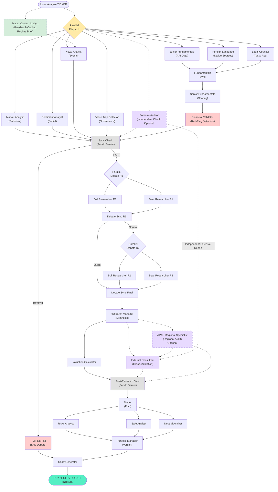

# Multi-Agent International Equity Analysis System

This repository is a multi-agent equity research system that targets under-followed small- and mid-cap value stocks outside the US that present few or no regulatory and tax risks to US investors, and that appear poised for growth. It can analyze single tickers, run broader screening pipelines, and optionally reconcile saved results against an Interactive Brokers portfolio through either a CLI workflow or a local Flask dashboard.

You need Python 3.12+, Poetry, and working API keys. The default binding uses Google for base analysis, OpenAI for adversarial review, a separately bindable regional provider, and Anthropic for prose; Finnhub and Tavily are also required by the normal CLI path.

I've gone to a lot of trouble to make this work with inexpensive/free services, at the cost of some code complexity. But practically speaking, search, LLM, and data-service keys are needed to get truly useful results. See the `.env.example` file.

Environment note:

- `poetry run ...` is the safest default for this repo.
- If you activate a virtual environment manually, make sure it is this project's environment and that it has the repo dependencies installed.
- If you have some other venv active, deactivate it or let the pipeline fall back to Poetry.

[](https://www.python.org/downloads/)
[](https://opensource.org/licenses/MIT)
[](https://github.com/langchain-ai/langgraph)

## What This Repo Covers

- Multi-agent international equity analysis for individual tickers
- Structured markdown reports and charts
- Screening pipeline for broader exchange-wide discovery
- Optional IBKR portfolio reconciliation and watchlist handling
- Optional local Flask dashboard for portfolio and refresh monitoring

## Architecture

Many people still equate agentic AI with prompt engineering. Agentic AI, though, takes a next step forward, coordinating the activity of multiple empowered agents to produce better results and to take action. 

Executing an analysis using this repo coordinates work across multiple specialist agents that gather information and then pool that information, apply deterministic rules, and then route surviving equities to additional valuation, risk, and portfolio-decision agents, and wrap the results up as a final recommendation.


```mermaid
graph TB
    Start(["User: Analyze TICKER"]) --> Dispatcher{"Parallel<br/>Dispatch"}
    Start -.-> MacroCtx["Macro Context Analyst<br/>(Pre-Graph Cached Regime Brief)"]

    Dispatcher --> MarketAnalyst["Market Analyst<br/>(Technical)"]
    Dispatcher --> SentimentAnalyst["Sentiment Analyst<br/>(Social)"]
    Dispatcher --> NewsAnalyst["News Analyst<br/>(Events)"]
    Dispatcher --> JuniorFund["Junior Fundamentals<br/>(API Data)"]
    Dispatcher --> ForeignLang["Foreign Language<br/>(Native Sources)"]
    Dispatcher --> LegalCounsel["Legal Counsel<br/>(Tax & Reg)"]
    Dispatcher --> ValueTrap["Value Trap Detector<br/>(Governance)"]
    Dispatcher -.-> Auditor["Forensic Auditor<br/>(Independent Check)<br/>Optional"]

    MacroCtx -.-> NewsAnalyst

    MarketAnalyst --> SyncCheck["Sync Check<br/>(Fan-In Barrier)"]
    SentimentAnalyst --> SyncCheck
    NewsAnalyst --> SyncCheck
    ValueTrap --> SyncCheck
    Auditor -.-> SyncCheck

    JuniorFund --> FundSync["Fundamentals<br/>Sync"]
    ForeignLang --> FundSync
    LegalCounsel --> FundSync
    FundSync --> SeniorFund["Senior Fundamentals<br/>(Scoring)"]
    SeniorFund --> Validator["Financial Validator<br/>(Red-Flag Detection)"]
    Validator --> SyncCheck

    SyncCheck -->|"REJECT"| PMFastFail["PM Fast-Fail<br/>(Skip Debate)"]
    SyncCheck -->|"PASS"| DebateR1{"Parallel<br/>Debate R1"}

    DebateR1 --> BullR1["Bull Researcher R1"]
    DebateR1 --> BearR1["Bear Researcher R1"]
    BullR1 --> DebateSyncR1["Debate Sync R1"]
    BearR1 --> DebateSyncR1

    DebateSyncR1 -->|"Normal"| DebateR2{"Parallel<br/>Debate R2"}
    DebateSyncR1 -->|"Quick"| DebateSyncFinal["Debate Sync Final"]

    DebateR2 --> BullR2["Bull Researcher R2"]
    DebateR2 --> BearR2["Bear Researcher R2"]
    BullR2 --> DebateSyncFinal
    BearR2 --> DebateSyncFinal

    DebateSyncFinal --> ResearchManager["Research Manager<br/>(Synthesis)"]
    ResearchManager --> ValuationCalc["Valuation Calculator"]
    ResearchManager -.-> APACSpecialist["APAC Regional Specialist<br/>(Regional Audit)<br/>Optional"]
    ResearchManager -.-> Consultant["External Consultant<br/>(Cross-Validation)"]
    APACSpecialist -.-> Consultant
    Auditor -.->|"Independent Forensic Report"| Consultant

    ValuationCalc --> PostSync["Post-Research Sync<br/>(Fan-In Barrier)"]
    Consultant -.-> PostSync
    APACSpecialist -.-> PostSync

    PostSync --> Trader["Trader<br/>(Plan)"]

    Trader --> RiskyAnalyst["Risky Analyst"]
    Trader --> SafeAnalyst["Safe Analyst"]
    Trader --> NeutralAnalyst["Neutral Analyst"]

    RiskyAnalyst --> PortfolioManager["Portfolio Manager<br/>(Verdict)"]
    SafeAnalyst --> PortfolioManager
    NeutralAnalyst --> PortfolioManager

    PMFastFail --> ChartGen["Chart Generator"]
    PortfolioManager --> ChartGen

    ChartGen --> Decision(["BUY / HOLD / DO NOT INITIATE"])

    style Dispatcher fill:#ffeaa7,color:#333
    style MacroCtx fill:#d4edda,color:#333,stroke-dasharray: 5 5
    style SyncCheck fill:#e0e0e0,color:#333
    style PostSync fill:#e0e0e0,color:#333
    style Validator fill:#ffcccc,color:#333
    style APACSpecialist fill:#e8daff,color:#333,stroke-dasharray: 5 5
    style Consultant fill:#e8daff,color:#333
    style Auditor fill:#e8daff,color:#333,stroke-dasharray: 5 5
    style PMFastFail fill:#ffcccc,color:#333
    style Decision fill:#55efc4,color:#333
```

`Macro Context Analyst` is a pre-graph summarizer, not an agent (LangGraph "node"). It can build a cached regional regime brief under `results/.macro_context_cache/` and injects that background only into News Analyst in v1. It remains separate from portfolio-detected macro events stored in `MacroEventsStore`.

Some additional notes on what is happening:

- A pre-graph macro-context step can summarize cached regional regime background for News Analyst before the graph fan-out begins.
- Parallel analyst fan-out gathers market, news, sentiment, fundamentals, language, legal, and value-trap evidence.
- Fundamentals are synthesized and then checked by deterministic red-flag rules before the debate path is allowed to continue.
- Bull and bear researchers argue one or two rounds depending on `--quick`, and Research Manager consolidates the result.
- Optional APAC Regional Specialist, Forensic Auditor, Consultant, MCP checks, and tracing add review depth when enabled; they are supporting layers around the core graph.
- Valuation, trader, and risk personas shape the portfolio decision before Portfolio Manager emits the final verdict.
- Chart generation and report rendering run after the decision.
- Memory and retrospective context are optional layers around the core analysis flow, not substitutes for it.

## Quick Start

I am assuming here that you have worked with Git repositories, feel comfortable at a command prompt, and understand basic things like what an exchange and stock ticker are.

```bash
git clone https://github.com/rgoerwit/ai-investment-agent.git
cd ai-investment-agent

poetry install
cp .env.example .env
```

Edit `.env` next. `FINNHUB_API_KEY` and `TAVILY_API_KEY` are always required. `GOOGLE_API_KEY` is required for the shipped default bindings, and startup derives that from the binding plan rather than assuming it — a configuration with no seat bound to Google does not demand one. Add a provider key for each group you bind (`OPENAI_API_KEY`, `ANTHROPIC_API_KEY`, `MOONSHOT_API_KEY`, `DEEPSEEK_API_KEY`, `ZAI_API_KEY`), plus EODHD or FMP for better international data. The exact knobs live in `.env.example`.

## LLM Provider Architecture

LLMs bind to named application seats through six groups. `base` owns the main
research/debate/decision fleet, including both Bull and Bear. `review` owns the
Consultant, Forensic Auditor, and Editor so those seats form one vendor-level
adversary. `regional` owns the separately bindable APAC specialist. Writer,
operational helpers, and the semantic judge have independent groups.

Model names remain plain provider model IDs. The runtime does not use or require
LangChain's `provider:model` notation. Startup validates `.env`; graph construction
resolves and injects an immutable per-run binding plan covering credentials, model
identity, seat capabilities, and review/regional independence boundaries, then
constructs clients through provider adapters.

The normal grouping is:

```dotenv
LLM_BASE_PROVIDER=google
LLM_REVIEW_PROVIDER=openai
LLM_REGIONAL_PROVIDER=deepseek
LLM_WRITER_PROVIDER=anthropic
LLM_OPERATIONAL_PROVIDER=google
LLM_JUDGE_PROVIDER=google
```

To reverse base analysis and adversarial review, change the group selectors and
leave Bull and Bear together:

```dotenv
LLM_BASE_PROVIDER=openai
LLM_REVIEW_PROVIDER=google
```

Provider-scoped model keys such as `OPENAI_LLM_FAST_MODEL` and
`GOOGLE_LLM_REASONING_MODEL` supply each intent tier. Advanced operators can pin
individual seats with JSON in `LLM_SEAT_MODEL_OVERRIDES` and
`LLM_SEAT_QUICK_MODEL_OVERRIDES`. Reviewed provider-specific reasoning values
can be pinned per seat with `LLM_SEAT_REASONING_OVERRIDES` and
`LLM_SEAT_QUICK_REASONING_OVERRIDES`. Optional seats use independent
`required|auto|off` modes. Collapsing base and review/regional identity requires
turning off the matching `LLM_REQUIRE_*_INDEPENDENCE` setting and recording a
non-empty waiver reason; there is no second contradictory “allow collapse” flag.

`--quick-model` and `--deep-model` work under both schemas. Under provider-scoped
bindings they are run-scoped overrides of the **base group only**: `--quick-model`
drives the `fast` intent and `--deep-model` the `reasoning` intent (researchers,
risk analysts, research manager). `--deep-model` deliberately does **not** reach
the `critical` intent, so the two gate-critical APEX seats keep their configured
binding — mirroring the legacy schema, where `APEX_MODEL` already superseded
`DEEP_MODEL` for them. Pin those with `LLM_SEAT_MODEL_OVERRIDES`. The flags never
touch the review, regional, writer, operational, or judge groups, and a model
belonging to another vendor is rejected at startup naming the seat and both
vendors. Quick mode disables APAC and the analyst high-reasoning retry as explicit
seat policy, and persisted binding telemetry records those mode-specific
availability reasons.

Provider throttles are isolated: `GOOGLE_RPM_LIMIT`, `OPENAI_RPM_LIMIT`,
`ANTHROPIC_RPM_LIMIT`, `DEEPSEEK_RPM_LIMIT`, `ZAI_RPM_LIMIT`,
`MOONSHOT_RPM_LIMIT`, and `XAI_RPM_LIMIT` create separate
runtime buckets. Shipped settings use conservative application-side ceilings,
including for direct construction outside the graph; raise them only after checking
the provider account's actual quota.

The OpenAI-compatible transport is deliberately restricted. A compatible URL does
not establish tool calling, structured output, or reasoning-control capability.
The current z.ai/DeepSeek path is qualified only for the no-tool APAC seat. Google
and OpenAI have offline construction/contract coverage in both base and review
roles. Claude profiles record their actual version-specific transport features,
including an explicit adaptive-thinking profile for Claude Opus 4.8; unknown later
Claude versions fail closed until reviewed. Anthropic remains
application-qualified only for the writer group. Moonshot Kimi K3 and xAI Grok 4.6
are qualified for the review group only — a compatible transport reaches no base
seat regardless of policy. Only `grok-4.6` has a reviewed profile; `grok-4.5`
documents a shorter reasoning ladder and fails closed rather than inheriting one.
Production qualification still requires credential-gated live tool,
structured-output, and multi-ticker runs with a fixed semantic judge. See
`docs/LLM_PROVIDERS.md`.

Old-only `.env` files remain supported during the compatibility window, but old
and new binding schemas cannot be mixed. Generate a separate migration candidate:

```bash
poetry run python scripts/llm_env_migrate.py .env --output scratch/.env.multi-provider
```

The command refuses to overwrite its source, derives APAC vendor identity from the
endpoint host, and fails rather than silently promoting an unqualified compatible
review endpoint.

Under provider-scoped settings, `OPENAI_API_BASE` is accepted only when its host
is validated as OpenAI-owned and is passed through without disabling the Responses
API. Moonshot uses `MOONSHOT_API_BASE`; xAI uses `XAI_API_BASE`
(`https://api.x.ai/v1`). Binding the review plane to xAI is two lines —
`LLM_REVIEW_PROVIDER=xai` and `XAI_API_KEY` — and reverting is one.

A service tier and a client timeout are separate concerns, in **both** schemas. A
compatible vendor sells no service tier, so `OPENAI_SERVICE_TIER` is ignored
whenever `OPENAI_API_BASE` names a non-OpenAI host — it no longer sets the tier,
the flex fallback, or the timeout there. How long a compatible client may wait is
`OPENAI_COMPATIBLE_CLIENT_TIMEOUT_SECONDS` (default 300), read by the legacy
consultant/auditor/editor path and the provider-scoped compatible adapter alike.
Legacy compatible OpenAI-base configurations continue to use Chat Completions
during the compatibility window.

Embeddings are selected independently with `EMBEDDING_PROVIDER` and
`EMBEDDING_MODEL`, and are **not** routed by `OPENAI_API_BASE` — that setting
selects the review chat plane's compatible vendor, and those vendors serve no
embeddings API. Provider/model/dimension/schema changes create a fingerprinted
Chroma collection; initialization never deletes the legacy collection. Inspect or
initialize exact targets with `scripts/embedding_collections.py`.

Run a fast smoke test (you can use a ticker other than 7203.T, if you want):

```bash
poetry run python -m src.main --ticker 7203.T --quick --output results/7203.T.md
```

That command exercises the main runtime and writes a markdown report. Saved analysis JSONs in `results/` also, optionally, power `portfolio_manager.py` and the dashboard later.

**A run can succeed while degraded.** The Consultant, Auditor, APAC specialist and valuation calculator are *optional* for publication: if one fails — an expired key, an exhausted balance, a provider outage — the analysis still completes, is still publishable, and is still worth reading. It just has less cross-checking behind it, and that shows up as a *lower* risk tally rather than an obvious error, because several risk flags are generated by those very agents. The run prints a `Degraded run` line naming each failed artifact and why (this survives `--quiet`), and the same detail is persisted in `run_summary.optional_failures` and `artifact_statuses`. A batch prints `OK (degraded): <ticker> — …`. Treat a degraded analysis as provisional, not as a clean bill of health.

## Choose Your Workflow

- **Analyze one ticker**: use `poetry run python -m src.main --ticker ...`
- **Screen a broader universe**: use `scripts/run_pipeline.sh`
- **Reconcile a portfolio afterwards**: use `scripts/portfolio_manager.py`
- **Use the browser UI**: run `python -m src.web.ibkr_dashboard.app`, and start the worker only if you want queued refresh jobs

## Single-Ticker Analysis

This is the core engine. Use it first before touching portfolio workflows or the dashboard.

```bash
# Normal run; again, you can use any ticker you want instead of 0005.HK
poetry run python -m src.main --ticker 0005.HK

# Save markdown output and charts
poetry run python -m src.main --ticker 0005.HK --output results/0005.HK.md

# Faster first pass
poetry run python -m src.main --ticker 0005.HK --quick --output results/0005.HK_quick.md

# Tighter investment-quality gates; can also be combined with --quick
poetry run python -m src.main --ticker 0005.HK --strict --output results/0005.HK_strict.md

# Stateless run without Chroma-backed memory
poetry run python -m src.main --ticker 0005.HK --no-memory --output results/0005.HK.md

# Also generate an edited, citation-checked article
poetry run python -m src.main --ticker 0005.HK --output results/0005.HK.md --article
```

**How long a run takes.** Measured over 19 full-mode single-ticker runs on this repo's longitudinal basket, with `GOOGLE_SERVICE_TIER=flex`:

| Mode | Typical | Observed range |
|---|---|---|
| `--quick` | ~4 min | 2–6 min |
| full | ~11–12 min | 5 min – **2h14m** |

The spread is vendor queueing, not machine speed — the *same ticker on the same code* has taken 5 min and 12 min hours apart. If runs feel slow, check the tier before suspecting a regression; saved artifacts carry a `token_usage.by_tier` breakdown showing how many calls actually queued.

**The tail is the reason to think about the tier, and it is worse than the median suggests.** One 8002.T run took **134 minutes**, of which ~121 were spent waiting on four queued flex calls that never returned (38, 27, 19 and 37 minutes each) before timing out and falling back to the standard tier. In full mode the flex floors deliberately raise the SDK client timeout to `FLEX_LLM_TIMEOUT_SECONDS` (900 s) so a legitimately-queued call is not killed — which is correct, and also means each failed flex attempt can burn up to 15 minutes before the fallback fires.

Note what that does to the economics: **a degraded flex tier costs both time and money.** Those fallback calls are re-issued at the standard tier and billed at full rate, so the 50% discount evaporates precisely when the queue is worst. That run cost **$0.90** against a $0.48–0.66 norm.

**A run now learns this for itself.** After `FLEX_DEGRADE_THRESHOLD` (2) flex fallbacks — latency or capacity — within `FLEX_DEGRADE_WINDOW_SECONDS` (900), that *provider* is asked for the standard tier until `FLEX_DEGRADE_COOL_OFF_SECONDS` (1800) elapses, then probed again; one failure on the probe re-degrades it. The scope is the provider, not the model, because models share a vendor's queue — in the run above two different Gemini models timed out and model-scoped memory would have re-learned the same outage twice. State is in-process, so a fresh run always re-probes. `run_summary.service_tier_downgrades` records any degradation, so a slow artifact explains itself. Set `FLEX_DEGRADE_ENABLED=false` to restore the old always-retry behavior.

`GOOGLE_SERVICE_TIER=standard` removes the variance and the fallback churn entirely, at roughly +$0.24/ticker versus a *healthy* flex run. It changes no model or parameter, so it cannot affect output quality. Flex is the right default for unattended batch work where wall-clock is free; standard is the right choice when you are waiting on the result.

Practical notes:

- `--quick` is usually the right first-pass setting for screening or broad review.
- `--strict` tightens financial, structural, and conviction gates; combine it with `--quick` when you want a cheaper first pass without relaxing those gates.
- `--output` is the cleanest way to get markdown plus chart assets in a stable location.
- `--article` writes an article beside `--output`; pass a path after the flag to choose a different location.
- Analysis can prefetch a cached regional macro brief before the graph runs; it lives under `results/.macro_context_cache/` with a 12-hour TTL, is generated by `Macro Context Analyst`, and is injected only into News Analyst as regime background.
- Projected token cost includes this pre-graph macro summarizer when it executes.
- Free-tier Gemini works, but it is slow for larger batches. Paid tiers mostly improve throughput and reduce retry friction (foundation model vendors are getting more restrictive about free tiers).
- Cost depends on the resolved seat plan. Optional review seats use independent `LLM_*_MODE` settings, and APAC is off by default. Saved JSON records `llm_bindings`, effective per-call identity, unpriced models, and cost rollups by seat, group, vendor, model, and service tier. Unknown custom models are visibly unpriced and contribute no fabricated dollar estimate.

### Interpreting Reports and Articles

- A standalone report ends in **BUY**, **HOLD**, or **DO NOT INITIATE**. Portfolio-level sell and trim decisions are handled separately because they require holdings, tax-lot, and account context.
- A BUY must cite at least one eligible supporting fact. Passing health or growth scores can satisfy or fail a gate, but the scores alone do not establish the forward case.
- Period-specific growth remains attached to its underlying statement period. If revenue and earnings use different periods, the report does not assign them a misleading shared “latest quarter.”
- For source-sensitive items such as latest results, management guidance, and capacity utilization, **N/A** or **unsupported** means the run could not establish the claim with the required source and period evidence; it does not mean zero.
- A report titled **ANALYSIS FAILED** is a retained diagnostic artifact, not an actionable recommendation. This occurs when required analysis sections, evidence contracts, or the final decision trace are missing or invalid.
- Article generation runs only for a publishable analysis. The writer produces a draft, the editor reviews it, and deterministic claim/citation checks run before publication; anything not approved is saved as `*.draft.md` for manual review instead of taking the requested final filename.

## Screening Pipeline

The screening pipeline is the shortest path from broad discovery to a shortlist of full reports.

```bash
# End-to-end path: scrape configured exchanges, filter, quick-screen, then run
# full analysis on BUY names only
./scripts/run_pipeline.sh

# Step-by-step alternative
poetry run python scripts/find_gems.py --output scratch/gems.txt
# Run this next; this is also how you would restart an aborted run, 
# where stage0-scrape finished, but stage1 didn't (fully) finish
./scripts/run_pipeline.sh --skip-scrape scratch/gems.txt
```

Outputs land in `scratch/`. In practice you will see:

- a source ticker list such as `gems_YYYY-MM-DD.txt`
- quick-screen outputs
- a `buys_YYYY-MM-DD.txt` list
- full reports for BUY names

Practical notes:

- Stage 1 is a broad quick screen: `--quick --no-charts --brief --no-memory`, not strict mode.
- The upstream `find_gems.py` filter starts conservative, with a modest higher-P/E band allowed when profitability, leverage, cash-flow quality, and coverage are stronger.
- Paid-tier cost for a full pipeline pass with all optional agents enabled is roughly **$0.12 × Stage 1 basket size + $0.22 × Stage 2 BUYs** — e.g., a ~1,000-ticker basket with a ~14% Stage-1 BUY rate lands near **$150**. Free-tier or optional-agent-off runs are substantially cheaper.

Resumption is built in:

- Re-running the same command family skips completed outputs.
- If Stage 2 was interrupted and you need to resume from an earlier day, point `--buys-file` at the original `scratch/buys_YYYY-MM-DD.txt`.
- If you already have your own ticker list, skip scraping and feed it directly to the pipeline.

## Optional Safety, Cross-Checks, and Tracing

These features matter, but they are supporting infrastructure. You do not need them for the first successful run.

For the broader local threat model, including secrets, broker context, untrusted content, MCP, and OWASP LLM Top 10 coverage, read [SECURITY.md](SECURITY.md).

### Untrusted-Content Inspection

The agents read untrusted text from web/search results, social content, filings, financial-API free text, retrieved memory, and cached context. Optional inspection checks that material before it is reused in prompts. It is off by default so existing local workflows do not change unexpectedly.

Recommended first posture:

```bash
UNTRUSTED_CONTENT_INSPECTION_ENABLED=true
UNTRUSTED_CONTENT_BACKEND=python
UNTRUSTED_CONTENT_INSPECTION_MODE=warn
UNTRUSTED_CONTENT_FAIL_POLICY=fail_open
```

`python` uses the in-process heuristic inspector. `composite` adds a selective LLM judge and costs more latency and tokens. Start with `warn`, inspect the logs, then move to `sanitize` or `block` only when you understand the false positives. See [SECURITY.md](SECURITY.md) for the broader security model.

### Adversarial Tests

The adversarial suite exists because prompt-injection defenses should fail tests when they weaken. It covers payloads aimed at tool use, memory poisoning, hidden instructions, and similar attacks across the inspection and policy layers.

```bash
make security-tests
```

Run this before changes to `src/tooling/`, prompt handling, memory read/write paths, or any new third-party text ingress. The tests are fast, local, and included in the normal `pytest` run. Corpus refresh and judge-fixture replay are manual review steps, not automatic ingestion.

### MCP Consultant Checks

The Consultant can optionally use narrow MCP-backed spot checks for material claims. MCP is disabled by default, access is curated, and the shipped registry keeps Twelve Data disabled because its public surface is too free-form for the current allowlist contract.

```bash
cp config/mcp_servers.example.json config/mcp_servers.json
```

Then set:

```bash
MCP_ENABLED=true
CONSULTANT_MCP_ENABLED=true
MCP_SERVERS_PATH=./config/mcp_servers.json
MCP_USAGE_DB_PATH=./runtime/mcp_usage.db
FMP_API_KEY=...
```

Keep secrets in `.env`, not in the JSON registry. `scripts/mcp_smoke.py` verifies that the MCP path works without putting an LLM in the loop. See [docs/MCP.md](docs/MCP.md) for setup and smoke-testing details.

#### Turning a service off — comment the key, or disable the server

A credential for a service you do not want called should be **commented out in `.env`**, not left dangling. A key that is present is a key that gets used: the service is contacted on every run, and if it cannot serve your tickers you pay the latency and the failed-call accounting for nothing.

For MCP specifically, know which switch you are throwing:

- **Commenting out the key** of a server that is still `"enabled": true` fails the **entire MCP runtime** at startup (`mcp_runtime_init_failed`), not just that one server. The consultant's MCP wrappers are then never exposed — `_mcp_wrapper_available` returns false — so no calls are attempted and nothing is counted as a failed verification. Effective, all-or-nothing, and it logs a warning every run.
- **Setting `"enabled": false`** in `config/mcp_servers.json` is the per-server switch, and the right one when another server is (or may later be) enabled — a disabled server skips credential resolution entirely, so one retired key cannot take the others down with it.
- **`MCP_ENABLED=false`** is the only fully silent off switch. `load_registry(..., required=True)` rejects a registry with *no* enabled servers, so disabling your last one trades the missing-key warning for a no-enabled-servers warning. Turn the feature off at the flag instead.

Coverage is a separate question from availability. FMP's MCP surface answers for US listings and is thin for ex-US ones; a live, correctly-authenticated call can still come back with no data. The consultant reports that as `COVERAGE_GAP` and does not downgrade the stock for it — but each miss still counts toward `CONSULTANT_PARTIAL_TOOL_FAILURE_RATIO` (0.5), past which the **whole review is discarded** and the Portfolio Manager loses the cross-check. On an ex-US-only universe, a spot-check vendor with no ex-US coverage is worth disabling rather than tolerating.

### Langfuse Tracing

Langfuse is opt-in tracing for runs where you want observability beyond local logs.

```bash
poetry run python -m src.main --ticker 0005.HK --enable-langfuse
```

Set `LANGFUSE_PUBLIC_KEY`, `LANGFUSE_SECRET_KEY`, and `LANGFUSE_BASE_URL` if you are not using the default Langfuse Cloud host. Prompt fetch from Langfuse is off by default; local prompts remain authoritative unless remote prompt fetch is explicitly enabled.

## IBKR Portfolio Management

`scripts/portfolio_manager.py` sits on top of the saved analysis JSONs in `results/`. It bridges the evaluator output with live or offline portfolio context.

The IBKR reconciliation path is split by ownership: `src/ibkr/reconciler.py` orchestrates while `analysis_index.py`, `reconciliation_rules.py`, `position_evaluator.py`, `watchlist_evaluator.py`, `opportunity_finder.py`, and `portfolio_health.py` own the underlying loading, rule, and routing logic.

```bash
# Verify credentials and IBKR connectivity first
poetry run python scripts/portfolio_manager.py --test-auth

# Report only, using saved results with no IBKR connection
poetry run python scripts/portfolio_manager.py --read-only

# Reconcile against live IBKR positions
poetry run python scripts/portfolio_manager.py

# Add order-size recommendations
poetry run python scripts/portfolio_manager.py --recommend

# Re-run stale analyses, then reconcile
poetry run python scripts/portfolio_manager.py --refresh-stale --quick

# Evaluate a specific IBKR watchlist against existing analyses
poetry run python scripts/portfolio_manager.py --recommend --watchlist-name "my watchlist"
```

Notes:

- `--read-only` is the safest way to understand the tool before you touch live broker data.
- `--recommend` produces actionable suggestions and sizing guidance. Order execution is currently disabled, so the tool remains advisory.
- Concentration warnings, stale-analysis flags, cash timing, macro-demoted review items, and capital-allocation `PROFIT_TAKE` candidates are part of the normal report output.
- `PROFIT_TAKE` is reserved for positions with intact business quality, material gains versus IBKR average cost, and saved analysis evidence of idle-cash capital-allocation risk. It is always advisory (a `REVIEW`, never an automatic sell suggestion) — selling an intact winner is a capital-gains and tax-lot decision the tool surfaces for you, not one it makes. More generally, the reconciler only proposes an executable sell for a small, positively-listed set of cases (a confirmed thesis failure across two full-mode analyses, or a mandatory-exit/tender-offer flag); price moves and stale-analysis rejections alone never do.

## Local Flask Dashboard

The dashboard is a local browser view over the same recommendation and reconciliation stack. It is useful once you already have analysis JSONs in `results/`.

```bash
# App only
poetry run python -m src.web.ibkr_dashboard.app

# Worker, only needed for queued background refresh jobs
poetry run python -m src.web.ibkr_dashboard.worker

# Live broker mode with an explicit account and watchlist
poetry run python -m src.web.ibkr_dashboard.app \
  --live \
  --account-id U1234567 \
  --watchlist-name "default watchlist"

# Offline/read-only mode for saved results only (the default)
poetry run python -m src.web.ibkr_dashboard.app --read-only
```

Open <http://127.0.0.1:5050>.

Convenience options:

```bash
# Start both processes together
./scripts/run_ibkr_dashboard.sh

# Start only the Flask app through the launcher
./scripts/run_ibkr_dashboard.sh --no-worker

# Pass startup flags through to the app
./scripts/run_ibkr_dashboard.sh -- --account-id U1234567 --watchlist-name "default watchlist"
```

If you have already run `poetry install`, the Poetry script shims also work:

```bash
poetry run ibkr-dashboard
poetry run ibkr-dashboard-worker
```

The dashboard includes:

- **Overview**: NLV, cash, freshness, pending inflows, concentration, portfolio health, macro alert
- **Actions**: stop breaches, sells, soft rejections, macro reviews, adds, trims, dip-watch candidates, holds
- **Watchlist**: new buys, off-watchlist candidates, monitor, and remove buckets
- **Orders & Cash**: live orders plus settlement timing
- **Refresh**: freshness summary and explicit background refresh jobs
- **Settings**: lightweight local preferences/stubs

Operational notes:

- The dashboard is read-only for trading.
- Read-only mode (saved-results-only snapshot) is the default. Use `--live` or `IBKR_DASHBOARD_READ_ONLY=false` when you want live IBKR portfolio data.
- Set the account explicitly with `--account-id` or `IBKR_DASHBOARD_ACCOUNT_ID` when the default IBKR account is not the one you want.
- Set the watchlist explicitly with `--watchlist-name` or in the Settings tab. Startup flags win for that run even if saved dashboard preferences differ.
- The page auto-loads a snapshot on first open. `Refresh Snapshot` is the manual force-reload control.
- Live orders and live broker cash context only appear in live mode.
- The dashboard process serves cached snapshot reads; the worker is the only process that executes queued refresh jobs.
- The module entrypoints are the most robust launch path because they do not depend on Poetry having installed wrapper scripts into `.venv/bin`.
- Saving settings only reloads the snapshot when the changed fields actually affect the bundle, such as account, watchlist, mode, or max-age.
- A snapshot status like `ready, read-only` with `Fresh count > 0` and `No refresh jobs yet` is normal in offline mode. It means the dashboard successfully loaded saved analyses from `results/`, found nothing stale enough to queue automatically, and has not been asked to run any manual background job yet.
- If all analyses are fresh, the stale/due-soon refresh buttons stay disabled. Use a ticker list if you want to force a rerun of specific names.
- While the **Refresh** tab is open, the UI polls `/api/refresh/jobs` every 5 seconds. In the Flask dev server logs that will look like repeated `GET /api/refresh/jobs 200` lines; that is expected.

## Default Investment Thesis

What is the system actually hunting for? Is a company cheap because the market missed something, or cheap because the business is deteriorating?

The built-in screen is intentionally narrow. It looks for transitional value-to-growth or GARP-style opportunities, not momentum chasing and not generic low-multiple cheapness.

Hard requirements:

- Financial health score of at least 50%
- Growth score of at least 50%
- Liquidity of at least $100k USD daily turnover (about $250k for a full pass)
- Low enough analyst coverage to still be plausibly underfollowed

Soft factors that still matter:

- value-trap and governance warnings
- regulatory and jurisdiction risk
- capital allocation quality
- valuation stretch versus thesis quality
- business mix and US revenue exposure where relevant

Deterministic red-flag logic can reject a name before the debate path continues. That is intentional.

## Repo Layout

```text
prompts/                     Versioned prompt JSON files
scripts/                     Screening, portfolio, and operator scripts
src/main.py                  Main CLI/runtime entrypoint
src/cli.py                   CLI parsing and output-path resolution
src/persistence.py           Analysis artifact building and persistence helpers
src/output.py                CLI/banner/report/article output helpers
src/runtime_services.py      Runtime-scoped tool, inspection, and provider ownership
src/runtime_config.py        Run-scoped CLI overrides (ContextVar, not global mutation)
src/llm_runtime/             Seat registry, provider bindings, and transport adapters
src/llms.py                  Legacy-schema construction facade and tiered transports
src/embeddings.py            Provider-selectable embeddings and collection fingerprints
src/macro_context.py         Pre-graph macro brief generation and cache
src/graph/                   Graph assembly, routing, barriers
src/agents/                  Node logic and shared agent state
src/tools/                   Tool implementations by domain
src/tooling/                 Tool execution, inspection, and audit hooks
src/data/                    Market and fundamental data fetching
src/validators/              Deterministic validation and red-flag screening
src/report_generator.py      Markdown report assembly
src/article_writer.py        Optional article-writing flow
src/charts/                  Chart extraction and rendering
src/memory.py                Chroma-backed memory and macro-event support
src/ibkr/                    Portfolio, reconciliation, and broker integration
src/web/ibkr_dashboard/      Local Flask dashboard
src/eval/                    Baseline capture and evaluation helpers
tests/                       Unit and integration coverage
```

How the pieces connect:

- `src/main.py` is orchestration-first: runtime setup, macro-context prefetch, graph execution, tracing, and mode dispatch.
- `src/cli.py` owns CLI parsing, flag validation, and output/article path resolution.
- `src/persistence.py` owns saved artifact assembly, JSON persistence, and rejection-record helpers.
- `src/output.py` owns banners, CLI/report rendering, and optional article generation.
- `src/runtime_services.py` owns runtime-scoped tool execution, content inspection, and long-lived provider dependencies for the CLI, worker, and dashboard processes. It also validates the LLM binding plan, so an unusable provider configuration fails at startup rather than at first model construction.
- `src/llm_runtime/` is the single construction path for every LLM in the repo: `seats.py` (the canonical seat registry and per-seat execution policy), `bindings.py` (group → provider resolution, capability checks, independence enforcement), `profiles.py` (reviewed vendor facts), `provider_policy.py` (what this repo has *evidence* for, as opposed to what a transport supports), and `adapters/`. `src/llms.py` remains the legacy-schema facade and owns the incident-tested tiered transports the adapters delegate to.
- `src/macro_context.py` builds and caches the pre-graph regional regime brief that is injected into News Analyst context.
- `src/graph/` wires the workflow, `src/agents/` owns node logic and state handling, and `src/tools/` plus `src/tools/registry.py` provide the tool surface used by agent tool nodes.
- `src/tooling/` owns the execution plane around those tools: inspection, audit hooks, and argument-policy enforcement.
- `src/data/`, `src/validators/`, `src/memory.py`, and `src/charts/` are shared subsystems used by the main analysis path.
- `src/data/fetcher.py` is an orchestration seam over `src/data/source_fetchers.py`, `src/data/metric_extraction.py`, `src/data/merge_policy.py`, and `src/data/gap_fill.py`.
- `src/report_generator.py` turns the final graph state into the structured markdown report; `src/article_writer.py` is the optional long-form writing pass on top of that report.
- `scripts/portfolio_manager.py`, `src/ibkr/`, and `src/web/ibkr_dashboard/` are the operator-facing portfolio workflows built on top of saved analysis outputs and, optionally, live broker context.

## Testing

```bash
# Full suite
poetry run pytest tests/ -v

# IBKR-focused changes
poetry run pytest tests/ibkr -v

# Dashboard-focused changes
poetry run pytest tests/web -v
```

If you are changing core runtime behavior, run the full suite before you call it done.

### Prompt-drift harness

Prompts are prose contracts the parsers depend on. These tiers catch drift between `prompts/*.json` and the code that reads them. The first two run no model and are part of the normal `pytest`:

```bash
make test-prompts   # L0 static parity + L1 contract round-trip (prompt template ≡ its parser)
make replay         # L2 deterministic replay of frozen LLM outputs through the pure consumers
make eval-semantic  # L3 semantic judge on the smoke suite (LLM cost; manual/nightly only)
```

Run `make test-prompts` after editing any `prompts/*.json` or the parser/validator that consumes its output (e.g. a renamed `DATA_BLOCK` field or a changed verdict header fails the round-trip immediately).

## Troubleshooting

**Poetry or import issues**

```bash
poetry env remove --all
poetry install
```

If `./scripts/run_pipeline.sh` or another script unexpectedly uses plain `python`, check whether you have an unrelated virtual environment active. The pipeline falls back to Poetry when the active venv is missing core repo dependencies, but the cleanest fix is one of:

```bash
deactivate
poetry install
poetry run python -m src.main --ticker 0005.HK
```

If `poetry run ibkr-dashboard` or `poetry run ibkr-dashboard-worker` warns that the entry point "isn't installed as a script", the commands were added to `pyproject.toml` after the virtualenv was created, or the project root was not reinstalled. `poetry install` fixes that. As a fallback, run:

```bash
poetry run python -m src.web.ibkr_dashboard.app
poetry run python -m src.web.ibkr_dashboard.worker
```

**Python version mismatch**

- This repo expects Python 3.12.x.
- Check with `python --version` and make sure Poetry is using the same interpreter.

**API errors or quota issues**

- Check `.env` first.
- Free-tier Gemini works, but rate limits and retries are normal.
- If you have a paid tier, make sure the API key belongs to the right project and that your per-provider RPM ceilings (`GOOGLE_RPM_LIMIT`, `OPENAI_RPM_LIMIT`, `ANTHROPIC_RPM_LIMIT`, `DEEPSEEK_RPM_LIMIT`, `ZAI_RPM_LIMIT`, `MOONSHOT_RPM_LIMIT`, `XAI_RPM_LIMIT`) match the account's real quota. Each provider gets an independent bucket, so raising one does not affect the others.

**LLM binding configuration errors at startup**

Binding problems fail before any model is built, listing every problem at once rather than one per run. The message names the seat and the setting; the common ones:

| Message | Cause and fix |
|---|---|
| `new and legacy LLM keys are mixed: …` | Both schemas are populated. Pick one — generate a candidate with `scripts/llm_env_migrate.py` and comment out the legacy keys it lists. |
| `provider 'X' is not application-qualified for binding group 'Y'` | The provider's transport works, but this repo has no evidence for it in that role. See the qualification levels in [docs/LLM_PROVIDERS.md](docs/LLM_PROVIDERS.md). |
| `<seat>: model 'X' belongs to 'Y', not 'Z'` | A model name from one vendor under another vendor's group — often a stale `LLM_SEAT_MODEL_OVERRIDES` pin left behind after flipping a provider, or a `--quick-model`/`--deep-model` flag naming a model outside `LLM_BASE_PROVIDER`. |
| `model 'X' has no reviewed capability profile` | The model family is not in `src/llm_runtime/profiles.py`. Unknown models fail closed by design; add a reviewed profile rather than looking for a bypass flag. |
| `<seat>: missing credential for provider 'X'` | The group is bound to a provider whose key is unset. A seat at `auto` degrades with a log line instead; only `required` fails startup. |
| `<seat>: endpoint host 'H' belongs to 'Y', not 'Z'` | A `*_API_BASE` points at a different vendor than its group. Note `OPENAI_API_BASE` accepts only an OpenAI-owned host — compatible vendors use their own key (`MOONSHOT_API_BASE`, …). |
| `… independence waiver reason is required …` | `LLM_REQUIRE_*_INDEPENDENCE=false` needs a non-empty `LLM_*_INDEPENDENCE_WAIVER_REASON`. Turning enforcement off is a recorded decision, not a silent toggle. |
| `<seat> binding must differ from base in vendor and model lineage` | Base and review collapsed onto one vendor, defeating the cross-check. Rebind one, or waive it explicitly as above. |

To see what a configuration actually resolves to without running an analysis, read the binding telemetry from any saved artifact:

```bash
jq -r '.run_summary.llm_bindings.seats | to_entries[] | select(.value.enabled)
       | "\(.key)\t\(.value.vendor)/\(.value.model)"' results/<TICKER>_<STAMP>_analysis.json
```

**`portfolio_manager.py` or analysis index rebuild is unexpectedly slow on macOS**

Spotlight indexing on `.venv/` or `results/` can turn a normal index rebuild into a very slow one.

```bash
touch .venv/.metadata_never_index results/.metadata_never_index
```

## Advanced Topics and References

These are real features, but they are not required to get started:

- **Agentic AI background**: [docs/AGENTIC-AI-101.md](docs/AGENTIC-AI-101.md) explains the broader agentic-AI ideas behind the repo without making this README carry that whole discussion.
- **Security model**: [SECURITY.md](SECURITY.md) summarizes the local threat model, untrusted-content inspection, broker/dashboard cautions, and OWASP LLM Top 10 alignment.
- **Container mode**: the repo includes a Dockerfile and supports local bind-mounted runs. Prefer Podman if you want stronger workstation isolation.
- **Observability**: Langfuse and LangSmith hooks exist for tracing and diagnostics. For sensitive deployments, LangSmith also supports `LANGSMITH_HIDE_INPUTS` and `LANGSMITH_HIDE_OUTPUTS`.
- **Inspection and tool audit hooks**: see `src/tooling/` if you want to inspect or audit untrusted external content before it reaches LLM context.
- **Deployment references**: `terraform/` contains reference infrastructure, not a turnkey hosted product.

## Limitations

- This is a research tool, not an automated trading system.
- “Publishable” means the run passed its required data and decision checks, not that every source, interpretation, or forward estimate is certain; review primary documents before acting.
- Data quality and coverage vary by provider, exchange, and ticker.
- Forward catalysts and regime changes are harder than backward-looking financial analysis.
- Broad screens can be slow on free-tier APIs.
- Portfolio workflows depend on having saved analysis JSONs in `results/`.

## Contributing

Contributions are welcome. Good targets include:

- additional or higher-quality data sources
- validator and data-pipeline hardening
- IBKR and portfolio workflow improvements
- Flask dashboard enhancements in `src/web/ibkr_dashboard/`, including drilldowns, settings, monitoring, and presentation
- test coverage and documentation cleanup

For orientation, start with:

1. `AGENTS.md`
2. `docs/CODEBASE_MEMORY.md`
3. this README

## License & Disclaimer

**License:** MIT

**Disclaimer:** This system is for research and educational use. It is not financial advice.

## Acknowledgments

- LangGraph and the broader LangChain ecosystem for the orchestration substrate
- Open-source data and infrastructure tools that make local-first experimentation practical
